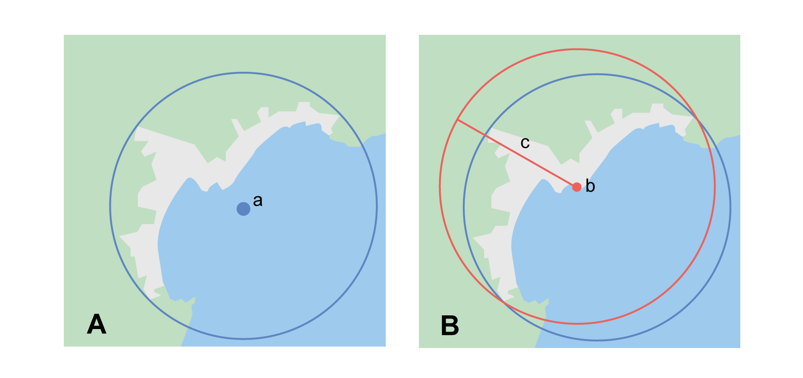

== Introduction

This is a practical guide for <<georeference,georeferencing>>. It describes the protocols to determine the shapes of <<feature,features>> and how to use them as the basis for georeferencing with the <<point-radius>> <<georeferencing-method>> (http://georeferencing.org/georefcalculator/docs/GeorefGuide.html[Wieczorek 2001^], https://doi.org/10.1080/13658810412331280211[Wieczorek et al. 2004^], https://doi.org/10.15468/doc-gg7h-s853[Chapman & Wieczorek 2020^]) using the http://georeferencing.org/georefcalculator/gc.html[Georeferencing Calculator (Wieczorek & Wieczorek 2020)^], and its associated {gcm}[Georeferencing Calculator Manual (Bloom et al. 2020)^], maps, <<gazetteer,gazetteer>>, and other resources from which <<coordinates>> and spatial <<boundary,boundaries>> for places can be found. This document is a citable <<georeferencing-protocol>>. If a derived protocol is used, a new document should be made publicly available and cited with attribution to this document.

The http://georeferencing.org/docs/GeoreferencingQuickGuide.pdf[first version of the Guide (Wieczorek et al. 2012)^]), was an adaptation of http://georeferencing.org/docs/georeffordummy.xls[Georeferencing for Dummies (Spencer et al. 2008)^]. It explains the recommended georeferencing procedures for the most commonly encountered type of <<locality,localities>>. This Guide should be used in parallel with {gbp}[Georeferencing Best Practices (Chapman & Wieczorek 2020)^], which contains the theoretical background and more detailed information about concepts used here.

Underlined terms throughout this document (e.g. <<accuracy>>) link to definitions in the <<Glossary>>. Terms in italics (e.g. [ui-element]#Input Latitude#) refer to fields and/or labels in the http://georeferencing.org/georefcalculator/gc.html[Georeferencing Calculator (Wieczorek & Wieczorek 2020)^] (hereafter referred to as 'the Calculator'). Darwin Core terms are displayed in monospace (e.g. term:dwc[georeferenceRemarks]) in all GBIF digital documentation.

At the end of this document is a <<key-to-locality-types,Georeference Quick Reference Guide Key to Locality Types>>, which contains a quick summary of the protocols for the most common <<locality-type,locality types>>, described in detail in the sections of this guide.

=== Objectives

This document provides guidance on how to <<georeference>> using the <<point-radius>> <<georeferencing-method,method>>. This Guide also provides the methods for determining the <<boundary,boundaries>> of <<feature,features>>, which form the basis of the <<shape>> method.

=== Target Audience

This document is a practical guide for anyone who needs to <<georeference>> textual <<locality>> descriptions so that they can be used in spatial filtering or analysis in research, education, or the maintenance of biological collections data.

=== Scope

This document is one of three that cover recommended requirements and methods to <<georeference>> <<location,locations>>. It provides a practical how-to guide for putting the theory of the <<point-radius>> <<georeferencing-method>> into practice.

The Guide relies on the {gbp}[Georeferencing Best Practices (Chapman & Wieczorek 2020)^] for background, definitions, and more detailed explanations of the theory behind the methods and calculations found here and in the Calculator.

The http://georeferencing.org/georefcalculator/gc.html[Georeferencing Calculator^] is a browser-based JavaScript application that aids in georeferencing descriptive <<locality,localities>>, making the calculations necessary to obtain <<geographic-coordinates>> and <<uncertainty,uncertainties>> for locations using the <<point-radius>> method.

These documents DO NOT provide guidance on georectifying images or <<geocode,geocoding>> street addresses – distinct operations that are sometimes called "georeferencing".

=== Changes from Previous Version

There have been a few changes in terminology since the previous edition of the Guide. These include:

* <<extent,Extent>> in the previous version has been changed to <<radial>>. Extent, where retained, is used in a more traditional way to mean the entire space within a <<location>>.
* "Named place" has been replaced with <<feature>>.
* Where the <<geographic-center>> was recommended in the past, <<corrected-center>> based on the <<geographic-radial>> is now used. This is an important change because the geographic center did not necessarily yield the smallest <<uncertainty>> due to the extent of a feature; the corrected-center and geographic-radial does.

This version of the Guide includes graphical examples of each type of location and steps for how to <<georeference>> them.

=== Using Darwin Core

<<georeference,Georeferences>> using the methods in this Guide will be of greatest value if as much information as possible is captured about and during the georeferencing process. The https://dwc.tdwg.org/terms/[Darwin Core standard (TDWG 2018)^] defines all of the fields recommended for the capture of reproducible georeferences, as follows:

<<Darwin-Core,Darwin Core>> georeferencing terms:

term:dwc[dwc:decimalLatitude], term:dwc[dwc:decimalLongitude], term:dwc[dwc:geodeticDatum]:: the combination of these fields provide the reference for the center of the <<point-radius>> representation of the georeference.
term:dwc[dwc:coordinateUncertaintyInMeters]::  The horizontal distance in meters from the given term:dwc[decimalLatitude] and term:dwc[decimalLongitude] that describes the <<smallest-enclosing-circle>> that contains the whole of the <<location>>. Leave the value empty if the <<uncertainty>> is unknown, cannot be estimated, or is not applicable (because there are no <<coordinates>>). Zero is not a valid value for this term. This term corresponds with the <<geographic-radial>> of the final georeference.
term:dwc[dwc:georeferencedBy], term:dwc[dwc:georeferencedDate]:: the individual(s) who last modified the georeference and when. These correspond to the final authority on the georeference in its current state, regardless of who might have worked on previous versions of the georeference.
term:dwc[dwc:georeferenceProtocol]::  A description or reference to the methods used to determine the <<shape>> using the shape <<georeferencing-method>>, or the coordinates and uncertainty using the point-radius method. If the protocol in this Guide is used unaltered, then the term:dwc[georeferenceProtocol] should be the citation for this document.
term:dwc[dwc:georeferenceSources]::  A list (concatenated and separated) of maps, <<gazetteer,gazetteers>>, or other resources used to georeference the location, described specifically enough to allow anyone in the future to use the same resources.
+
.{blank}
[caption=Examples]
====
USGS 1:24000 Florence Montana Quad 1967 +
Terrametrics 2008 Google Earth +
Wieczorek C & J Wieczorek (2020) Georeferencing Calculator, version yyyymmdd. Available: http://georeferencing.org/georefcalculator/gc.html.
====

term:dwc[dwc:georeferenceVerificationStatus]::  A categorical description of the extent to which the georeference has been verified to represent the best possible spatial description. Recommended best practice is to use a controlled vocabulary.
+
.{blank}
[caption=Examples]
====
requires verification +
verified by collector +
verified by curator
====

term:dwc[dwc:georeferenceRemarks]::  Notes or comments out of the ordinary about the georeference, explaining assumptions made in addition or opposition to those formalized in the method referred to in term:dwc[georeferenceProtocol].
+
.{blank}
[caption=Example]
====
assumed distance by road (Hwy. 101)
====

term:dwc[dwc:locationRemarks]::  Notes or comments of interest about the location (not the georeference of the location, which go in term:dwc[georeferenceRemarks]).
+
.{blank}
[caption=Example]
====
Villa Epecuen was inundated in November 1985 and ceased to be inhabited until 2009
====

For additional community discussion and recommendations, see the https://github.com/tdwg/dwc-qa/wiki/Georeferences[Darwin-Core Project wiki (Wieczorek 2017)^], the https://github.com/tdwg/dwc-qa/wiki/Webinars[Darwin Core Hour Webinars^] and {gbp}[Georeferencing Best Practices^].

=== Georeferencing Concepts

One of the goals of <<georeference,georeferencing>> following best practices is to be sure that enough information is provided in the output so that the georeference is repeatable (see {gbp}#principles-of-best-practice[Principles of Best Practice] in {gbp}[Georeferencing Best Practices (Chapman & Wieczorek 2020)^]). To that end, this document provides a set of recipes for georeferencing various <<locality-type,locality types>> using the http://georeferencing.org/georefcalculator/gc.html[Georeferencing Calculator]. The Calculator allows you to make distinct kinds of calculations based on the locality type (<<s-locality-type>>). When the locality type is chosen from the predefined list, the Calculator presents input boxes for all of the parameters needed for that type of calculation. Note that the locality type is for the most specific <<locality-clause,clause>> in the <<locality>> description (see {gbp}#parsing-the-locality-description[Parsing the Locality Description] in {gbp}[Georeferencing Best Practices (Chapman & Wieczorek 2020)^]), but there may be information for other clauses or other parts of the <<location>> record that help to constrain the location and come into play when a <<feature>> <<boundary>> is determined. Many Calculator parameters are used for more than one locality type. Rather than repeat the explanation for each locality type, they are collected here for common reference. Some locality types require specific parameters, for which the corresponding explanations are included in each subsection of <<Georeferencing Methods for Locality Type>>. Refer to the {gcm}[Georeferencing Calculator Manual (Bloom et al. 2020)^] for details about the Calculator not answered in this document.

[#s-locality-type]
==== Locality Type

The <<locality-type,locality type>> refers to the pattern of the most specific part of a <<locality>> description to be <<georeference,georeferenced>> – the one that determines which calculation method to use. The http://georeferencing.org/georefcalculator/gc.html[Calculator^] has options to compute georeferences for six basic locality types:

* <<coordinates,Coordinates>> only
* Geographic <<feature>> only
* Distance only
* Distance along a path
* Distance along orthogonal <<direction,directions>>
* Distance at a <<heading>>

Selecting a locality type will configure the Calculator to show all of the parameters that need to be set to perform the georeference calculation. This Guide gives specific instructions for how to set the parameters for many different examples of each of the locality types.

[#s-corrected-center]
==== Corrected Center

The <<corrected-center,corrected center>> is the point within a <<location>>, or on its <<boundary>>, that minimizes the <<geographic-radial,geographic radial>> (see <<Radial of Feature>>). This point is obtained by finding the <<smallest-enclosing-circle,smallest enclosing circle>> that contains the entire <<feature>>, and then taking the center of that circle (<>A). If that center does not fall on or inside the boundaries of the feature, find the smallest-enclosing-circle that contains the entire feature, *but* has its center on the boundary of the feature (<>B). Note that in the corrected case, the new circle, and hence the <<radial>>, will always be larger than the uncorrected one. In the http://georeferencing.org/georefcalculator/gc.html[Calculator^], the <<coordinates>> corresponding to the corrected center are labelled as [ui-element]#Input Latitude# and [ui-element]#Input Longitude#.

[#img-corrected-center]
.A: The center ⓐ of the smallest enclosing circle of a feature (polygon highlighted in light grey). Note that the center does not fall within the boundary of the feature. B: The corrected center ⓑ, which is on the boundary of the feature, and the corresponding geographic radial ⓒ.

==== Radial of Feature

A <<feature>> is a place in the <<locality>> description that has an <<extent>> and can be delimited by a <<boundary>>. The <<geographic-radial,geographic radial>> of the feature (shown as [ui-element]#Radial of Feature# in the http://georeferencing.org/georefcalculator/gc.html[Calculator^]) is the distance from the <<corrected-center,corrected center>> of the feature to the furthest point on the <<geographic-boundary,geographic boundary>> of that feature (see <> and {gbp}#extent-of-a-location[Extent of a Location^] in {gbp}[Georeferencing Best Practices (Chapman & Wieczorek 2020)^]). Note that the radial was called "extent" in early versions of the Calculator.

NOTE: The final <<georeference>> will have a geographic radial distinct from the geographic radial of any of the features in the <<locality>> description (because it will also encompass all sources of <<uncertainty>>), and this will be captured in the output from the Calculator in the [ui-element]#Uncertainty# field.

[#s-latitude]
==== Latitude

Labelled as [ui-element]#Input Latitude# in the http://georeferencing.org/georefcalculator/gc.html[Calculator^]. The <<geographic-coordinates,geographic coordinate>> north or south of the equator (where <<latitude>> is 0) that represents the starting point for a <<georeference>> calculation and depends on the <<locality-type,locality type>>.

Latitudes in <<decimal-degrees,decimal degrees>> north of the equator are positive by convention, while latitudes to the south are negative. The Calculator supports three degree-based geographic-coordinate formats for latitude and <<longitude>>: <<decimal-degrees>> (e.g. −41.0570673), degrees decimal minutes (e.g. 41° 3.424") and <<DMS,degrees-minutes-and-seconds>> (e.g. 41° 3' 25.44" S).

[#s-longitude]
==== Longitude

Labelled as [ui-element]#Input Longitude# in the http://georeferencing.org/georefcalculator/gc.html[Calculator^]. The <<geographic-coordinates,geographic coordinate>> east or west of the <<prime-meridian,prime meridian>> (an arc between the north and south poles where <<longitude>> is 0) that represents the starting point for a <<georeference>> calculation and depends on the <<locality-type>>.

Longitudes in <<decimal-degrees,decimal degrees>> east of the prime meridian>> are positive by convention, while longitudes to the west are negative. The Calculator supports three degree-based geographic-coordinate formats for <<latitude>> and longitude: <<decimal-degrees,decimal degrees>> (−71.5246934), degrees decimal minutes (71° 31.482") and <<DMS,degrees-minutes-and-seconds>> (71° 31' 28.90" W).

==== Coordinate Source

The [ui-element]#Coordinate Source# is the type of resource (map type, <<GPS>>, <<gazetteer>>, <<locality>> description) from which the starting [ui-element]#Input Latitude# and [ui-element]#Longitude# were derived.

NOTE: More often than not, the original <<coordinates>> are used to find the general vicinity of the <<location>> on a map, after which the process of determining the <<corrected-center,corrected center>> provides the new coordinates. The Coordinate Source to use in the http://georeferencing.org/georefcalculator/gc.html[Calculator^] in this case is the map from which the corrected center was determined, not the original source used to determine the general vicinity on the map. For example, suppose the original coordinates came from a gazetteer, but the <<boundary>> and corrected center of the <<feature>> were determined from Google Maps, the Coordinate Source would be "Google Earth/Maps 2008", not "gazetteer".

This term is related to, but *NOT* the same as, the <<Darwin-Core>> term term:dwc[georeferenceSources], which requires the specific resources used rather than their type. Note that the <<uncertainty,uncertainties>> from the two sources _gazetteer_ and _locality description_ can not be anticipated universally, and therefore do not contribute to the global uncertainty in the calculations. If the <<error>> characteristics of these sources are known, they can be added in the [ui-element]#Measurement Error# field before calculating. If the source [ui-element]#GPS# is selected, the label for [ui-element]#Measurement Error# will change to [ui-element]#GPS Accuracy#, which is where the <<accuracy>> of the <<GPS>> (see {gbp}#using-a-gps[Using a GPS^] in {gbp}[Georeferencing Best Practices (Chapman & Wieczorek 2020)^] at the time the coordinates were taken should be entered.

[#s-coordinate-format]
==== Coordinate Format

The [ui-element]#Coordinate Format# in the http://georeferencing.org/georefcalculator/gc.html[Calculator^] defines the representation of the original <<geographic-coordinates,geographic coordinates>> (<<decimal-degrees>>, <<DMS,degrees-minutes-and-seconds>> (DMS) or degrees decimal minutes) of the <<coordinates,coordinate>> source.

NOTE: More often than not, the original coordinates are used to find the general vicinity of the <<location>> on a map, after which the process of determining the <<corrected-center,corrected center>> provides the new coordinates. The Coordinate Format to use in the Calculator in this case is the <<coordinate-format,coordinate format>> on the map from which the corrected center was determined, not the coordinate format of the original source used to determine the general vicinity on the map. For example, suppose the original coordinates came from a <<gazetteer>> in DMS, but the <<boundary>> and corrected center of the <<feature>> were determined from Google Maps, the Coordinate Format would be decimal degrees, not DMS.

This term is equivalent to the <<Darwin-Core,Darwin Core>> term term:dwc[verbatimCoordinateSystem]. Selecting the original coordinate format allows the coordinates to be entered in their native format and forces the Calculator to present appropriate options for <<coordinate-precision,coordinate precision>>. Changing the coordinate format will automatically reset the coordinate precision value to _nearest degree_. Be sure to correct this for the actual coordinate precision. The Calculator stores coordinates in decimal degrees to seven decimal places. This is to preserve the correct coordinates in all formats regardless of how many coordinate transformations are done.

[#s-coordinate-precision]
==== Coordinate Precision

Labelled in the http://georeferencing.org/georefcalculator/gc.html[Calculator^] as [ui-element]#Precision# in the first column of input parameters, this drop-down list is populated with levels of <<precision>> in keeping with the <<coordinate-format,coordinate format>> chosen. For example, with a [ui-element]#Coordinate Format# of [ui-element]#degrees minutes seconds#, an [ui-element]#Input Latitude# of 35° 22' 24" N and an [ui-element]#Input Longitude# of 105° 22' 28" W, the [ui-element]#Coordinate Precision# would be [ui-element]#nearest second#. A value of [ui-element]#exact# is any level of precision higher than the otherwise highest precision given on a list. Sources of <<coordinate-precision,coordinate precision>> may include paper or digital maps, digital imagery, <<GPS>>, <<gazetteer,gazetteers>>, or <<locality>> descriptions.

NOTE: The Coordinate Precision to use in the Calculator is the coordinate precision of the map from which the <<corrected-center,corrected center>> was determined, not the coordinate precision of the original source used to determine the general vicinity on the map. For example, suppose the original <<coordinates>> came from a gazetteer, but the <<boundary>> and corrected center of the <<feature>> were determined from Google Maps, the Coordinate Precision would be determined by the number of digits of <<decimal-degrees,decimal degrees>> you captured from the corrected center on Google Maps, not the Coordinate Precision of the coordinates from the original gazetteer entry. If you use all of the digits provided on Google Maps, the Coordinate Precision would be "exact".

NOTE: This term is similar to, but **NOT** the same as, the <<Darwin-Core,Darwin Core>> term term:dwc[coordinatePrecision], which applies to the output coordinates.

[#s-datum]
==== Datum

Defines the position of the origin and orientation of an <<ellipsoid>> upon which the <<coordinates>> are based for the given [ui-element]#Input Latitude# and [ui-element]#Longitude# (see {gbp}#coordinate-reference-system[Coordinate Reference System^] in {gbp}[Georeferencing Best Practices (Chapman & Wieczorek 2020)^]).

NOTE: The Datum to use in the http://georeferencing.org/georefcalculator/gc.html[Calculator^] is the <<datum>> (or <<ellipsoid>>) of the map from which the <<corrected-center,corrected center>> was determined. For example, suppose the original coordinates came from a <<gazetteer>> with an unknown datum, but the <<boundary>> and corrected center of the <<feature>> were determined from Google Maps, the Datum would be "WGS84", not "datum not recorded."

The term [ui-element]#Datum# in the http://georeferencing.org/georefcalculator/gc.html[Calculator^] is equivalent to the <<Darwin-Core,Darwin Core>> term term:dwc[geodeticDatum]. The Calculator includes <<ellipsoid,ellipsoids>> on the [ui-element]#Datum# drop-down list, as sometimes that is all that coordinate source shows. The choice of datum in the Calculator has two important effects. The first is the contribution to <<uncertainty>> if the datum of the input coordinates is not known. If the datum and ellipsoid are not known, [ui-element]#datum not recorded# must be selected. Uncertainty due to an unknown datum can be severe and varies geographically in a complex way with a worst-case contribution of 5359 m (see {gbp}#coordinate-reference-system[Coordinate Reference System^] in {gbp}[Georeferencing Best Practices (Chapman & Wieczorek 2020)^]). The second important effect of the datum selection is to provide the characteristics of the ellipsoid model of the earth, on which the distance calculations depend.

[#s-direction]
==== Direction

The [ui-element]#Direction# in the http://georeferencing.org/georefcalculator/gc.html[Georeferencing Calculator^] is the <<heading>> given in the <<locality>> description, either as a standard compass point (see https://en.wikipedia.org/wiki/Boxing_the_compass[Boxing the compass^]) or as a number of degrees in the clockwise direction from north. True North is not the same as Magnetic North (see {gbp}#headings[Headings^] in {gbp}[Georeferencing Best Practices (Chapman & Wieczorek 2020)^]). If a heading is known to be a magnetic heading, it will have to be converted into a true heading (see NOAA's https://www.ngdc.noaa.gov/geomag/calculators/magcalc.shtml[Magnetic Field Calculator^]) before it can be used in the Calculator. If [ui-element]#degrees from N# is selected, a text box will appear to the right of the selection, into which the degree heading should be entered.

NOTE: Some marine locality descriptions reference a direction (azimuth) toward a landmark rather than a heading from the current location (e.g., "327° to Nubble Lighthouse"). To make a Distance a heading calculation for such a locality description, use the compass point 180 degrees from the one given in the locality description (147° in the example above) as the Direction.

==== Offset Distance

The [ui-element]#Offset Distance# in the http://georeferencing.org/georefcalculator/gc.html[Calculator^] is the linear surface distance from a point of origin. <<offset,Offsets>> are used for the [ui-element]#Locality Types# [ui-element]#Distance at a heading# and [ui-element]#Distance only#. If the [ui-element]#Locality Type# [ui-element]#Distance along orthogonal directions# is selected, there are two distinct offsets:

North or South Offset Distance:: The distance to the north or south (set with the selection box to the right of the distance text box) of the [ui-element]#Input Latitude#.

East or West Offset Distance:: The distance to the east or west (set with the selection box to the right of the distance text box) of the [ui-element]#Input Longitude#.

==== Distance Units

The [ui-element]#Distance Units# selection denotes the real world units used in the <<locality>> description. It is important to select the original units as given in the description. This is needed to incorporate the <<uncertainty>> from <<distance-precision,Distance Precision>> properly. If the <<locality>> description does not include distance units, use the distance units of the map from which measurements are derived.

.{blank}
====
* select [ui-element]#mi# for "10 mi E (by air) Bakersfield"
* select [ui-element]#km# for "3.2 km SE of Lisbon"
* select [ui-element]#km# for measurements in Google Maps where the distance units are set to _km_.
====

==== Distance Precision

The [ui-element]#Distance Precision#, labelled in the http://georeferencing.org/georefcalculator/gc.html[Calculator^] as [ui-element]#Precision# in the second column of input parameters, refers to the <<precision>> with which a distance was described in a <<locality>> (see {gbp}#uncertainty-related-to-offset-precision[Uncertainty Related to Offset Precision^] in {gbp}[Georeferencing Best Practices (Chapman & Wieczorek 2020)^]). This drop-down list is populated based on the [ui-element]#Distance Units# chosen and contains powers of ten and simple fractions to indicate the precision demonstrated in the verbatim original <<offset>>.

.{blank}
====
* select [ui-element]#1 mi# for "6 mi NE of Davis"
* select [ui-element]#¼ km# for "3.75 km W of Hamilton"
====

==== Measurement Error

The [ui-element]#Measurement Error# accounts for <<error>> associated with the ability to distinguish one point from another using any measuring tool, such as rulers on paper maps or the measuring tools on Google Maps or Google Earth. The units of measurement must be the same as those in the <<locality>> description as captured in [ui-element]#Distance Units# (see <<Distance Units>>). The [ui-element]#Distance Converter# at the bottom of the http://georeferencing.org/georefcalculator/gc.html[Calculator^] is provided to aid in changing a measurement to the locality description units. For example, a measurement error of 1 mm on a map of 1:24,000 scale would be 24 m.

==== GPS Accuracy

When [ui-element]#GPS# is selected from the [ui-element]#Coordinate Source# drop-down list, the label for the [ui-element]#Measurement Error# text box changes to [ui-element]#GPS Accuracy#. We recommend entering a value that is at least twice the value given by the <<GPS>> at the time the <<coordinates>> were captured (see {gbp}#uncertainty-due-to-gps[Uncertainty due to GPS^] in {gbp}[Georeferencing Best Practices (Chapman & Wieczorek 2020)^]. If [ui-element]#GPS Accuracy# is not known, enter 100 m for standard hand-held GPS coordinates taken before 1 May 2000 when Selective Availability was discontinued. After that, use 30 m as a conservative default value.

[#s-uncertainty]
==== Uncertainty

The [ui-element]#Uncertainty# in the http://georeferencing.org/georefcalculator/gc.html[Calculator^] is the calculated result of the combination of all sources of <<uncertainty>> (<<coordinate-precision>>, unknown <<datum>>, data source, <<GPS>> <<accuracy>>, measurement <<error>>, <<feature>> <<extent>>, distance <<precision>> and <<heading>> <<precision>>) expressed as a linear distance – the <<geographic-radial,geographic radial>> of the <<georeference>> and the <<radial,radius>> in the <<point-radius>> <<georeferencing-method,method>> (https://doi.org/10.1080/13658810412331280211[Wieczorek et al. 2004^]). Along with the [ui-element]#Output Latitude#, [ui-element]#Output Longitude#, and [ui-element]#Datum#, the radius defines a circle containing all of the possible places a <<locality>> description could mean. In the Calculator the [ui-element]#Uncertainty# is given in meters.

