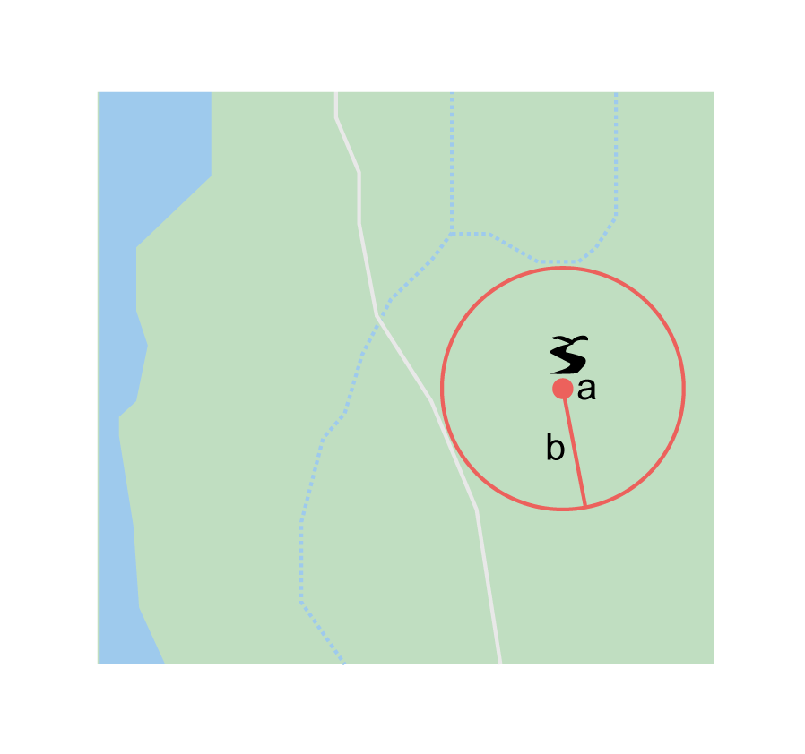
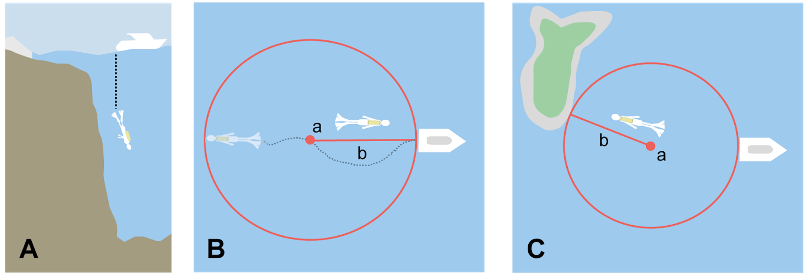
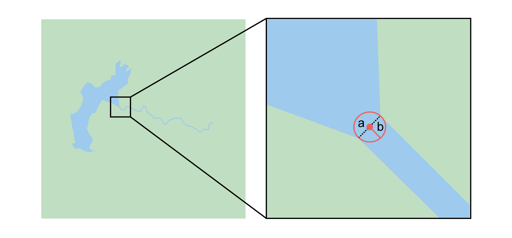
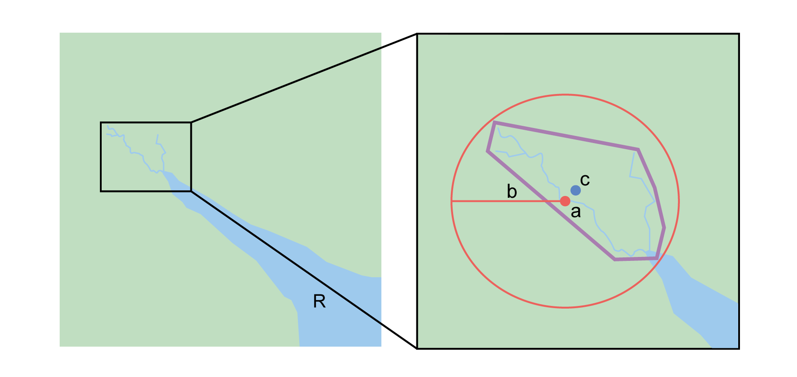
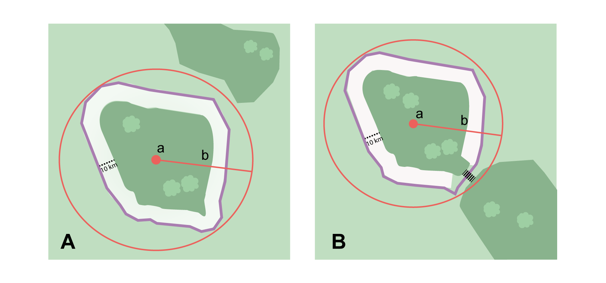
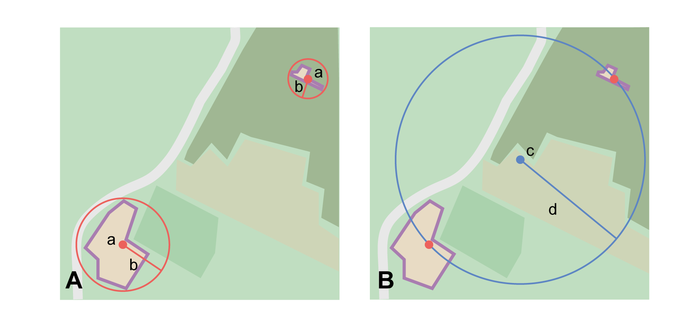
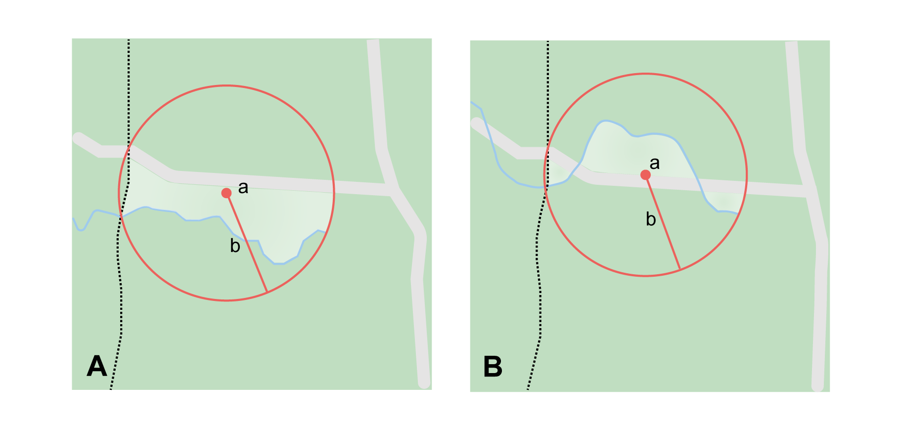

== Georeferencing Methods for Locality Type

=== Geographic Feature only

.Definition
[NOTE]
====
The simplest locality descriptions consist of only a named place, or more generally, a feature, which is often listed in a standard gazetteer and can probably be located on a map of the appropriate scale.
====

Despite how they might be presented in a <<gazetteer>> or on a map, <<feature,features>> are not points; they are areas that have a spatial <<extent>>. Some features can have an obvious spatial extent, while others may not. All variations of features are treated in this Guide as one or the other of these two main categories. The basic methodology is to try to determine the <<boundary,boundaries>> of the feature, its <<corrected-center,corrected center>> and a measure of how specific the feature is (defined here by the <<geographic-radial,geographic radial>>). See <<Appendix B: Methods to Find the Corrected Center and Geographic Radial>> for techniques to determine the corrected center and geographic radial for various geometric types of features.

NOTE: Coordinates from geographic indexes such as gazetteers often use reference points that are not necessarily in the center of the feature. For example, a river may be referenced by its mouth, and a town by its main post office, courthouse, or main plaza. It is best to use a visual reference to determine boundaries, centers, and radials. For this reason, it is a good idea to use the gazetteer coordinates to find the feature on a map, and then use the map to find the boundaries, corrected center and geographic radial of the feature.

==== Feature – with Obvious Spatial Extent

The <<locality>> refers to a geographic <<feature>> with discernible spatial <<extent>>, i.e. the <<boundary,boundaries>> of the feature can be determined easily (<>).

.{blank}
[caption=Examples]
====
* "Puerto Madryn" +
* "Isla Tiburón" +
* "Yosemite National Park" +
* "Botany Bay"
====

*Locality Type:* [ui-element]#Geographic feature only#

*Step 1 – Determine the feature boundaries*: This step is to determine the <<shape>> that contains the <<feature>>. This is typically done by drawing a polygon around the feature (<>A), but some features may require more complex <<geometry,geometries>>, such as multiple polygons.

NOTE: Record the source (including date) used to determine the boundaries (see term:dwc[georeferenceSources]).

*Step 2 – Determine the coordinates*: Use the <<coordinates>> of the <<corrected-center,corrected center>> of the <<feature>> ("*a*" in <>B) as the [ui-element]#Input Latitude# and [ui-element]#Longitude#.

*Step 3 – Measure the geographic radial*: Measure the distance from the <<corrected-center,corrected center>> to the furthest point on the <<boundary>> of the <<feature>> ("*b*" in <>B) as the [ui-element]#Radial of Feature#.

*Step 4 – Calculate using the following additional parameters*: [ui-element]#Coordinate Source#, [ui-element]#Coordinate Format#, [ui-element]#Datum#, [ui-element]#Coordinate Precision#, [ui-element]#GPS Accuracy#/[ui-element]#Measurement Error#, and [ui-element]#Distance Units# (see <<Georeferencing Concepts>>).

[#img-obvious-spatial-extent]
.A. Boundary only, and B. center *a* of the smallest enclosing circle and geographic radial *b* of a feature with obvious spatial extent. The center *a* falls within the boundaries and thus needs no correction.
image::img/web/obvious-spatial-extent.png[width=618,align="center"]

==== Feature – without Obvious Spatial Extent

The <<locality>> refers to a geographic <<feature>> that does not have an easily discernible spatial <<boundary>>. Some features may have undefined boundaries (e.g. mountains, unincorporated towns, etc.). Other features may only have a label, with no apparent boundaries or size on a map because they are small or obscured on satellite imagery (e.g. spring, monument, etc.). Another possibility is a feature with only <<coordinates>> from a <<gazetteer>> and no discernible presence on a map.

.{blank}
[caption=Examples]
====
* "Pampa Grande" as a region, "Mt Hypipamee" +
* "Great Barrier Reef"
====

*Locality Type:* [ui-element]#Geographic feature only#

*Step 1 – Estimate the feature boundaries*: Determine the <<boundary,boundaries>> of the <<feature>> as well as possible using visible evidence for the feature on a map. Try to get into the mind of the person who recorded the <<locality>>. Imagine yourself there. What circumstances would influence which feature was recorded and what circumstances would have encouraged them to choose a different feature?

For towns without obvious borders one can use the presence of buildings near the <<coordinates>> given for the town to decide where the town ends (<>). In some cases there might not be such indicators and these will be more subjective. For this reason it is particularly important to document the rationale for the selection of the locality with unclear boundaries.

[#img-without-obvious-spatial-extent]
.Boundary (lighter dotted line), corrected center *a* and geographic radial *b* of a town based on the locations of buildings and a well-defined neighbouring town border (denoted by the darker dotted line) on a map.
image::img/web/without-obvious-spatial-extent.png[width=378,align="center"]

Where there are no indicators for the boundary, use the midpoint between the given feature and neighbouring features with similar type, size, or importance to make a rough boundary. Though this boundary may not represent the actual feature very well, it will represent the uncertainty of where the locality is, and that is the major goal of the <<georeference>>.

For small features, where the only indicator on a map is a label and possibly a marker, or where there are only coordinates from a <<gazetteer>> (and no further indicators at those coordinates on a map), a good strategy would be to use a predefined default size based on the feature type (<>, <<table-default-geographic-radial>>).

[#img-without-obvious-spatial-extent-default-size]
.The boundary for a spring determined from the position of its icon on a map *a* and a geographic radial *b* determined by a default size for the feature type.

// NB was Table 2 in the source document, but there is no Table 1.

[#table-default-geographic-radial]
.List of feature types and the default geographic radial to use. If the feature type you are looking for isn't on the list, use one that is most like the feature type you seek and be sure to document your choice in term:dwc[georeferenceRemarks].
[%autowidth,frame=topbot,grid=rows,stripes=none,align="center"]
|===
h|Feature Type h|Default <<geographic-radial>>
|spring, bore, tank, well, or waterhole |3 m
|small stream |3 m
|two-lane city streets, two-lane highways intersections |10 m
|four-lane highways intersections |20 m
|highway intersection, unknown type |15 m
|PLSS Township |6828 m
|PLSS Section |1138 m
|PLSS ¼ Section |570 m
|Grid (e.g. UTM), 1 m precision |1 m
|Grid (e.g. UTM), 10 m precision |7 m
|Grid (e.g. UTM), 100 m precision |71 m
|Grid (e.g. UTM), 1 km precision |707 m
|Grid, ¼ degree *precision* (at equator)† |39226 m
|===

† <<grid,Grids>> based on <<geographic-coordinates,geographic coordinates>>, such as Quarter Degree Squares, are not square, nor are they constant. They vary in size and shape by <<latitude>>. See {gbp}#table-uncertainty[table^] in {gbp}#uncertainty-related-to-coordinate-precision[Uncertainty Related to Coordinate Precision in Georeferencing Best Practices (Chapman & Wieczorek 2020)^].

The boundaries between mountains can be determined by using the terrain (valleys, saddles, and plains) that separate one mountain from others around it (<>).

Always use term:dwc[georeferenceRemarks] to document the decisions made and the reasons for them as well as possible, including the neighbouring features used for reference.

[#img-mountain-boundaries]
.A. Topographic contours of a group of nearby mountains. B. Rough boundary, corrected center *a* and geographic radial *b* of a mountain determined by the surrounding valleys, saddles, and plains.
image::img/web/mountain-boundaries.png[width=574,align="center"]

*Step 2 – Determine the coordinates*: Once the estimated boundary has been determined, use the coordinates of the corrected center (<>, <>, and <>B) as the [ui-element]#Input Latitude# and [ui-element]#Longitude#.

*Step 3 – Measure the geographic radial*: Once the rough boundary and the coordinates of the corrected center have been determined, find the geographic radial as the [ui-element]#Radial of Feature# by measuring the distance from the corrected center to the furthest point on the estimated boundary of the feature.

*Step 4 – Calculate using the following additional parameters in the [ui-element]#Calculator#*: [ui-element]#Coordinate Source#, [ui-element]#Coordinate Format#, [ui-element]#Datum#, [ui-element]#Coordinate Precision#, [ui-element]#GPS Accuracy#/[ui-element]#Measurement Error#, [ui-element]#Distance Units# (see <<Georeferencing Concepts>>).

==== Feature – Special Cases

The following are special cases of <<feature,features>> that might or might not have an obvious spatial <<extent>>, depending on the completeness of the information available.

===== Feature – Street Address

The <<locality>> is a street address – usually with a number, a street name, and an administrative <<feature>> name.

.{blank}
[caption=Examples]
====
* "Av. Angel Gallardo 470, Buenos Aires, Argentina" +
* "1 Orchard Lane, Berkeley, CA" +
* "21054 Baldersleigh Road, Guyra, NSW" (indicates that the locality is 21.054 km from the beginning of Baldersleigh Road).
====

*Locality Type:* [ui-element]#Geographic feature only#

*Step 1 – Determine the feature boundaries*: Locate the address using a site such as Google Maps, Mapquest or OpenStreetMap.

a. Address <<boundary>> evident – if the map shows the <<extent>> of the address clearly, determine the boundary exactly as you would for a feature with an Obvious Spatial Extent (<>A); (see <<Feature – with Obvious Spatial Extent>>).

b. Address boundary not evident – if the exact address cannot be found, estimate the boundary as well as possible, such as the block that it must be on (<>B), as for <<Feature – without Obvious Spatial Extent>>. Many addresses reflect a <<grid>> system of labelling addresses. For instance, addresses between 12th Street and 13th Street would lie between 1200 and 1300.

*Step 2 – Determine the coordinates and measure the geographic radial*: Once the boundary has been determined, use the same method to determine the coordinates and <<geographic-radial,geographic radial>> as for <<Feature – with Obvious Spatial Extent>>, namely, measure the distance from the coordinates of the <<corrected-center,corrected center>> to the furthest point on the boundary of the feature.

*Step 3 – Calculate using the following additional parameters in the [ui-element]#Calculator#*: [ui-element]#Coordinate Source#, [ui-element]#Coordinate Format#, [ui-element]#Datum#, [ui-element]#Coordinate Precision#, [ui-element]#GPS Accuracy#/[ui-element]#Measurement Error#, [ui-element]#Distance Units# (see <<Georeferencing Concepts>>).

[#img-street-address]
.Boundary, corrected center *a* and geographic radial *b* of a street address. *A* has obvious boundaries; *B* has no obvious boundaries, and where it is not possible to tell from the source map whether the location is on one side of the street or the other.
image::img/web/street-address.png[width=613,align="center"]

===== Feature – Property

The <<locality>> is a property – a ranch, rancho, station, farm, finca, grange, granja, estância, plantation, hacienda, fazenda, manor, holding, estate, spread, acreage, orchard, steading, parcel, terreno, etc.

.{blank}
[caption=Examples]
====
* "Victoria River Station" +
* "Mathae Ranch" +
* "Estancia 9 de Julio"
====

*Locality Type:* [ui-element]#Geographic feature only#

*Step 1 – Determine the feature boundaries*: Locate the property using whatever sources you can. You may have to resort to a cadastral map.

a. Property <<boundary,boundaries>> evident – if the map shows the <<extent>> of the property, determine the boundary exactly as you would for <<Feature – with Obvious Spatial Extent>>).

b. Property boundaries not evident – if the full extent of the property cannot be found, it should still be possible to determine some part of it confidently, and the rest with less certainty. Delimit the outer, uncertain feature boundaries as usual by following <<Feature – without Obvious Spatial Extent>>. In addition, determine the boundaries of the part of the property that is obvious following <<Feature – with Obvious Spatial Extent>>.

*Step 2 – Determine the coordinates and geographic radial*:

a. Property boundaries evident – once the boundary is determined, determine the <<coordinates>> and <<geographic-radial,geographic radial>> as for <<Feature – with Obvious Spatial Extent>>, namely, measure the distance from the coordinates of the <<corrected-center,corrected center>> to the furthest point on the boundary of the feature (<>A).

b. Property boundaries not evident – once the outer boundaries are determined, use them to find coordinates as for <<Feature – with Obvious Spatial Extent>>, namely find the center of the <<smallest-enclosing-circle,smallest enclosing circle>> containing the outer, uncertain  boundary. If that center falls within the inner, confident boundary, use it to determine the geographic radial by finding the distance from that point to the furthest point on the uncertain boundary (<>B). If the center does not fall in or on the confident inner boundary, let the <<corrected-center,corrected center>> be a point on the inner confident boundary that minimizes the geographic radial to the outer uncertain boundary (<>C).

*Step 3 – Calculate using the following additional parameters in the Calculator*: [ui-element]#Coordinate Source#, [ui-element]#Coordinate Format#, [ui-element]#Datum#, [ui-element]#Coordinate Precision#, [ui-element]#GPS Accuracy#/[ui-element]#Measurement Error#, [ui-element]#Distance Units# (see <<Georeferencing Concepts>>).

[#img-property-boundary]
.Boundary, corrected center *a* and geographic radial *b* of a property. *A* has obvious boundaries; *B* has an obvious inner boundary (dark shading) and a less obvious rough outer boundary (lighter shading), where the center of the outer boundary falls within the obvious inner boundary; *C* has an obvious inner boundary (dark shading) and a rough outer boundary (lighter shading), where the center of the outer boundary *c* does not fall within the obvious inner boundary.
image::img/web/property-boundary.png[width=615,align="center"]

===== Feature – Path

A <<path>> is a linear <<feature>> such as a road, trail, river, stream, contour line, <<boundary>>, <<transect>>, track of an animal’s movements, tow, trawl, etc. The <<locality>> may also refer to part (or subdivision) of a bigger path.

NOTE: A path may cross over itself, for example, as with the track of an animal’s movements.

.{blank}
[caption=Examples]
====
* "Sacramento River" +
* "Arroyo Urugua-í" +
* "Hwy 1" +
* "along 100 m contour line"
====

*Locality Type:* [ui-element]#Geographic feature only#

*Step 1 – Determine the feature boundaries*: As a linear feature, a path is often represented as a series of line segments (i.e. a polyline), with or without a buffer. When viewed on satellite imagery these features (especially rivers) can be quite complex, so a constant buffer around the midline is not a good representation in these cases. When possible, determine the boundary as for any other <<shape>> using <<Feature – with Obvious Spatial Extent>>) (<>A). Otherwise, treat the boundary as a polyline (<>B) and determine the <<corrected-center>> and <<geographic-radial>> as explained below.

NOTE: Paths are susceptible to change over time, so it may be best to find a map source from the period during which the event occurred. The scale is important when looking at a path on a map, as smaller scale maps reduce the complexity shown, with corners cut off, and with loops (oxbows, billabongs), etc. often not shown.

*Contour Lines* — these are linear features defined by <<elevation>> or <<depth>>. The horizontal width of the buffer around the contour line depends on the <<uncertainty>> in elevation due either to an elevational range, or due to the imprecision in the elevation recorded. For example, if the elevational range is given as 100-200 m, then the boundary of the feature defined by the contours would contain the horizontal area between the contours at 100 m and 200 m.

The determination of the boundary would be similar for an elevational buffer defined by the uncertainty in elevation. For example, if the elevation is given as 220 m, the elevational precision would be to the nearest 10 m and the boundary would be defined by the contours 210 m and 230 m.

NOTE: Buffers might require interpolation on a topographic map if they do not correspond with the printed contour lines (<>C).

These considerations apply equally to depth and <<bathymetry>> where contours are available, bearing in mind that some bathymetric contours are quite coarse.

*Step 2 – Determine the coordinates and geographic radial*: If the boundary can be determined, treat as for <<Feature – with Obvious Spatial Extent>>, namely, measure the distance from the **<<coordinates>>** of the corrected-center to the furthest point on the boundary of the feature (<>A).

If the  feature must be treated as a polyline, draw a straight line connecting the ends of the polyline and determine its midpoint. If the midpoint falls on the polyline, that will be the center (no need for correction), and the geographic radial will be the distance from that point to either of the endpoints of the polyline. If the midpoint does not fall on the polyline, move it to the point on the polyline that minimizes the distance to both endpoints. This is the corrected center and the distance to the endpoints is the geographic radial (<>B).

*Step 3 – Calculate using the following additional parameters in the [ui-element]#Calculator#*: [ui-element]#Coordinate Source#, [ui-element]#Coordinate Format#, [ui-element]#Datum#, [ui-element]#Coordinate Precision#, [ui-element]#GPS Accuracy#/[ui-element]#Measurement Error#, [ui-element]#Distance Units# (see <<Georeferencing Concepts>>).

[#img-paths]
.Corrected center *a* and geographic radial *b* for a path. *A*: with boundary of the path as a  shape. *B*: with path as a polyline, showing the midpoint *c* between the ends of the path. *C*: Boundary center *c*, corrected center *a* and geographic radial *b* of bounded section of a contour line, in this case an isohypse of 220 m with an elevational uncertainty of 10 m.
image::img/web/paths.png[width=600,align="center"]

===== Feature – Junction, Intersection, Crossing, Confluence

The <<locality>> is the junction of two or more <<path,paths>> – roads, a road and a river, the mouth of a river (i.e. where it meets a larger water body), a road or river and an administrative <<boundary>> (e.g. of a park), a road and a contour line, etc.

.{blank}
[caption=Examples]
====
* "junction of Coora Rd. and E Siparia Rd" +
* "Where Dalby Road crosses Bunya Mountains National Park Boundary" +
* "confluence of Rio Claro and Rio La Hondura"
====

*Locality Type:* [ui-element]#Geographic feature only#

*Step 1 – Determine the feature boundaries*: Determine the boundary of the junction using routes of highways, roads, and rivers from resources such as Google Maps, Mapquest or OpenStreetMap, road atlases, <<GPS>> navigators, and satellite or aerial images (<>A). Most modern spatial data can be used to determine the actual boundaries. If the only available representation of the junction shows the adjoining paths as lines, then the boundary must be determined as for <<Feature – without Obvious Spatial Extent>>.

For a confluence of two waterways, the boundary is a triangle that consists of the two segments at the same <<elevation>> reaching from where the waterways join to the opposite shores at the same elevation, plus the segment that joins those two points on the opposite shores (<>B).

*Step 2 – Determine the coordinates and geographic radial*: Once the boundary has been determined, use the same method to determine the <<coordinates>> and <<geographic-radial>> as for <<Feature – with Obvious Spatial Extent>>, namely, measure the distance from the coordinates of the <<corrected-center>> to the furthest point on the boundary of the feature (<>B).

*Step 3 – Calculate using the following additional parameters in the [ui-element]#Calculator#*: [ui-element]#Coordinate Source#, [ui-element]#Coordinate Format#, [ui-element]#Datum#, [ui-element]#Coordinate Precision#, [ui-element]#GPS Accuracy#/[ui-element]#Measurement Error#, [ui-element]#Distance Units# (see <<Georeferencing Concepts>>).

[#img-junction]
.*A*: Crossing of a road and a stream with details of boundary, corrected center *a* (with no need for correction) and geographic radial *b* of the intersection. *B*: Boundary, corrected center *a* and geographic radial *b* of a confluence of two rivers.
image::img/web/junction.png[width=627,align="center"]

===== Feature – Cave

The <<locality>> is a cave, an underground mine, etc. For details of how to record a locality within a cave, see {gbp}#caves[Caves^] in {gbp}[Georeferencing Best Practices (Chapman & Wieczorek 2020)^].

.{blank}
[caption=Examples]
====
* "Giant Dome, Hall of Giants, Carlsbad Caverns" +
* "Cueva de Las Brujas"
====

*Locality Type:* [ui-element]#Geographic feature only#

*Step 1 – Determine the feature boundaries*: Locate the cave and/or its main entrance.

a. Cave <<extent>> evident – if a map of all the interior of the cave with measurements and orientation to the surface is available, or if a position can be determined directly above the <<location>> inside the cave using the <<ground-zero>> concept (see {gbp}#determining-location[Determining Location^] in {gbp}[Georeferencing Best Practices (Chapman & Wieczorek 2020)^]), determine the <<boundary>> as if it is a <<Feature – with Obvious Spatial Extent>> (<>A).

b. Cave extent not evident – if the limits of the cave are not evident: a) use the nearest identifiable <<feature>> to determine the extent and boundary of the cave, as for <<Feature – without Obvious Spatial Extent>> (<>B); or b) determine the <<coordinates>> of the cave entrance and use any evidence of the size of the cave to circumscribe the boundary as a circle around the entrance with a <<radial,radius>> commensurate with its size (<>C). Document accordingly in term:dwc[georeferenceRemarks].

*Step 2 – Determine the coordinates and geographic radial*: Once the boundary has been determined, use the same method to determine the coordinates and <<geographic-radial>> as for <<Feature – with Obvious Spatial Extent>>, namely, measure the distance from the coordinates of the <<corrected-center>> to the furthest point on the boundary of the feature.

*Step 3 – Calculate using the following additional parameters in the [ui-element]#Calculator#*: [ui-element]#Coordinate Source#, [ui-element]#Coordinate Format#, [ui-element]#Datum#, [ui-element]#Coordinate Precision#, [ui-element]#GPS Accuracy#/[ui-element]#Measurement Error#, [ui-element]#Distance Units# (see <<Georeferencing Concepts>>).

[#img-caves]
.Boundary, corrected center *a* and geographic radial *b* of a cave. *A*: cave extent known and projected onto the surface. *B*: cave extent not known, but inferred from other evidence. *C*: cave extent not known, but maximum horizontal length known and measured from the entrance.
image::img/web/caves.png[width=617,align="center"]

===== Feature – Dive Location

The <<locality>> is a marine or freshwater diving site. Commonly recorded using the <<geographic-coordinates>> of the point on the surface where the diver entered the water (i.e. the <<entry-point>>).

.{blank}
[caption=Example]
====
"Exploratory dive extending in a rough circle of 20 meters diameter between depths of 75 and 100 meters, beginning 100 meters south east of the entry point at a depth of 85 meters."
====

*Locality Type:* [ui-element]#Geographic feature only#

*Step 1 – Determine the feature boundaries*: Locate the <<extent>> of the dive as a 3D-shape, which should be projected perpendicularly onto the water surface. Determine the <<boundary>> of that projection in the horizontal plane (i.e. the <<geographic-boundary>>) (<>).

a. Dive <<extent>> evident – underwater <<location,locations>> are often recorded as a distance, <<direction>> and water <<depth>> from the entry point. Below the surface there may be a "trajectory" with a three dimensional aspect that includes a horizontal component and a minimum and maximum water depth. Use these to circumscribe the boundary on the surface (see <>A and {gbp}#three-dimensional-shapes[Three Dimensional Shapes^] in {gbp}[Georeferencing Best Practices (Chapman & Wieczorek 2020)^]).

b. Dive extent not evident – if the limits of the dive are not evident, there is no trajectory, and no distance or direction from the entry point, use a reasonable upper limit for the distance the diver might have been able to cover in a straight line from and back to the entry point. This could vary greatly depending on the diver, the depth reached, equipment used, etc. Use any evidence of the length of the dive to circumscribe the boundary as a circle around the entry point with a <<radial,radius>> commensurate with that length (<>B).

*Step 2 – Determine the coordinates and geographic radial*: Treat as for <<Feature – with Obvious Spatial Extent>>, namely, measure the distance from the <<coordinates>> of the <<corrected-center>> to the furthest point on the boundary of the feature.

*Step 3 – Calculate using the following additional parameters in the [ui-element]#Calculator#*: [ui-element]#Coordinate Source#, [ui-element]#Coordinate Format#, [ui-element]#Datum#, [ui-element]#Coordinate Precision#, [ui-element]#GPS Accuracy#/[ui-element]#Measurement Error#, [ui-element]#Distance Units# (see <<Georeferencing Concepts>>).

[#img-dive-location]
.Boundary,  corrected center *a* and geographic radial *b* of a dive location. *A*: side view of a dive with extent evident. *B*: top view of a dive location with evident extent, projected onto the surface. *C*: top view of a dive location with extent not evident, but inferred from other evidence.

===== Feature – Headwaters of a Waterway

The headwater of a waterway may or may not be well defined. For most sizeable rivers a headwater is designated. If not, there is no universally agreed upon definition for a headwater. A reasonable interpretation might be the beginning of the most upstream first order stream that is a tributary of the named waterway. However, there is no guarantee that the author of the <<locality>> description used that definition. Therefore, we recommend the conservative solution that includes the watershed of all of the streams of lower order than the waterway mentioned.

.{blank}
[caption=Examples]
====
* "headwaters of the Missouri River" +
* "Cabecera Río Manso"
====

*Locality Type:* [ui-element]#Geographic feature only#

*Step 1 – Determine the feature boundaries*: When the position of a headwater is well known, the feature is just the spring, lake, marsh, or beginning of the stream as generally accepted and treat as <<Feature – with Obvious Spatial Extent>>. If the headwater issues from a stationary waterbody such as a spring or lake, the feature is a line segment or polyline across the area where the water flows out of the stationary waterbody. In the latter case, treat the <<boundary>> as for a <<path>> (see <<Feature – Path>>), albeit a short one, as it is transverse to the flow of the waterway (<>).

If the headwater is not designated, use the set of all of the streams upstream of the waterway mentioned. Draw the least convex polygon containing the entire set of streams as the *boundary* (<>).

*Step 2 – Determine the coordinates and geographic radial*: Once the boundary has been determined, treat as for <<Feature – with Obvious Spatial Extent>>, namely, measure the distance from the <<coordinates>> of the <<corrected-center>> to the furthest point on the boundary. The corrected center should be on a waterbody within the boundaries.

*Step 3 – Calculate using the following additional parameters in the [ui-element]#Calculator#*: [ui-element]#Coordinate Source#, [ui-element]#Coordinate Format#, [ui-element]#Datum#, [ui-element]#Coordinate Precision#, [ui-element]#GPS Accuracy#/[ui-element]#Measurement Error#, [ui-element]#Distance Units# (see <<Georeferencing Concepts>>).

[#img-headwater]
.Overview of a headwater issuing from a stationary waterbody (in this case a lake). Detail of corrected center *a* and geographic radial *b*.

[#img-watershed]
.Overview of a watershed as the headwater of a river Ⓡ with detail showing the boundaries of the upstream tributaries of R, with center *c*, corrected center *a* and geographic radial *b*.

===== Feature – near a Feature

The <<locality>> is given with a proximity to a <<feature>>, usually written as "near", "in the vicinity of", or "adjacent to", without any particular <<heading>> or distance. "Off" of a locality, often seen in marine locations, is included here, but in this case there is at least one constraint imposed by the shore.

.{blank}
[caption=Examples]
====
* "before Ceibas" +
* "near Dina Huapi" +
* "off Rottnest island" , "adjacent to the railway underpass on Smith Street"
====

*Locality Type:* [ui-element]#Geographic feature only#

*Step 1 – Determine the feature boundaries*: First determine the <<boundary>> of the feature itself based on the feature type, either as <<Feature – with Obvious Spatial Extent>>, or as <<Feature – without Obvious Spatial Extent>>. Then, to account for the proximity indicator, extend that boundary outward for a fixed distance in all directions (<>A). Call this the "extended feature". If the extension overlaps the extension of any other similar feature, modify the boundary in the shared space to be half the distance between the nearest boundaries between the two features (<>B).

NOTE: Neighbouring features were not necessarily there at the time the locality was recorded, nor were they necessarily the same size. The feature of interest may have changed size in the time between the recording of the locality and the time when the map you use was made. These considerations add to the vagaries associated with this type of locality and underline the importance to never describe localities in this way.

NOTE: The buffer distance for the extension is arbitrary – it is hard to defend any given value as a default. Make a judgement and imagine what the person who recorded the locality meant. Document the rationale and decisions made in georeferenceRemarks. Remember, one goal of a georeference is that it is repeatable.

*Step 2 – Determine the coordinates and geographic radial:*: Once the boundary of the extended feature has been determined, treat as for <<Feature – with Obvious Spatial Extent>>, namely, measure the distance from the <<coordinates>> of the <<corrected-center>> to the furthest point on the boundary of the extended feature.

*Step 3 – Calculate using the following additional parameters in the [ui-element]#Calculator#*: [ui-element]#Coordinate Source#, [ui-element]#Coordinate Format#, [ui-element]#Datum#, [ui-element]#Coordinate Precision#, [ui-element]#GPS Accuracy#/[ui-element]#Measurement Error#, [ui-element]#Distance Units# (see <<Georeferencing Concepts>>).

[#img-near-a-feature]
.Boundary, corrected center *a* and geographic radial *b* of an interpretation of locality type _near a Feature_ with a boundary extended a fixed distance in all directions, in this case 10 km. *A*: Boundary extended a fixed distance in all directions with no neighbouring conflicts. *B*: Boundary extended a fixed distance in all directions except in the area overlapping a similar feature, where it extends half the distance to the neighbouring feature.

===== Feature – between Two Features

The <<locality>> description uses the pattern "between A and B", where A and B are two distinct <<feature,features>>.

.{blank}
[caption=Examples]
====
* "between Missoula and Florence, Montana" +
* "Entre Pampa Blanca y Pampa Vieja, Jujuy" +
* "between Point Reyes and Inverness"
====

*Locality Type:* [ui-element]#Geographic feature only#

*Step 1 – Determine the feature boundaries*: Determine the <<boundary,boundaries>> of each feature as <<Feature – with Obvious Spatial Extent>> or <<Feature – without Obvious Spatial Extent>> (<>A).

*Step 2 – Determine the coordinates and geographic radial*: Once you have determined the boundaries of the two feature, find their <<corrected-center,corrected-centers>>, as for <<Feature – with Obvious Spatial Extent>>. Use the midpoint between the <<corrected-center>> of the two features (<>B) to determine the <<coordinates>> of the <<location>> between the features. The <<geographic-radial>> of the location between the two features is half the distance between the corrected centers of the features (<>B).

*Step 3 – Calculate using the following additional parameters in the [ui-element]#Calculator#*: [ui-element]#Coordinate Source#, [ui-element]#Coordinate Format#, [ui-element]#Datum#, [ui-element]#Coordinate Precision#, [ui-element]#Radial of Feature#, [ui-element]#GPS Accuracy#/[ui-element]#Measurement Error#, [ui-element]#Distance Units# (see <<Georeferencing Concepts>>).

[#img-between-two-features]
.*A*: Boundary, corrected center *a* and geographic radial *b* of two features. *B*: Coordinates *c* and geographic radial *d* of the interpretation of _between Two Features_.

===== Feature – between Two Paths

The <<locality>> describes a <<location>> between two <<path,paths>> (two roads, two rivers, a road and a river, etc.).

.{blank}
[caption=Examples]
====
* "between the Great Western Hwy and the railway line" +
* "between Tanama R. and Clearwater Ck." +
* "entre Av. Corrientes y Av. Córdoba" (i.e. two streets that don’t intersect).
====

*Locality Type:* [ui-element]#Geographic feature only#

*Step 1 – Determine the feature boundaries*: Create a <<boundary>> that includes the two paths and any other boundaries that terminate those paths (e.g. the border of a given administrative division) (<>A).

NOTE: Paths may cross each other one or more times, with the area between switching from one side of each path to the other, resulting in a *boundary* consisting of multiple polygons (<>B).

*Step 2 – Determine the coordinates and geographic radial*: Once the boundary has been determined, obtain the <<coordinates>> and the <<geographic-radial>> as for <<Feature – with Obvious Spatial Extent>>, namely, measure the distance from the coordinates of the corrected center to the furthest point on the boundary of the <<feature>>.

*Step 3 – Calculate using the following additional parameters in the [ui-element]#Calculator#*: [ui-element]#Coordinate Source#, [ui-element]#Coordinate Format#, [ui-element]#Datum#, [ui-element]#Coordinate Precision#, [ui-element]#GPS Accuracy#/[ui-element]#Measurement Error#, [ui-element]#Distance Units# (see <<Georeferencing Concepts>>).

[#img-between-two-paths]
.Boundary, corrected center *a* and geographic radial *b* for a location between two paths (light shaded area), with location restricted by an administrative boundary (dashed line). *A*: Paths do not cross. *B*: Paths cross each other multiple times.

