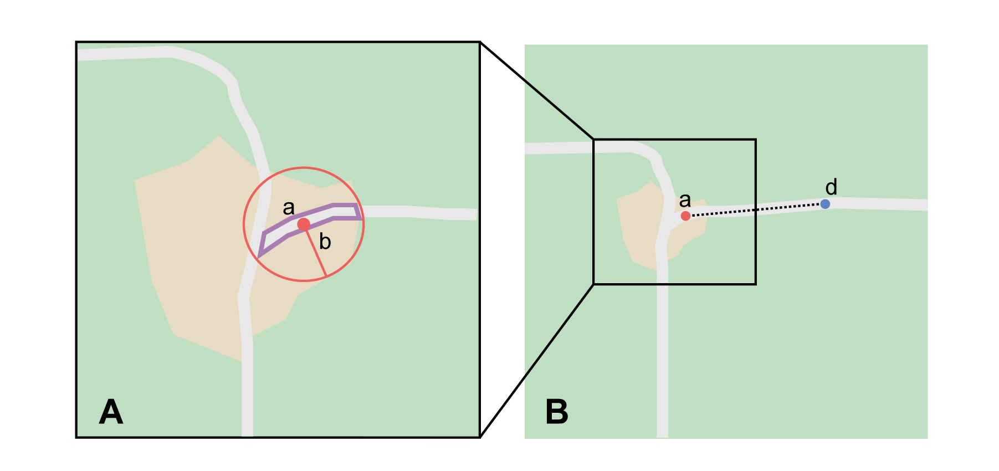
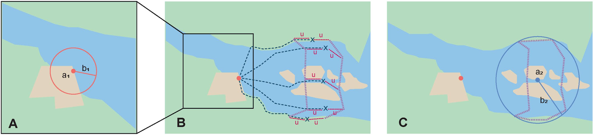
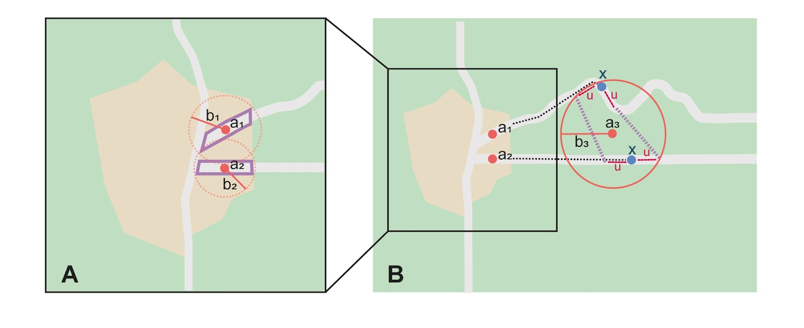
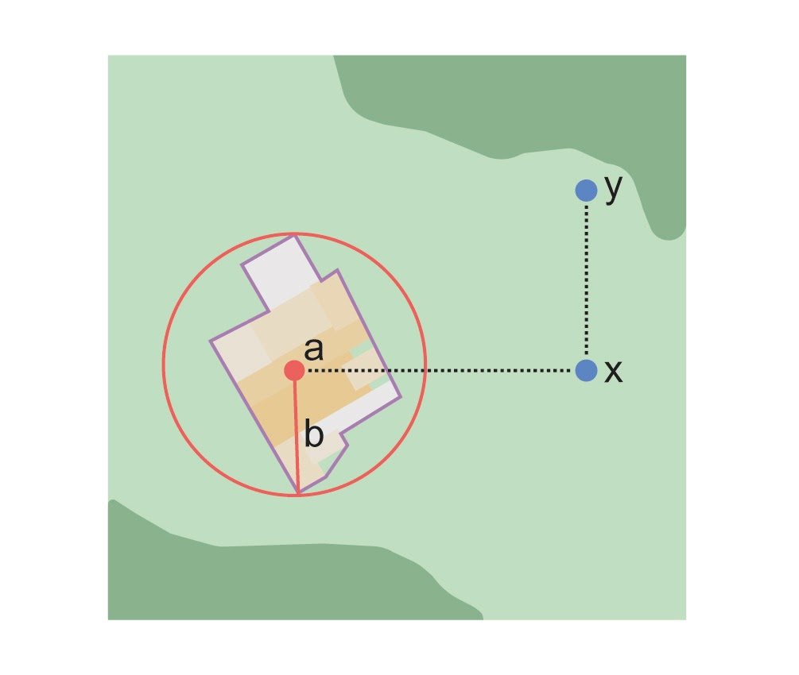
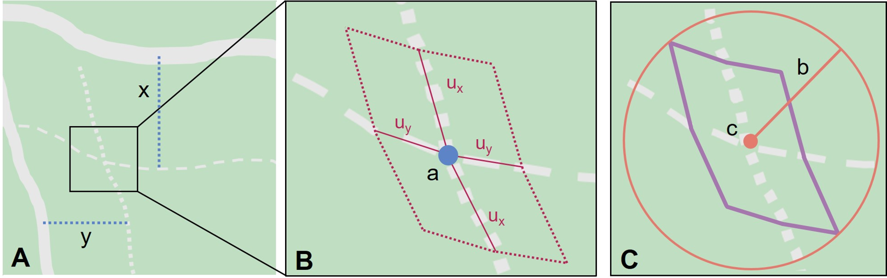

=== Offsets

.**Definition**
[NOTE]
====
An *offset* is a displacement from a reference location. An offset is usually used in conjunction with a heading to give a distance and direction from a feature (see {gbp}#offsets[Offsets^] and {gbp}#uncertainty-related-to-offset-precision[Uncertainty Related to Offset Precision^] in {gbp}[Georeferencing Best Practices (Chapman & Wieczorek 2020)^]). There are a variety of ways in which offsets with features and headings are represented in locality descriptions, each with its own methods of spatial interpretation.
====

In all cases, both for the <<shape>> <<georeferencing-method,method>> and for the <<point-radius>> <<georeferencing-method,method>> using the http://georeferencing.org/georefcalculator/gc.html[Georeferencing Calculator], the <<boundary,boundaries>> of the reference <<feature,feature(s)>> are needed. Thus, this section on Offsets will repeatedly refer to features as determined by the methods presented in the various sections of <<Geographic Feature only>>.

The <<locality-type,locality-types>> that involve offsets, in addition to the tricky one we have already seen above ("near a feature", <<Feature – near a Feature>>), are:

* distance only (e.g. "5 mi from Bakersfield")
* <<heading>> only (e.g. "North of Bakersfield")
* distance along a <<path>> (e.g. "13 miles east (by road) from Bakersfield")
* distance along orthogonal <<direction,directions>> (e.g. "2 miles east and 3 miles north of Bakersfield")
* distance at a heading (e.g. "10 miles east (by air) from Bakersfield")
* distances from two distinct paths (e.g. "1.5 miles east of Louisiana State Highway 1026 and 2 miles south of U.S. Highway 190")

==== Offset – Distance only

<<locality,Locality>> consists of an <<offset>> from a <<feature>> without any direction specified.

.{blank}
[caption=Examples]
====
* "5 km outside Calgary" +
* "12 km de Purmamarca"
====

*Locality Type:* [ui-element]#Distance only#

*Step 1 – Determine the feature boundaries:* Determine the <<boundary>> of the feature as you would for <<Feature – near a Feature>>, except that the distance to use for the buffer is the distance given in the locality description, and there is no need to account for the proximity of other features.

*Step 2 – Determine the coordinates and geographic radial*: Once the boundary has been determined, obtain the <<coordinates>> and the <<geographic-radial>> as for <<Feature – with Obvious Spatial Extent>>, namely, measure the distance from the coordinates of the <<corrected-center>> to the furthest point on the boundary of the feature.

*Offset Distance*: Set to 0. The distance has already been incorporated in the determination of the boundary. Use the distance and units given in the locality description to <<georeference>> using the http://georeferencing.org/georefcalculator/gc.html[Georeferencing Calculator^].

*Distance Precision:* Though the [ui-element]#Offset Distance# is set to zero, the [ui-element]#Distance Precision# should still be set (see <<Distance Precision>>) to account for this source of <<uncertainty>>.

*Step 3 – Calculate using the following additional parameters in the Calculator:* [ui-element]#Coordinate source#, [ui-element]#Coordinate Format#, [ui-element]#Datum#, [ui-element]#Coordinate Precision#, [ui-element]#Measurement Error# (see <<Georeferencing Concepts>>).

==== Offset – Heading only

The <<locality>> consists of a direction from a <<feature>> without any distance specified. Note that seldom is such information given alone; there is usually some supporting information. For example, the locality may have higher-level geographic information such as "East of Albuquerque, Bernalillo County, New Mexico". This provides a stopping point (the county border), and should allow you to <<georeference>> the locality. Alternatively, there might be another similar feature in the direction of the given <<heading>> that can constrain the <<offset>>.

.{blank}
[caption=Examples]
====
* "N Palmetto" +
* "W of Berkeley" +
* "Saladillo E" +
* "Al N de Saladillo"
====

*Locality Type:* [ui-element]#Geographic feature only#

*Step 1 – Determine the feature boundaries*: First determine the <<boundary>> of the given feature based on the feature type, either as for <<Feature – with Obvious Spatial Extent>>, or as for <<Feature – without Obvious Spatial Extent>>. Then, to account for the offset at a heading, extend that boundary outward in a cone defined by the heading <<uncertainty>> (see {gbp}#offset-direction-only[Offset – Direction Only^] and {gbp}#uncertainty-related-to-heading[Uncertainty Related to Heading^] in {gbp}[Georeferencing Best Practices (Chapman & Wieczorek 2020)^]) until reaching a constraining boundary imposed by other information in the locality record, or until reaching the proximity of another similar feature, whichever is nearer to the original feature (<>A). Call this the "extended feature". If the extension impinges on any similar extension of another similar feature in the cone of the specified heading, modify the boundary in the shared space to be half the distance between the nearest boundaries between the two features (<>B). For example, "N Palmetto" could mean "northern part of Palmetto" or "North of Palmetto". Since we have no way of knowing which was intended, we choose the latter interpretation, which is more inclusive and will entirely contain the less inclusive interpretation. Use the rules for heading uncertainty to determine the angle within which to find the nearest similar feature. For example, for "N Palmetto" look for a named place somewhere between NE and NW of Palmetto.

*Step 2 – Determine the coordinates and geographic radial*: Once you have determined the boundary of the extended feature, treat as for <<Feature – with Obvious Spatial Extent>>, namely, measure the distance from the <<coordinates>> of the <<corrected-center>> to the furthest point on the boundary of the extended feature.

*Step 3 – Calculate using the following additional parameters in the [ui-element]#Calculator#*: [ui-element]#Coordinate Source#, [ui-element]#Coordinate Format#, [ui-element]#Datum#, [ui-element]#Coordinate Precision#, [ui-element]#GPS Accuracy#/[ui-element]#Measurement Error#, [ui-element]#Distance Units# (see <<Georeferencing Concepts>>).

[#img-offset-heading]
.A locality "east of" a feature, but bounded on the east by an administrative border (dotted line). *A*: Boundary and corrected center *a* of the starting feature. The cone to the east forms part of the new boundary with center *c* (no need for correction) and geographic radial *d*. *B*: Similar to A, but with an intervening feature to the northeast before the border.
image::img/web/offset-heading.png[width=501,align="center"]

==== Offset – Distance along a Path

The <<locality>> consists of a reference <<feature>> to start from and a distance to travel along a <<path>> from there. Most of the time there will be just one path that matches the description and it will not be very wide compared to the reference feature, for example, a highway out of a town, or a stream out of a lake. In cases such as these, the <<georeferencing-method>> is relatively simple (see <<Offset along a Narrow Path>>). If the path is wide enough that multiple possible routes could be taken along it, such as in a wide river, the method for dealing with it is a little more complex (see <<Offset along a Wide Path>>). Sometimes there might be multiple distinct possible paths that match the locality description, such as two different roads in the same general matching direction out of a town, and there is a third method to use to find the <<georeference>> (see <<Offset along Multiple Possible Paths>>). In all cases, the georeference will cover a segment of the path or possible paths that includes all the sources of <<uncertainty>>. Though there might be a <<heading>> mentioned in the locality description (e.g. "9 km S El Bolsón on Ruta 40"), it serves only to constrain which path or paths are possible, and does not contribute uncertainty due to heading <<precision>>.

NOTE: The more accumulated curvature there is in the path, the more important it is to measure carefully (and therefore use a map of appropriate scale or zoom), otherwise there will be an accumulated error in the position of the offset. The less detail there is in the map compared to the real path, the greater the overestimate of the actual distance from the starting point to the end point will be because the measurements will be "cutting corners" along the whole measured path.

NOTE: The more accumulated change in elevation there is along a path, the greater the deviation between the distance on the ground and the horizontal distance on a map. The distance on the ground is always greater than the corresponding horizontal distance. This effect is generally not very large, especially considering that localities of the type "Distance along a Path" follow a path that is traversable. Traversable roads and rivers can not have abrupt or excessive inclines. The only troublesome case is a walking path through steep terrain. No mainstream tools other than GIS, or measuring in situ again, permit the direct determination of distance on the ground. 

First let's get an idea of how large the elevation effect can be, to understand the circumstances under which it is worth making the extra effort to estimate the distance on the ground. An important thing to understand is that the changes in elevation, both up and down, contribute to lengthen the route relative to the horizontal distance. The distance on the ground, on the path, is stem:[sqrt(x^2+y^2)], where stem:[x] is the projected horizontal distance and stem:[y] is the accumulated sum of changes in elevation. Note that the accumulated sum of changes in elevation is not necessarily the same as the final change in elevation between the starting point and the ending point of the trajectory. On a road, there could be ups and downs, and the sum of changes includes both, added as absolute values.

Let's take an extreme case using the steepest road in the world, Baldwin Street in Dunedin, New Zealand. The street has a maximum grade of 35%. For comparison, highways with grades of 6% are usually considered steep enough to merit cautionary signage, and more than about 12% is rare to find. With a 35% grade, stem:[y] is 0.35 times stem:[x]. Set stem:[x = 1] and do the calculation. The distance on the ground would be stem:[sqrt(0.35^2 + 1^2)] or 1.059 (5.9% longer). In a more normal extreme case of a 10% grade, the difference would be just 0.5%. Thus, under normal circumstances the difference is essentially negligible for roads and certainly so for navigable waters.

There are several ways to estimate distances on the ground without specialized tools or GIS. One way is to use an image of the elevation profile, which can be obtained using a screen capture in Google Earth Pro, for example. The image must be distorted so that the scale in both stem:[x] and stem:[y] is the same (1m elevation = 1m horizontal distance). With the image thus flattened, measure along the path of elevation and compare it to the length of the horizontal distance on the image.

A second way to estimate the distance on the ground is to sum all the elevation gains between pair-wise minima and maxima and do the same for all the pair-wise elevation losses. Sum the gains and losses (both as positive, because the rises and falls both contribute to positive length gains). Use that sum as the rise (stem:[y]) in a slope calculation where the run (stem:[x]) is the horizontal length of the path. From stem:[x] and stem:[y], calculate the distance on the ground as above.

A third way to estimate the distance on the ground is a gross simplification of the second method, above. Instead of measuring all pair-wise gains and losses, sum the net changes in elevation along three segments, 1) from the elevation at the beginning of the path to the lowest elevation, 2) the net change from the lowest elevation to the highest elevation, and 3) the net change from the highest elevation to the elevation at the end of the path.

===== Offset along a Narrow Path

.{blank}
[caption=Examples]
====
* "Ruta Nacional 81, 8 km O de Ingeniero Guillermo Nicasio Juárez" +
* "left bank of the Mississippi River, 16 mi downstream from St. Louis" +
* "500m up Skeleton Gorge"
====

*Locality Type:* [ui-element]#Distance along path#

*Step 1 – Determine the starting feature boundaries*: Find the <<boundary>> of the starting feature, which is the intersection of the reference <<feature>> with the <<path>> as you would for <<feature-junction-intersection-crossing-confluence,Feature – Junction, Intersection, Crossing, Confluence>> (<>).

*Step 2 – Determine the starting feature coordinates and length of the matching path*: Once the <<boundary>> of the starting <<feature>> has been determined, find the midpoint along the path within the boundary of the feature it intersects with (<>B). Note the distance along the path from the midpoint to the boundary of the feature it intersects in the direction of the offset. Enter the length of that segment in [ui-element]#Radial of Feature# in the http://georeferencing.org/georefcalculator/gc.html[Georeferencing Calculator^].

*Step 3 – Enter the [ui-element]#Input Latitude# and [ui-element]#Longitude#*: Enter the coordinates of the <<offset>> position, which can be determined by measuring the length along the midline of the path from the midpoint found in the previous step to the distance along the path given in the <<locality>> description. See the notes on map scale and accumulated <<error>> in <<Offset – Distance along a Path>>.

*Step 4 – Calculate using the following additional parameters in the Calculator*: [ui-element]#Coordinate Source#, [ui-element]#Coordinate Format#, [ui-element]#Datum#, [ui-element]#Coordinate Precision#, [ui-element]#Measurement Error#, [ui-element]#Distance Units#, [ui-element]#Distance Precision# (see <<Georeferencing Concepts>>).

[#img-offset-narrow-path]
.A locality of the type "Offset along a path" where the path is narrow, specifically, along a road "east of" a feature. *A*: Inset showing the boundary of the section of the path that intersects the starting feature, midpoint *a*, and half the distance along the path inside the feature *b*. *B*: The midpoint *a* and the offset *c* measured along the road.

===== Offset along a Wide Path

.{blank}
[caption=Example]
====
* "Mississippi River, 16 mi downstream from St. Louis"
====

*Locality Type:* [ui-element]#Distance along path#

*Step 1 – Determine the starting feature boundaries*: Find the center of the starting feature, which is the intersection of the reference <<feature>> with the <<path>> as you would for <<feature-junction-intersection-crossing-confluence,Feature – Junction, Intersection, Crossing, Confluence>> (<>A).

*Step 2 – Determine the starting feature coordinates and geographic radial*: Once the <<boundary>> of the starting feature has been determined, use the same method to determine the <<corrected-center>> and <<geographic-radial>> as for <<Feature – with Obvious Spatial Extent>>, namely, measure the distance from the <<coordinates>> of the corrected center to the furthest point on the boundary of the starting feature (<>A).

*Step 3 – Calculate preliminary uncertainties*: Calculate a preliminary <<uncertainty>> by entering the geographic radial from *Step 1* into the [ui-element]#Radial of feature# in the {gcm}[Georeferencing Calculator] and fill in the rest of the parameters for the [ui-element]#Distance along path# <<locality-type>>.

*Additional parameters for Step 4*: [ui-element]#Coordinate Source#, [ui-element]#Coordinate Format#, [ui-element]#Datum#, [ui-element]#Coordinate Precision#, [ui-element]#Measurement Error#, [ui-element]#Distance Units#, [ui-element]#Distance Precision# (see <<Georeferencing Concepts>>).

*Step 4 – Final path boundary*: The objective of this step is to estimate a boundary around the set of possible paths matching the description. To do so, we need to trace at least three of the possible paths. The first of these paths is from the coordinates of *Step 2* along one side of the wide path to a distance equal to the offset distance given in the locality description. The second path is similar, but along the opposite side of the wide path starting at a point of equal elevation and tracing along that opposite side. The third path is from the coordinates of Step 2, along the middle of the wide path (or the deepest channel if locatable in the case of a waterway) to as far as to the offset distance given in the locality description. If there are other reasonably likely paths that are very different from these three, trace them in a similar manner. Each of these paths terminate at an X in the example in <>B. From each of these termination points, trace both forward and backward to a distance equal to the uncertainty determined in *Step 3* (the segments of the paths marked with u in <>B). The outer endpoints of all the segments marked with u form a polygon (<>B). This polygon is the final path boundary we seek.

*Step 5 – Final corrected center and geographic radial*: Once you have determined the boundary of the final boundary from *Step 4*, treat as for <<Feature – with Obvious Spatial Extent>>, namely, find the corrected center of the final path boundary and measure the distance from there to the furthest point on the boundary. Use the coordinates of the corrected center for the resulting [ui-element]#Latitude# and [ui-element]#Longitude# and use the length of the geographic radial of the final path boundary as the final [ui-element]#Uncertainty#. Use all of the rest of the output values from the calculation in *Step 4* in the final georeference. No new calculation has to be made for this step.

[#img-offset-wide-path]
.Determination of the final coordinates and geographic radial for a locality of the type [ui-element]#Offset along path#, where the path is wide enough that there are multiple reasonable routes within it, in this case a river. *A*: Boundary, corrected center *a₁* and geographic radial *b₁* for the starting feature. *B*: Offsets *x* along various routes along the wider path, buffers of uncertainty *u* forward and backward along the possible paths, and the boundary (red dotted segments) defined by the buffers. *C*: Boundary, corrected center *a₂* and geographic radial *b₂* of the final path, that is, the section of the river covered by the distance X downstream from the corrected center of the starting feature *a₁* buffered by the uncertainties *u*.

===== Offset along Multiple Possible Paths

.{blank}
[caption=Examples]
====
* "15km al O de Rosario por ruta" +
* “5 km up Cox River from the coast, Limmen NP, NT, Australia” (Cox River is a delta with several arms).
====

*Locality Type:* As the <<locality-type>> of the possible <<path,paths>>.

*Step 1 – Determine the starting feature boundaries*: Find the center of the intersection of the reference <<feature>> with each path as you would for <<feature-junction-intersection-crossing-confluence,Feature – Junction, Intersection, Crossing, Confluence>> (<>A).

*Step 2 – Determine the boundaries for distinct paths*: For each of the distinct possible paths, determine the final <<boundary,boundaries>> of the path segment as for <<Offset along a Narrow Path>> or <<Offset along a Wide Path>>, as appropriate (<>B).

*Step 3 – Determine the final coordinates and geographic radial*: Treat the set of boundaries from *Step 2* and the minimum area between them as parts of the same feature. Find the <<corrected-center>> and <<geographic-radial>> for this combined feature (<>B). Use the <<coordinates>> of the corrected center of this combined feature for the resulting [ui-element]#Input Latitude# and [ui-element]#Longitude# and use the length of the geographic radial of the combined feature as the final <<uncertainty>>. No further calculation is necessary.

[#img-offset-multiple-paths]
.Determination of the input coordinates and geographic radial for a [ui-element]#Locality Type Offset along path# where there are multiple possible paths matching the locality description, in this case two roads out of a town. *A*: Inset showing the boundaries, midpoints (*a₁* and *a₂*), and distances from midpoints to outer edges (shown as geographic radials *b~1~* and *b₂*) of the intersections of the paths and the starting feature. *B*: Boundary, corrected center *a₃* and geographic radial *b₃* for the combination of the two road sections, each defined by offsets at a distance X along the respective paths from their respective midpoints in the starting feature, plus or minus the uncertainties determined for the [ui-element]#Distance along a Path# locality type *u*.

==== Offset – Distance along Orthogonal Directions

The <<locality,locality>> consists of a linear distance in each of two orthogonal <<direction,directions>> from a <<feature>>. For more information and details see {gbp}#offset-along-orthogonal-directions[Offset along Orthogonal Directions^] in {gbp}[Georeferencing Best Practices (Chapman & Wieczorek 2020)^].

NOTE: Where localities have two orthogonal measurements in them, it should always be assumed that the measurements are "by air" unless there is a reference that indicates otherwise.

.{blank}
[caption=Examples]
====
* "6 km N and 4 km W of Welna" +
* "2 mi E and 1.5 mi N of Kandy" +
* "2 miles north, 1 mile east of Boulder Falls, Boulder County, Colorado"
====

*Locality Type:* [ui-element]#Distance along orthogonal directions#

*Step 1 – Determine the starting feature boundaries*: Determine the <<boundary>> of the <<feature>> based on whatever the feature type is, either as for <<Feature – with Obvious Spatial Extent>>, or as for <<Feature – without Obvious Spatial Extent>>.

*Step 2 – Determine the starting feature coordinates and geographic radial*: Once the boundary of the starting feature has been determined, use the same method to determine the <<corrected-center>> and <<geographic-radial>> as for <<Feature – with Obvious Spatial Extent>>, namely, measure the distance from the <<coordinates>> of the corrected center to the furthest point on the boundary of the starting feature (<>).

*Step 3 – Calculate using the following additional parameters in the http://georeferencing.org/georefcalculator/gc.html[Georeferencing Calculator^]*: [ui-element]#Coordinate Source,# [ui-element]#Coordinate Format#, [ui-element]#Datum#, [ui-element]#Coordinate Precision#, [ui-element]#North or South Offset Distance, East or West Offset Distance#, [ui-element]#GPS Accuracy#/[ui-element]#Measurement Error#, [ui-element]#Distance Units#, [ui-element]#Distance Precision# (see <<Georeferencing Concepts>>).

NOTE: For this type of calculation, the output coordinates are different from the _Input Latitude_ and _Input Longitude_.

[#img-offset-orthogonal-direction]
.Example of offsets (*x*, and *y*) in orthogonal directions from the corrected center *a* of a feature with radial *b*. By convention the headings are exactly in the specified directions and contribute no uncertainty due to direction precision.

==== Offset – Distance at a Heading

The <<locality,locality>> consists of a distance in a given <<direction>> from a single <<feature>>. Such localities sometimes contain an explicit indicator of how the distance was measured, (e.g. "by air", "air miles W of", "due N of", "as the crow flies", "by road", "downstream from", etc.). Without such an indicator the interpretation is a matter of judgement, which should be documented in term:dwc[georeferenceRemarks].

NOTE: Since an offset at a heading "by air" will usually encompass the alternative by a path anyway, the former is the recommended locality type to use if there is no indication to the contrary. You can increase the maximum uncertainty to encompass the other option. This recommendation applies if you don’t have a compelling reason to use <<Offset – Distance along a Path>>).

NOTE: The addition of an adverbial modifier to the distance part of a locality description (e.g. "about 25 km WNW Campinas"), while an honest observation, should not affect the determination of the <<geographic-coordinates>> or the overall <<uncertainty>>.

.{blank}
[caption=Examples]
====
* "50 miles W of Las Vegas" +
* "10.2 km E de Amamá" +
* "16 mi downstream from St Louis on the Mississippi River" +
* "about 25 km WNW of Campinas" +
* "10 mi E (by air) Yerevan"
====

*Locality Type:* [ui-element]#Distance at a heading#

*Step 1 – Determine the starting feature boundaries*: Determine the <<boundary>> of the <<feature>> based on whatever the feature type is, either as for <<Feature – with Obvious Spatial Extent>>, or as for <<Feature – without Obvious Spatial Extent>>.

*Step 2 – Determine the starting feature coordinates and geographic radial*: Once the boundary has been determined, obtain the <<coordinates>> and the <<geographic-radial>> as for <<Feature – with Obvious Spatial Extent>>, namely, measure the distance from the coordinates of the <<corrected-center>> to the furthest point on the boundary of the feature.

*Step 3 – Calculate using the following additional parameters in the http://georeferencing.org/georefcalculator/gc.html[Georefencing Calculator^]*: [ui-element]#Coordinate Source,# [ui-element]#Coordinate Format#, [ui-element]#Datum#, [ui-element]#Coordinate Precision#, [ui-element]#Direction#, [ui-element]#Offset Distance#, [ui-element]#GPS Accuracy#/[ui-element]#Measurement Error#, [ui-element]#Distance Units#, [ui-element]#Distance Precision# (see <<Georeferencing Concepts>>).

NOTE: For this type of calculation, the output coordinates are different from the _Input Latitude_ and _Input Longitude_.

==== Offset – Distances from Two Distinct Paths

The <<locality,locality>> consists of orthogonal <<offset>> distances, one from each of two distinct <<path,paths>>.

.{blank}
[caption=Example]
====
* "1.5 mi E LA Hwy. 1026 and 2 mi S U.S. 190"
====

*Locality Type:* [ui-element]#Distance along path#

Although this is not technically a distance along a path, the choice of this <<locality-type>> in the http://georeferencing.org/georefcalculator/gc.html[Georeferencing Calculator^] will allow all of the relevant parameters to be entered.

*Step 1 – Determine the feature boundaries*: Determine the <<boundary,boundaries>> of the area matching the locality description by "transporting" each path by its given offset distance and <<direction>>. The transported paths will then overlap, each one having its corresponding buffer due to <<distance-precision,distance precision>> and path widths around it. This overlap of the two buffered areas defines the <<extent>> of the place described (<>). Draw the boundary around the overlapping area.

*Step 2 – Determine the coordinates and geographic radial*: Once the boundary has been determined, obtain the <<coordinates>> and the <<geographic-radial>> as for <<Feature – with Obvious Spatial Extent>>, namely, measure the distance from the coordinates of the <<corrected-center>> to the furthest point on the boundary of the feature.

*Step 3 – Calculate using the following additional parameters in the Calculator*: [ui-element]#Coordinate Source#, [ui-element]#Coordinate Format#, [ui-element]#Datum#, [ui-element]#Coordinate Precision#, [ui-element]#Radial of Feature#, [ui-element]#Measurement Error#, [ui-element]#Distance Units#, [ui-element]#Distance Precision# (see <<Georeferencing Concepts>>).

[#img-offset-two-paths]
.Determination of a place described as an offset from two paths. *A*: Transportation of the paths by their offsets, *x* and *y*, and directions (in this case south and east). *B*: Intersection a of the midlines of the transported paths, and their buffers due to distance precision and path width (*u~x~* and *u~y~*). *C*: Boundary, corrected center *c*, and radial *b* of the place described.

[#s-coordinates]
