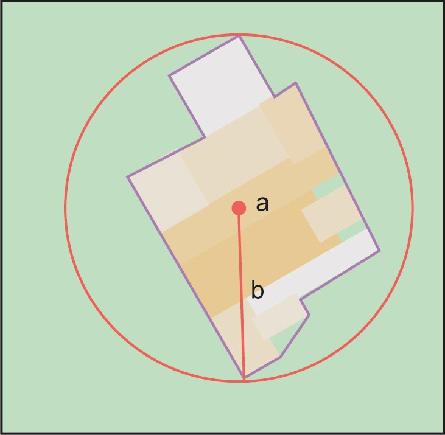
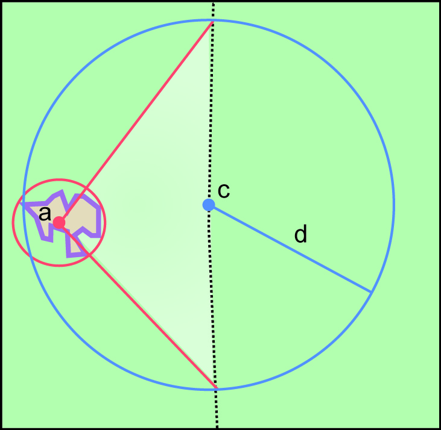
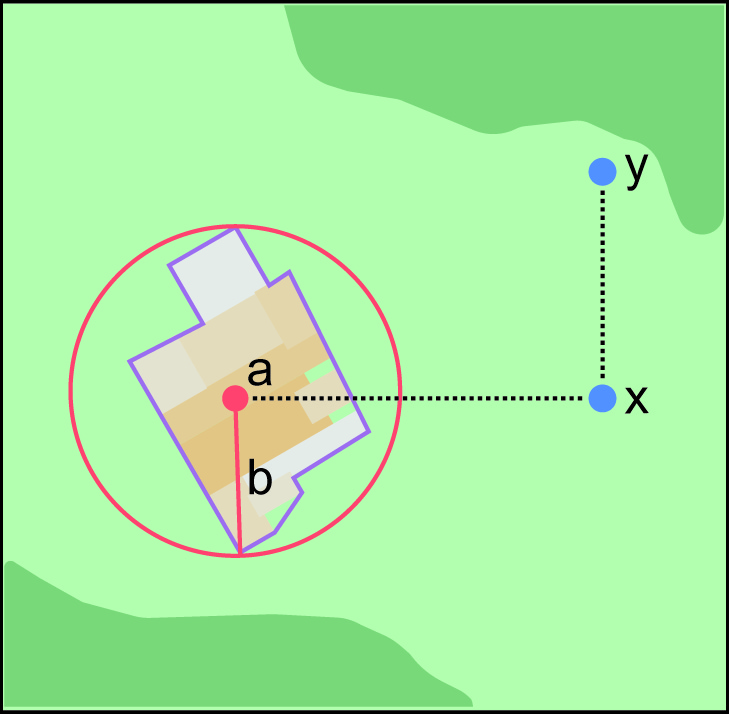

ifdef::backend-pdf[]
[discrete]
=== Georeferencing Quick Reference Guide
endif::backend-pdf[]

== Appendix A: Key to Locality Types

<<corrected-center,Corrected center>>:: the center of the <<smallest-enclosing-circle>> of a <<feature>> while having its center in or on the <<boundary>> of that feature.

<<geographic-radial,Geographic radial>>:: distance from the corrected center to the furthest point on the boundary of the feature.

=== Features

// TODO Section links
[#table-key-features]
[%autowidth,cols=","]
|===
h|Locality Type
h|Calculation Steps

|<<Geographic Feature only,§2.1 Geographic Feature only>>
|The <<locality>> description consists only of a <<feature>>, which is often listed in a standard <<gazetteer>> and can probably be located on a map. Remember: <<feature,features>> are not points; they have a spatial <<extent>>.

a|
<<Feature – with Obvious Spatial Extent,§2.1.1 With Obvious Extent>>

a|
Step 1: Determine <<feature>> <<boundary,boundaries>>.

Step 2: Determine the <<coordinates>> of the <<corrected-center>> of the feature for [ui-element]#Input Latitude# and [ui-element]#Longitude#.

Step 3: Measure the <<geographic-radial>>.

a|
<<Feature – without Obvious Spatial Extent,§2.1.2 Without Obvious Extent>>

image::img/web/key-without-obvious-extent.jpg[width=108,align="center"]

a|
Step 1: Estimate <<feature>> <<boundary,boundaries>> using known information from the map, record, or other documentation.

Step 2: Determine the <<coordinates>> of the <<corrected-center>> of the estimated feature boundaries as the [ui-element]#Input Latitude# and [ui-element]#Longitude#.

Step 3: Measure the <<geographic-radial>>.

|<<Feature – Special Cases,§2.1.3 Special Cases>>

a|
_Special Cases_ all follow the same process as **<<feature,features>>** with or without an obvious spatial **<<extent>>**, but may have some special considerations. For details see:

* <<Feature – Street Address,Street Address (§2.1.3.1)>> +
* <<Feature – Property,Property (§2.1.3.2)>> +
* <<Feature – Path,Path (§2.1.3.3)>> +
* <<feature-junction-intersection-crossing-confluence,Junction, Intersection, Crossing, Confluence (§2.1.3.4)>> +
* <<Feature – Cave,Cave (§2.1.3.5)>> +
* <<Feature – Dive Location,Dive Location (§2.1.3.6)>> +
* <<Feature – Headwaters of a Waterway,Headwaters of a Waterway (§2.1.3.7)>> +
* <<Feature – near a Feature,near a Feature (§2.1.3.8)>> +
* <<Feature – between Two Features,between Two Features (§2.1.3.9)>> +
* <<Feature – between Two Paths,between Two Paths (§2.1.3.10)>>
|===

=== Offsets

[#table-key-offsets]
[%autowidth,cols=","]
|===
h|Locality Type
h|Calculation Steps

|<<Offsets,§2.2 Offsets>>
|An <<offset>> is a displacement from a reference <<location>>, usually used in conjunction with <<heading>> to give a distance and direction from a <<feature>>.

|<<Offset – Distance only,§2.2.1 Distance only>>
a|
Step 1: Determine the <<feature>> <<boundary,boundaries>> using the method for <<Geographic Feature only,Geographic Feature only (§2.1)>> except that the distance to use for the buffer is the distance given in the <<locality>> description, and there is no need to account for the proximity of other features.

Step 2: Determine <<coordinates>> and <<geographic-radial>>. [ui-element]#Offset Distance# = 0. [ui-element]#Distance Precision# = <<precision>> with which a distance was described in the <<locality>>.

a|
<<Offset – Heading only,§2.2.2 Heading only>>

a|
Step 1: Determine <<feature>> <<boundary,boundaries>> using method for <<Feature – with Obvious Spatial Extent,Feature – with Obvious Spatial Extent (§2.1.1)>>. Account for the <<offset>> at a <<heading>> using information in the <<locality>> record, or until reaching the proximity of another similar feature, whichever is nearer the original feature. Call this the "extended feature".

Step 2: Determine and use the <<coordinates>> and <<radial>> of the extended feature.

a|
<<Offset – Distance along a Path,§2.2.3 Distance along a Path>>

|Georeferencing consists of a reference <<feature>> to start from and a distance to travel along a <<path>>. The path is usually <<Offset along a Narrow Path,Narrow (§2.2.3.1)>> or <<Offset along a Wide Path,Wide (§2.2.3.2)>>. At times there may be <<Offset along Multiple Possible Paths,Multiple Possible Paths (§2.2.3.3)>>. Please reference the appropriate section for specific instructions.

a|
<<Offset – Distance along Orthogonal Directions,§2.2.4 Distance along Orthogonal Directions>>

a|
Step 1: Determine the <<boundary>> of the <<feature>> based on feature *type*.

Step 2: Determine and use the <<coordinates>> of the <<corrected-center>> of the estimated feature boundaries as the [ui-element]#Input Latitude# and [ui-element]#Longitude#.

|<<Offset – Distance at a Heading,§2.2.5 Distance at a Heading>>
a|
Step 1: Determine the starting <<feature>>.

Step 2: Determine and use the starting feature <<coordinates>> and the <<geographic-radial>>.

|<<Offset – Distances from Two Distinct Paths,§2.2.6 Distances from Two Distinct Paths>> a|
When the <<locality>> consists of orthogonal <<offset>> distances, one from each of two distinct <<path,paths>>.

Step 1: Determine the starting <<feature>>.

Step 2: Determine and use the starting feature <<coordinates>> and the <<geographic-radial>>.
|===

[#s-offsets-coordinates]
=== Coordinates

[#table-key-coordinates]
[%autowidth,cols=","]
|===
h|Locality Type
h|Calculation Steps

|<<Coordinates,§2.3 Coordinates>>
|The <<locality>> consists of a point represented by <<latitude>> and <<longitude>> in one of various <<coordinate-format,coordinate formats>>.

|<<Coordinates – Geographic Coordinates,§2.3.1 Geographic Coordinates>>
|Step 1: Enter the <<coordinates>> in the format they were captured from the <<GPS>> or from the verbatim <<locality>>.

|<<Coordinates – Universal Transverse Mercator (UTM),§2.3.2 Universal Transverse Mercator (UTM)>>
a|
Although this is not technically a <<feature>>, the <<Geographic Feature only,Geographic Feature only (§2.1)>> <<locality-type>> in the http://georeferencing.org/georefcalculator/gc.html[Georeferencing Calculator (Wieczorek & Wieczorek 2020)^] includes all of the relevant parameters.

Step 1: The <<UTM>> <<coordinates>> must be converted to <<decimal-degrees>> using a UTM to <<latitude,Latitude>>/<<longitude,Longitude>> conversion tool. The UTM Zone is required to do this.

// TODO extra section link here

Step 2: *Determine <<radial>>*: If the UTM coordinates have 7 digits in the <<northing>> and 6 digits in the <<easting>>, the <<geographic-radial>> is 0.707 m. For UTM coordinates with fewer digits of <<precision>> see <<table-default-geographic-radial>> (§2.1.2).

|<<Coordinates – Grid Systems,§2.3.3 Grid Systems>>
a|
Step 1: Determine the <<coordinates>> as for a <<Feature – with Obvious Spatial Extent,Feature – with Obvious Spatial Extent (§2.1.1)>>. Use the coordinates for the <<corrected-center>> of the named <<grid>> cell.

Step 2: Measure the <<geographic-radial>>.

|===

=== Difficult Localities

[#table-key-difficult-localities]
[%autowidth,cols=","]
|===
h|Locality Type
h|Calculation Steps

|<<Difficult Localities,§2.4 Difficult Localities>>
|The <<locality>> is vague. It is recommended to check the original catalogues, ledgers, field notes, specimen labels, etc. as a first step to resolve the vagaries.

|<<Dubious Locations,§2.4.1 Dubious Locations>>
a|
If some part of the <<locality>> description is in question, but there is locality information that is not in question, use the unquestioned part of the locality to determine the <<locality-type>> and <<georeference>> following the appropriate method.

If the entire locality is in question, do not <<georeference>> and document in term:dwc[georeferenceRemarks] the reason for not <<georeference,georeferencing>> (e.g. "locality in question").

|<<Cannot Be Located,§2.4.2 Cannot Be Located>>
a|
The cited <<locality>> cannot be found. Reasons may include:

a. There is no locality information cited;

b. The <<location>> fields contain other than *location* information;

c. The <<feature>>(s) cannot be found with available references.

Do not <<georeference>> these localities. Document in term:dwc[georeferenceRemarks].

|<<More than One Matching Feature,§2.4.3 More than One Matching Feature>>
a|
Multiple related <<feature,features>>: If there are multiple distinct nearby places with the same name and no further information to distinguish between the possibilities, treat the combination of them as the feature and follow the procedure for the appropriate <<locality-type>>. Document in term:dwc[georeferenceRemarks].

Multiple unrelated features: Do not <<georeference>>. Document in term:dwc[georeferenceRemarks].

|<<Demonstrably Inconsistent,§2.4.4 Demonstrably Inconsistent>>
|The <<locality>> description contains irreconcilable inconsistencies – assertions that can not all be simultaneously true. Do not <<georeference>>. Document in term:dwc[georeferenceRemarks].

|<<Cultivated or Captive,§2.4.5 Cultivated or Captive>>
a|
Refers to a captive animal, a cultivated plant or [ui-element]#event# from some other non-natural occurrence. The <<locality>> cited is often that of a zoo, aquarium, or botanical garden.

<<georeference,Georeference>> the locality normally based on the <<locality-type>> and <<feature>>. Document in term:dwc[georeferenceRemarks].
|===
