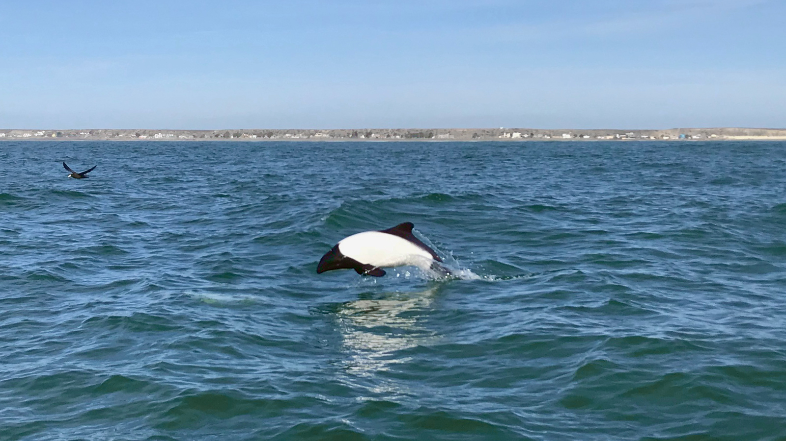

// add cover image to img directory and update filename below
ifdef::backend-html5[]

endif::backend-html5[]

== Colophon

[#citation]
=== Suggested citation

Zermoglio PF, Chapman AD, Wieczorek JR, Luna MC & Bloom DA (2020) Georeferencing Quick Reference Guide. Copenhagen: GBIF Secretariat. https://doi.org/10.35035/e09p-h128

=== Authors

https://orcid.org/0000-0002-6056-5084[Paula F. Zermoglio], https://orcid.org/0000-0003-1700-6962[Arthur D. Chapman], https://orcid.org/0000-0003-1144-0290[John R. Wieczorek], https://orcid.org/0000-0002-6392-8864[Marie Celeste Luna] & https://orcid.org/0000-0003-1273-1807[David A. Bloom]

=== Contributors

=== Licence

The document _Georeferencing Quick Reference Guide_ is licensed under https://creativecommons.org/licenses/by-sa/4.0[Creative Commons Attribution-ShareAlike 4.0 Unported License].

=== Disclaimer

The information in this book represents the professional opinion of the authors, and does not necessarily represent the views of the publisher. While the authors and the publisher have attempted to make this book as accurate and as thorough as possible, the information contained herein is provided on an "As Is" basis, and without any warranties with respect to its accuracy or completeness. The authors and the publisher shall have no liability to any person or entity for any loss or damage caused by using the information provided in this book.

Where there are differences in interpretation between this document and translated versions in languages other than English, the English version remains the original and definitive version.

=== Persistent URI

https://doi.org/10.35035/e09p-h128

=== Document control

Third edition, December 2020

=== Cover image

Commerson's dolphin (_Cephalorhynchus commersonii_), off the coast of Chubut, Argentina. Photo 2018 Gabriel Laufer via https://www.gbif.org/occurrence/2563539903[iNaturalist research-grade observations], in the public domain under http://creativecommons.org/publicdomain/zero/1.0/[CC0].
