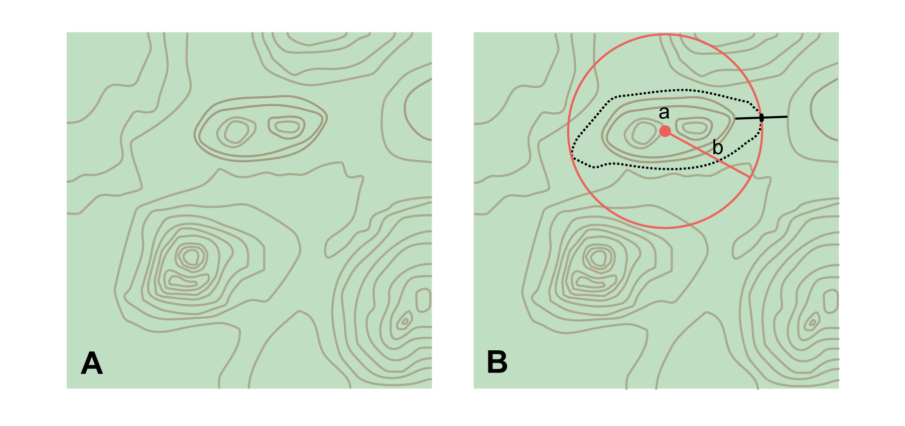
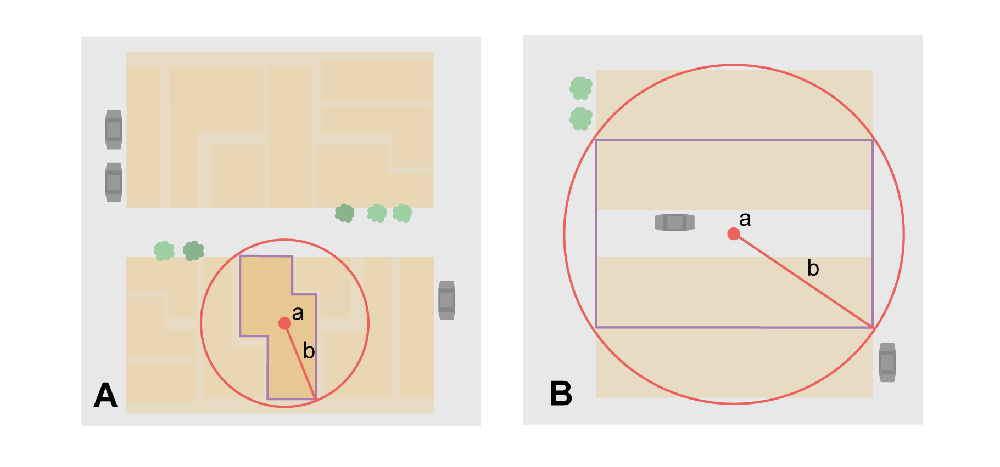
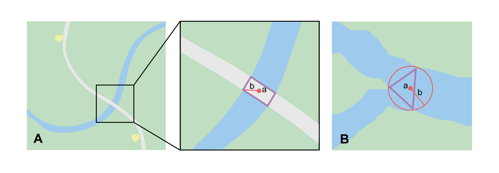
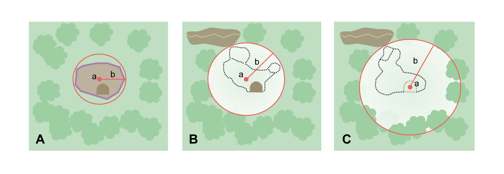
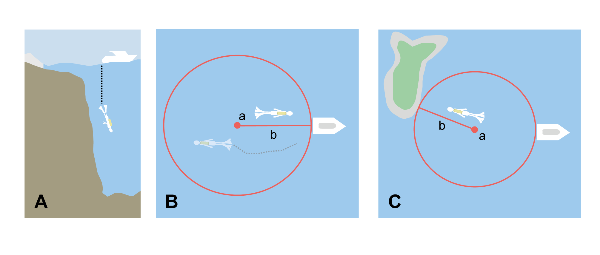
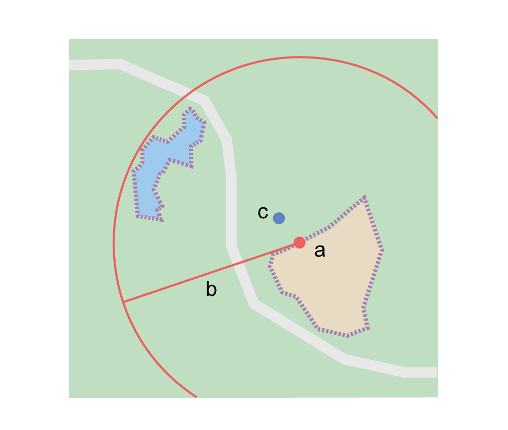

*GEOREFERENCING*

*QUICK REFERENCE GUIDE*

Paula F. Zermoglio, Arthur D. Chapman, John R. Wieczorek, María Celeste Luna, David A. Bloom

April 2020

Published by:

Global Biodiversity Information Facility, Copenhagen

http://www.gbif.org[_http://www.gbif.org_]

_Georeferencing Quick Reference Guide_ is licensed under https://creativecommons.org/licenses/by/4.0[_Creative Commons Attribution 4.0 Unported License_]

The information in this book represents the professional opinion of the authors, and does not necessarily represent the views of the publisher. While the authors and the publisher have attempted to make this book as accurate and as thorough as possible, the information contained herein is provided on an "as is" basis, and without any warranties with respect to its accuracy or completeness. The authors and the publisher shall have no liability to any person or entity for any loss or damage caused by using the information provided in this book.

Where there are differences in interpretation between this document and translated versions in languages other than English, the English version remains the original and definitive version.

Georeferencing Quick Reference Guide

Recommended Citation:

Zermoglio PF, Chapman AD, Wieczorek JR, Luna MC, Bloom DA. 2020. _Georeferencing Quick Reference Guide_. Copenhagen: GBIF Secretariat. https://doi.org/10.35035/e09p-h128[_https://doi.org/10.35035/e09p-h128_]

Contents

== Introduction

This is a practical guide for ¤<<georeference,georeferencing>>¤. It describes the protocols to determine the shapes of ¤<<feature,features>>¤ and how to use them as the basis for georeferencing with the ¤<<point-radius>>¤ ¤<<georeferencing method>>¤ (Wieczorek 2001, Wieczorek _et al._ 2004, Chapman & Wieczorek 2020) using the http://georeferencing.org/georefcalculator/gc.html[_*Georeferencing Calculator*_] (Wieczorek & Wieczorek 2019), and its associated *_Georeferencing Calculator Manual_* (Bloom _et al_. 2020), maps, ¤<<gazetteer,gazetteer>>¤, and other resources from which ¤<<coordinates>>¤ and spatial ¤<<boundary,boundaries>>¤ for places can be found. This document is a citable <<**georeference protocol>>. **If a derived protocol is used, a new document should be made publicly available and cited with attribution to this document.

The *_Guide_*, in its first version (Wieczorek __et al. __2012), was an adaptation of *_Georeferencing for Dummies* _(Spencer _et al. n.dat.)._ It explains the recommended ¤<<georeference,georeferencing>>¤ procedures for the most commonly encountered type of ¤<<locality,localities>>¤. This __*Guid*__e should be used in parallel with *_Georeferencing Best Practices* _(Chapman & Wieczorek 2020), which contains the theoretical background and more detailed information about concepts used here.

Throughout this document there are terms with a very specific meaning as it is being used here. Those that are given in *bold* have a link to the *_<<Glossary>>_* of the *_<<Georeferencing Best Practices>>_* where they are defined in detail. Terms in italics and not bold (_e.g._, _Input Latitude_) are references to fields or labels in the *_Calculator_*. Terms in italics and bold (_e.g._, *_georeferenceRemarks_*) are names of terms in the *<<Darwin Core>>.*

At the end of this document is a ¤<<Georeference Quick Reference Guide Key to Locality Types>>¤, which contains a quick summary of the ¤<<georeferencing protocol,protocols>>¤ for the most common ¤<<locality type,locality types>>¤, described in detail in the sections of this guide.

=== Objectives

This document provides guidance on how to ¤<<georeference>>¤ using the ¤<<point-radius>>¤ ¤<<georeferencing method,method>>¤. This *_Guide_* also provides the methods for determining the ¤<<boundary,boundaries>>¤ of ¤<<feature,features>>¤, which form the basis of the ¤<<shape>>¤ ¤<<georeferencing method,method>>¤.

=== Target Audience

This document is a practical guide for anyone who needs to ¤<<georeference>>¤ textual ¤<<locality>>¤ descriptions so that they can be used in spatial filtering or analysis in research, education, or the maintenance of biological collections data.

=== Scope

This document is one of three that cover recommended requirements and methods to ¤<<georeference>>¤ ¤<<location,locations>>¤. It provides a practical how-to guide for putting the theory of the ¤<<point-radius>> <<georeferencing method>>¤ into practice.

The *_Guide_* relies on the *_<<Georeferencing Best Practices>>_* for background, definitions, and more detailed explanations of the theory behind the methods and calculations found here and in the *_Calculator_*.

The *_Georeferencing Calculator_* is a browser-based javascript application that aids in ¤<<georeference,georeferencing>>¤ descriptive ¤<<locality,localities>>¤, making the calculations necessary to obtain ¤<<geographic coordinates>>¤ and ¤<<uncertainty,uncertainties>>¤ for ¤<<location,locations>>¤ using the ¤<<point-radius>>¤ ¤<<georeferencing method,method>>¤.

These documents DO NOT provide guidance on georectifying images or ¤<<geocoding>>¤ street addresses – distinct operations that are sometimes called "georeferencing".

=== Changes from Previous Version

There have been a few changes in terminology since the previous edition of the *_Guide_*. These include:

* *extent* in the previous version has been changed to ¤<<radial>>¤. ¤<<extent,Extent>>¤, where retained, is used in a more traditional way to mean the entire space within a ¤<<location>>¤.
* "named place" has been replaced with "¤<<feature>>¤".
* where the ¤<<geographic center>>¤ was recommended in the past, ¤<<corrected center>>¤ based on the ¤<<geographic radial>>¤ is now used. This is an important change because the ¤<<geographic center>>¤ did not necessarily yield the smallest ¤<<uncertainty>>¤ due to the ¤<<extent>>¤ of a ¤<<feature>>¤; the ¤<<corrected center>>¤ and ¤<<geographic radial>>¤ does.

This version of the *_Guide_* includes graphical examples of each type of location and steps for how to ¤<<georeference>>¤ them.

=== Using Darwin Core

¤<<georeference,Georeferences>>¤ using the methods in this *_Guide_* will be of greatest value if as much information as possible is captured about and during the ¤<<georeference,georeferencing>>¤ process. The ¤<<Darwin Core>>¤ Standard (TDWG 2018) defines all of the fields recommended for the capture of reproducible ¤<<georeference,georeferences>>¤, as follows:

*<<Darwin Core>>* ¤<<georeference,georeferencing>>¤ terms:

http://rs.tdwg.org/dwc/terms/#dwc:decimalLatitude[_*decimalLatitude*_], http://rs.tdwg.org/dwc/terms/#dwc:decimalLongitude[_*decimalLongitude*_], http://rs.tdwg.org/dwc/terms/#dwc:geodeticDatum[_*geodeticDatum*_]:: the combination of these fields provide the reference for the center of the ¤<<point-radius>>¤ representation of the ¤<<georeference>>¤.
http://rs.tdwg.org/dwc/terms/#dwc:coordinateUncertaintyInMeters[_*coordinateUncertaintyInMeters*_]::  The horizontal distance in meters from the given *_decimalLatitude_* and *_decimalLongitude_* that describes the ¤<<smallest enclosing circle>>¤ that contains the whole of the ¤<<location>>¤. Leave the value empty if the ¤<<uncertainty>>¤ is unknown, cannot be estimated, or is not applicable (because there are no ¤<<coordinates>>¤). Zero is not a valid value for this term. This term corresponds with the ¤<<geographic radial>>¤ of the final ¤<<georeference>>¤.
http://rs.tdwg.org/dwc/terms/#dwc:georeferencedBy[_*georeferencedBy*_], http://rs.tdwg.org/dwc/terms/#dwc:georeferencedDate[_*georeferencedDate*_]:: the individual(s) who last modified the ¤<<georeference>>¤ and when. These correspond to the final authority on the ¤<<georeference>>¤ in its current state, regardless of who might have worked on previous versions of the ¤<<georeference>>¤.
http://rs.tdwg.org/dwc/terms/#dwc:georeferenceProtocol[_*georeferenceProtocol*_]::  A description or reference to the methods used to determine the ¤<<shape>>¤ using the ¤<<shape>>¤ ¤<<georeferencing method>>¤, or the ¤<<coordinates>>¤ and ¤<<uncertainty>>¤ using the ¤<<point-radius>>¤ ¤<<georeferencing method,method>>¤. If the protocol in this *_Guide_* is used unaltered, then the *_georeferenceProtocol_* should be the citation for this document.
http://rs.tdwg.org/dwc/terms/#dwc:georeferenceSources[_*georeferenceSources*_]::  A list (concatenated and separated) of maps, ¤<<gazetteer,gazetteers>>¤, or other resources used to ¤<<georeference>>¤ the ¤<<location>>¤, described specifically enough to allow anyone in the future to use the same resources.

+
Examples: "USGS 1:24000 Florence Montana Quad", "Terrametrics® 2008 Google Earth™", "Wieczorek C, J Wieczorek (2020) Georeferencing Calculator. Version yyyymmdd. Available: http://georeferencing.org/georefcalculator/gc.html. Accessed [yyyy-mm-dd]"

* http://rs.tdwg.org/dwc/terms/#dwc:georeferenceVerificationStatus[_*georeferenceVerificationStatus*_]::  A categorical description of the extent to which the ¤georeference¤ has been verified to represent the best possible spatial description. Recommended best practice is to use a controlled vocabulary.

+
Examples: "requires verification", "verified by collector", "verified by curator".

* http://rs.tdwg.org/dwc/terms/#dwc:georeferenceRemarks[_*georeferenceRemarks*_]::  Notes or comments out of the ordinary about the ¤<<georeference>>¤, explaining assumptions made in addition or opposition to those formalized in the method referred to in *_georeferenceProtocol_*.

+
Example: "assumed distance by road (Hwy. 101)"

* http://rs.tdwg.org/dwc/terms/#dwc:locationRemarks[_*locationRemarks*_]::  Notes or comments of interest about the ¤<<location>>¤ (not the ¤<<georeference>>¤ of the ¤<<location>>¤, which go in *_georeferenceRemarks_*).

+
Example: "Villa Epecuen was inundated in November 1985 and ceased to be inhabited until 2009"

For additional community discussion and recommendations, see the ¤<<Darwin Core>>¤ Project wiki (Wieczorek 2017), the https://github.com/tdwg/dwc-qa/wiki/Webinars[_Darwin Core Hour Webinars_] and *_<<Georeferencing Best Practices>>_*.

=== Georeferencing Concepts

One of the goals of ¤<<georeference,georeferencing>>¤ following best practices is to be sure that enough information is provided in the output so that the ¤<<georeference>>¤ is repeatable (see <<Principles of Best Practice>> in *_Georeferencing Best Practices_*). To that end, this document provides a set of recipes for ¤<<georeference,georeferencing>>¤ various ¤<<locality type,locality types>>¤ using the *_Georeferencing Calculator_*. The *_Calculator_* allows you to make distinct kinds of calculations based on the ¤<<locality type>>¤ (<<Locality Type>>). When the ¤<<locality type>>¤ is chosen from the predefined list, the *_Calculator_* presents input boxes for all of the parameters needed for that type of calculation. Note that the ¤<<locality type>>¤ is for the most specific ¤<<locality clause,clause>>¤ in the ¤<<locality>>¤ description (see <<Parsing the Locality Description>> in *_Georeferencing Best Practices_*), but there may be information for other ¤<<locality clause,clauses>>¤ or other parts of the ¤<<location>>¤ record that help to constrain the ¤<<location>>¤ and come into play when a ¤<<feature>> <<boundary>>¤ is determined. Many *_Calculator_* parameters are used for more than one ¤<<locality type>>¤. Rather than repeat the explanation for each ¤<<locality type>>¤, they are collected here for common reference. Some ¤<<locality type,locality types>>¤ require specific parameters, for which the corresponding explanations are included in each subsection of <<Georeferencing Method for Locality Type>>. Refer to the *_Georeferencing Calculator Manual_* (Bloom _et al._ 2020) for details about the *_Calculator_* not answered in this document.

==== Locality Type

The ¤<<locality type>>¤ refers to the pattern of the most specific part of a ¤<<locality>>¤ description to be ¤<<georeference,georeferenced>>¤ – the one that determines which calculation method to use. The *_Calculator_* has options to compute ¤<<georeference,georeferences>>¤ for six basic ¤<<locality type,locality types>>¤:

* ¤<<coordinates,Coordinates>>¤ only.
* Geographic ¤<<feature>>¤ only.
* Distance only.
* Distance along a path.
* Distance along orthogonal ¤<<direction,directions>>¤.
* Distance at a ¤<<heading>>¤.

Selecting a ¤<<locality type,Locality Type>>¤ will configure the *_Calculator_* to show all of the parameters that need to be set to perform the ¤<<georeference>>¤ calculation. This *_Guide_* gives specific instructions for how to set the parameters for many different examples of each of the ¤<<locality type,Locality Types>>¤.

==== Corrected Center

The ¤<<corrected center>>¤ is the point within a ¤<<location>>¤, or on its ¤<<boundary>>¤, that minimizes the ¤<<geographic radial>>¤ (see <<Radial of Feature>>). This point is obtained by finding the ¤<<smallest enclosing circle>>¤ that contains the entire ¤<<feature>>¤, and then taking the center of that circle (xref:img-corrected-center[xrefstyle="short"]A). If that center does not fall on or inside the ¤<<boundary,boundaries>>¤ of the ¤<<feature>>¤, find the ¤<<smallest enclosing circle>>¤ that contains the entire ¤<<feature>>¤, *but* has its center on the ¤<<boundary>>¤ of the ¤<<feature>>¤ (xref:img-corrected-center[xrefstyle="short"]B). Note that in the corrected case, the new circle, and hence the ¤<<radial>>¤, will always be larger than the uncorrected one. In the *_Calculator_*, the ¤<<coordinates>>¤ corresponding to the ¤<<corrected center>>¤ are labelled as _Input Latitude_ and _Input Longitude_.

[#img-corrected-center]
.**Ⓐ**: The *center* ⓐ of the ¤<<smallest enclosing circle>>¤ of a ¤<<feature>>¤ (polygon highlighted in light grey). Note that the center does not fall within the ¤<<boundary>>¤ of the ¤<<feature>>¤. **Ⓑ**: The ¤<<corrected center>>¤ ⓑ, which is on the ¤<<boundary>>¤ of the ¤<<feature>>¤, and the corresponding ¤<<geographic radial>>¤ ⓒ.
image::img/corrected-center.png[width=597,align="center"]

==== Radial of Feature

A ¤<<feature>>¤ is a place in the ¤<<locality>>¤ description that has an ¤<<extent>>¤ and can be delimited by a ¤<<boundary>>¤. The ¤<<geographic radial>>¤ of the ¤<<feature>>¤ (shown as _Radial of Feature_ in the *_Calculator_*) is the distance from the ¤<<corrected center>>¤ of the ¤<<feature>>¤ to the furthest point on the ¤<<geographic boundary>>¤ of that ¤<<feature>>¤ (see xref:img-corrected-center[xrefstyle="short"] and <<Extent of a Location>> in *_<<Georeferencing Best Practices>>_*). Note that the radial was called "*extent*" in early versions of the *_Calculator_*.

NOTE: The final <<georeference>> will have a <<geographic radial>> distinct from the <<geographic radial>> of any of the <<feature,features>> in the <<locality>> description (because it will also encompass all sources of <<uncertainty>>), and this will be captured in the output from the Calculator in the *Uncertainty* field.

==== Latitude

Labelled as _Input Latitude_ in the *_Calculator_*. The ¤<<geographic coordinates,geographic coordinate>>¤ north or south of the equator (where ¤<<latitude>>¤ is 0) that represents the starting point for a ¤<<georeference>>¤ calculation and depends on the ¤<<locality type>>¤.

¤<<latitude,Latitudes>>¤ in ¤<<decimal degrees>>¤ north of the equator are positive by convention, while ¤<<latitudes>>¤ to the south are negative. The *_Calculator_* supports three degree-based ¤<<geographic coordinates,geographic coordinate>>¤ formats for ¤<<latitude>>¤ and ¤<<longitude>>¤: ¤<<decimal degrees>>¤ (_e.g._, -41.0570673), degrees decimal minutes (_e.g._, 41° 3.424"), and ¤<<DMS,degrees minutes seconds>>¤ (_e.g._, 41° 3' 25.44" S).

==== Longitude

Labelled as _Input Longitude_ in the *_Calculator_*. The ¤<<geographic coordinates,geographic coordinate>>¤ east or west of the ¤<<prime meridian>>¤ (an arc between the north and south poles where ¤<<longitude>>¤ is 0) that represents the starting point for a ¤<<georeference>>¤ calculation and depends on the ¤<<locality type>>¤.

¤<<longitude,Longitudes>>¤ in ¤<<decimal degrees>>¤ east of the ¤<<prime meridian>>¤ are positive by convention, while ¤<<longitude,longitudes>>¤ to the west are negative. The *_Calculator_* supports three degree-based ¤<<geographic coordinates,geographic coordinate>>¤ formats for ¤<<latitude>>¤ and ¤<<longitude>>¤: ¤<<decimal degrees>>¤ (-71.5246934), degrees decimal minutes (71° 31.482"), and ¤<<DMS,degrees minutes seconds>>¤ (71° 31' 28.90" W).

==== Coordinate Source

The _Coordinate Source_ is the type of resource (map type, ¤<<GPS>>¤, ¤<<gazetteer>>¤, ¤<<locality>>¤ description) from which the starting _Input Latitude_ and _Longitude_ were derived.

// TODO That > sign after Maps?
NOTE: More often than not, the original ¤<<coordinates>>¤ are used to find the general vicinity of the ¤<<location>>¤ on a map, after which the process of determining the ¤<<corrected center>>¤ provides the new ¤<<coordinates>>¤. The **Coordinate Source** to use in the **Calculator** in this case is the map from which the ¤<<corrected center>>¤ was determined, not the original source used to determine the general vicinity on the map. For example, suppose the original ¤<<coordinates>>¤ came from a ¤<<gazetteer>>¤, but the ¤<<boundary>>¤ and ¤<<corrected center>>¤ of the ¤<<feature>>¤ were determined from Google Maps™, the **Coordinate Source** would be "**Google Earth/Maps >2008**", not "**gazetteer**".

This term is related to, but *NOT* the same as, the ¤<<Darwin Core>>¤ term *_georeferenceSources_*, which requires the specific resources used rather than their type. Note that the ¤<<uncertainty,uncertainties>>¤ from the two sources _gazetteer_ and _locality description_ can not be anticipated universally, and therefore do not contribute to the global ¤<<uncertainty>>¤ in the calculations. If the ¤<<error>>¤ characteristics of these sources are known, they can be added in the _Measurement Error_ field before calculating. If the source _GPS_ is selected, the label for _Measurement Error_ will change to _GPS Accuracy_, which is where the ¤<<accuracy>>¤ of the ¤<<GPS>>¤ (see <<Using a GPS>> in *_Georeferencing Best Practices_*) at the time the ¤<<coordinates>>¤ were taken should be entered.

==== Coordinate Format

The _Coordinate Format_ in the *_Calculator_* defines the representation of the original ¤<<geographic coordinates>>¤ (¤<<decimal degrees>>¤, ¤<<DMS,degrees minutes seconds>>¤ degrees decimal minutes) of the ¤<<coordinates,coordinate>>¤ source.

NOTE: More often than not, the original ¤<<coordinates>>¤ are used to find the general vicinity of the ¤<<location>>¤ on a map, after which the process of determining the ¤<<corrected center>>¤ provides the new ¤<<coordinates>>¤. The **Coordinate Format** to use in the **Calculator** in this case is the ¤<<coordinate format>>¤ on the map from which the ¤<<corrected center>>¤ was determined, not the <<coordinate format>> of the original source used to determine the general vicinity on the map. For example, suppose the original ¤<<coordinates>>¤ came from a ¤<<gazetteer>>¤ in <<DMS,degrees minutes seconds>>, but the ¤<<boundary>>¤ and ¤<<corrected center>>¤ of the ¤<<feature>>¤ were determined from Google Maps™, the **Coordinate Format** would be **decimal degrees**, not **degrees minutes seconds**.

This term is equivalent to the ¤<<Darwin Core>>¤ term *_verbatimCoordinateSystem_*. Selecting the original ¤<<coordinate format>>¤ allows the ¤<<coordinates>>¤ to be entered in their native format and forces the *_Calculator_* to present appropriate options for ¤<<coordinate precision>>¤. Changing the ¤<<coordinate format>>¤ will automatically reset the ¤<<coordinate precision>>¤ value to _nearest degree_. Be sure to correct this for the actual ¤<<coordinate precision>>¤. The *_Calculator_* stores ¤<<coordinates>>¤ in ¤<<decimal degrees>>¤ to seven decimal places. This is to preserve the correct ¤<<coordinates>>¤ in all formats regardless of how many ¤<<coordinates,coordinate>>¤ transformations are done.

==== Coordinate Precision

Labeled in the *_Calculator_* as _Precision_ in the first column of input parameters, this drop-down list is populated with levels of ¤<<precision>>¤ in keeping with the ¤<<coordinate format>>¤ chosen. For example, with a _Coordinate Format_ of _degrees minutes seconds_, an _Input Latitude_ of 35° 22' 24" N and an _Input Longitude_ of 105° 22’ 28" W, the _Coordinate Precision_ would be _nearest second_. A value of _exact_ is any level of ¤<<precision>>¤ higher than the otherwise highest ¤<<precision>>¤ given on a list. Sources of ¤<<coordinate precision>>¤ may include paper or digital maps, digital imagery, ¤<<GPS>>¤, ¤<<gazetteer,gazetteers>>¤, or ¤<<locality>>¤ descriptions.

NOTE: The **Coordinate Precision** to use in the **Calculator** is the ¤<<coordinate precision>>¤ of the map from which the ¤<<corrected center>>¤ was determined, not the ¤<<coordinate precision>>¤ of the original source used to determine the general vicinity on the map. For example, suppose the original ¤<<coordinates>>¤ came from a ¤<<gazetteer>>¤, but the ¤<<boundary>>¤ and ¤<<corrected center>>¤ of the ¤<<feature>>¤ were determined from *_Google Maps_*, the **Coordinate Precision** would be determined by the number of digits of <<decimal degrees>> you captured from the ¤<<corrected center>>¤ on Google Maps™, not the **Coordinate Precision** of the ¤<<coordinates>>¤ from the original ¤<<gazetteer entry>>¤. If you use all of the digits provided on Google Maps™, the **Coordinate Precision** would be **exact**.

NOTE: This term is similar to, but **NOT** the same as, the <<Darwin Core>> term coordinatePrecision, which applies to the output ¤<<coordinates>>¤.

==== Datum

Defines the position of the origin and orientation of an ¤<<ellipsoid>>¤ upon which the ¤<<coordinates>>¤ are based for the given _Input Latitude_ and __Longitude__ (see <<Coordinate Reference System>> in *_Georeferencing Best Practices_*).

_NOTE: The **Datum** to use in the **Calculator** is the ¤<<datum>>¤ (or ¤<<ellipsoid>>¤) of the map from which the ¤<<corrected center>>¤ was determined. For example, suppose the original ¤<<coordinates>>¤ came from a ¤<<gazetteer>>¤ with an unknown <<datum>>, but the ¤<<boundary>>¤ and ¤<<corrected center>>¤ of the ¤<<feature>>¤ were determined from Google Maps™, the **Datum** would be **WGS84**, not **datum not recorded**.

The term _Datum_ in the *_Calculator_* is equivalent to the ¤<<Darwin Core>>¤ term *_geodeticDatum_*. The *_Calculator_* includes ¤<<ellipsoid,ellipsoids>>¤ on the __Datum __drop-down list, as sometimes that is all that ¤<<coordinates,coordinate>>¤ source shows. The choice of ¤<<datum>>¤ in the *_Calculator_* has two important effects. The first is the contribution to ¤<<uncertainty>>¤ if the ¤<<datum>>¤ of the input ¤<<coordinates>>¤ is not known. If the ¤<<datum>>¤ and ¤<<ellipsoid>>¤ are not known, _datum not recorded_ must be selected. ¤<<uncertainty,Uncertainty>>¤ due to an unknown ¤<<datum>>¤ can be severe and varies geographically in a complex way with a worst-case contribution of 5359 m (see <<Coordinate Reference System>> in <<__*Georeferencing Best Practices>>*__). The second important effect of the ¤<<datum>>¤ selection is to provide the characteristics of the ¤<<ellipsoid>>¤ model of the earth, on which the distance calculations depend.

==== Direction

The _Direction_ in the *_Calculator_* is the ¤<<heading>>¤ given in the ¤<<locality>>¤ description, either as a standard compass point (see https://en.wikipedia.org/wiki/Boxing_the_compass[_Boxing_the_compass_]) or as a number of degrees in the clockwise direction from north. True North is not the same as Magnetic North (see <<Headings>> in *_Georeferencing Best Practices_*). If a ¤<<heading>>¤ is known to be a magnetic ¤<<heading>>¤, it will have to be converted into a true ¤<<heading>>¤ (see NOAA's https://www.ngdc.noaa.gov/geomag/calculators/magcalc.shtml[_Magnetic Field Calculator_]) before it can be used in the *_Georeferencing Calculator_*. If _degrees from N_ is selected, a text box will appear to the right of the selection, into which the degree ¤<<heading>>¤ should be entered.

NOTE: Some marine **locality** descriptions reference a direction (azimuth) toward a landmark rather than a ¤<<heading>>¤ from the current **location** (e.g., "327° to Nubble Lighthouse"). To make a **Distance** at a <<heading>>** calculation for such a ¤<<locality>>¤ description, use the compass point 180 degrees from the one given in the ¤<<locality>>¤ description (147° in the example above) as the **Direction**.

==== Offset Distance

The _Offset Distance_ in the *_Calculator_* is the linear surface distance from a point of origin. ¤<<offset,Offsets>>¤ are used for the _Locality Types_ _Distance at a heading_ and _Distance only_. If the _Locality Type_ _Distance along orthogonal directions_ is selected, there are two distinct ¤<<offsets>>¤:

North or South Offset Distance:: The distance to the north or south (set with the selection box to the right of the distance text box) of the _Input Latitude_.

East or West Offset Distance:: The distance to the east or west (set with the selection box to the right of the distance text box) of the _Input Longitude_.

==== Distance Units

The _Distance Units_ selection denotes the real world units used in the ¤<<locality>>¤ description. It is important to select the original units as given in the description. This is needed to incorporate the ¤<<uncertainty>>¤ from ¤<<distance precision>>¤ properly. If the ¤<<locality>>¤ description does not include distance units, use the distance units of the map from which measurements are derived.

.{blank}
====
Examples: select _mi_ for "10 mi E (by air) Bakersfield"; select _km_ for "3.2 km SE of Lisbon"; select _km_ for measurements in Google Maps™ where the distance units are set to _km_.
====

==== Distance Precision

The _Distance Precision_, labeled in the __**C**alculator** __as _Precision_ in the second column of input parameters, refers to the ¤<<precision>>¤ with which a distance was described in a ¤<<locality>>¤ (see <<Uncertainty Related to Offset Precision>> in <<__*Georeferencing Best Practices>>*__). This drop-down list is populated based on the _Distance Units_ chosen and contains powers of ten and simple fractions to indicate the ¤<<precision>>¤ demonstrated in the verbatim original ¤<<offset>>¤.

Examples: select _1 mi_ for "6 mi NE of Davis"; select _¼ km_ for "3.75 km W of Hamilton"

==== Measurement Error

The _Measurement Error_ accounts for ¤<<error>>¤ associated with the ability to distinguish one point from another using any measuring tool, such as rulers on paper maps or the measuring tools on Googlehttps://docs.google.com/document/d/19zCg20WcRCqQeqJxU33np7IIFhuE4dPl_XKSNCggExM/edit#heading=h.c6adhmx0uk1[™] Maps or Googlehttps://docs.google.com/document/d/19zCg20WcRCqQeqJxU33np7IIFhuE4dPl_XKSNCggExM/edit#heading=h.c6adhmx0uk1[™] Earth. The units of measurement must be the same as those in the ¤<<locality>>¤ description as captured in _Distance Units_ (see <<Distance Units>>). The _Distance Converter_ at the bottom of the *_Calculator_* is provided to aid in changing a measurement to the ¤<<locality>>¤ description units. For example, a measurement error of 1 mm on a map of 1:24,000 scale would be 24 m.

==== GPS Accuracy

When _GPS_ is selected from the _Coordinate Source_ drop-down list, the label for the _Measurement Error_ text box changes to _GPS Accuracy_. Enter a value that we recommend is at least twice the value given by the ¤<<GPS>>¤ at the time the ¤<<coordinates>>¤ were captured (see <<Uncertainty due to GPS>> in <<__*Georeferencing Best Practices*__>>). If _GPS Accuracy_ is not known, enter 100 m for standard hand-held ¤<<GPS>>¤ ¤<<coordinates>>¤ taken before 1 May 2000 when Selective Availability was discontinued. After that, use 30 m as a conservative default value.

==== Uncertainty

The __Uncertainty __in the *_Calculator_* is the calculated result of the combination of all sources of ¤<<uncertainty>>¤ (¤<<coordinate precision>>¤, unknown <<**datum>**, data source, ¤<<GPS>>¤ ¤<<accuracy>>¤, measurement ¤<<error>>¤, ¤<<feature>> <<extent>>¤, distance ¤<<precision>>¤, and ¤<<heading>>¤ ¤<<precision>>¤) expressed as a linear distance – the ¤<<geographic radial>>¤ of the ¤<<georeference>>¤ and the ¤<<radial,radius>>¤ in the ¤<<point-radius>>¤ ¤<<georeferencing method,method>>¤ (Wieczorek _et al_. 2004). Along with the _Output Latitude_, _Output Longitude_, and _Datum_, the ¤<<radial,radius>>¤ defines a circle containing all of the possible places a ¤<<locality>>¤ description could mean. In the *_Calculator_* the __Uncertainty __is given in meters.

== Georeferencing Methods for Locality Type

=== Geographic Feature only

*Definition:* The simplest ¤<<locality>>¤ descriptions consist of only a named place, or more generally, a ¤<<feature>>¤, which is often listed in a standard ¤<<gazetteer>>¤ and can probably be located on a map of the appropriate scale.

Despite how they might be presented in a ¤<<gazetteer>>¤ or on a map, ¤<<feature,features>>¤ are not points; they are areas that have a spatial ¤<<extent>>¤. Some ¤<<feature,features>>¤ can have an obvious spatial ¤<<extent>>¤, while others may not. All variations of ¤<<feature,features>>¤ are treated in this *_*G**uide*_* as one or the other of these two main categories. The basic methodology is to try to determine the ¤<<boundary,boundaries>>¤ of the ¤<<feature>>¤, its ¤<<corrected center>>¤ and a measure of how specific the ¤<<feature>>¤ is (defined here by the ¤<<geographic radial>>¤).

_NOTE: ¤<<coordinates,Coordinates>>¤ from geographic indexes such as ¤<<gazetteer,gazetteers>>¤ often use reference points that are not necessarily in the center of the **feature**. For example, a river may be referenced by its mouth, and a town by its main post office, courthouse, or main plaza. It is best to use a visual reference to determine <<boundary,**boundaries>>,** centers, and **radials**. For this reason, it is a good idea to use the <<**gazetteer>> <<coordinates>> **to find the ¤<<feature>>¤ on a map, and then use the map to find the <<boundary,**boundaries>>**, ¤<<corrected center>>¤, and <<geographic radial>> of the ¤<<feature>>¤*.

==== Feature – with Obvious Spatial Extent

The ¤<<locality>>¤ refers to a geographic ¤<<feature>>¤ with discernible spatial ¤<<extent>>¤, _i.e._, the ¤<<boundary,boundaries>>¤ of the ¤<<feature>>¤ can be determined easily (<<Figure 2>>).

*Examples*: "Puerto Madryn", "Isla Tiburón", "Yosemite National Park", "Botany Bay"

**Locality Type: **__Geographic feature only__

**Step 1 – Determine the **¤<<feature>>¤ <<boundary,*boundaries>> :* This step is to determine the ¤<<shape>>¤ that contains the ¤<<feature>>¤. This is typically done by drawing a polygon around the ¤<<feature>>¤ (<<Figure 2>>A), but some features may require more complex ¤<<geometry,geometries>>¤, such as multiple polygons.

____
_NOTE: Record the source (including date) used to determine the <<boundary,boundaries>> (see georeferenceSources).
____

*Step 2 – Determine the <<coordinates>>:* Use the ¤<<coordinates>>¤ of the ¤<<corrected center>>¤ of the ¤<<feature>>¤ ("*a*" in <<Figure 2>>B) as the _Input Latitude_ and _Longitude_.

*Step 3 – Measure the <<geographic radial>>:* Measure the distance from the ¤<<corrected center>>¤ to the furthest point on the ¤<<boundary>>¤ of the ¤<<feature>>¤ ("*b*" in <<Figure 2>>B) as the _Radial of Feature_.

*Step 4 – Calculate using the following additional parameters:* _Coordinate Source_, _Coordinate Format_, _Datum_, _Coordinate Precision_, _GPS Accuracy_/_Measurement Error_, and _Distance Units_ (see <<Georeferencing Concepts>>).

image::img/100002010000071A000003529BD94CBB6CC48702.png[width=618,align="center"]

*Figure 2.* *A.* ¤<<boundary,Boundary>>¤ only, and *B. <<boundary>>*, center (a) of the ¤<<smallest enclosing circle>>¤ and ¤<<geographic radial>>¤ (b) of a ¤<<feature>>¤ with obvious spatial ¤<<extent>>¤. The center (a) falls within the ¤<<boundary,boundaries>>¤ and thus needs no correction.

==== Feature – without Obvious Spatial Extent

The ¤<<locality>>¤ refers to a geographic ¤<<feature>>¤ that does not have an easily discernible spatial ¤<<boundary>>¤. Some ¤<<feature,features>>¤ may have undefined <<boundary,*boundaries>> *(__e.g., __mountains, unincorporated towns, etc.). Other ¤<<feature,features>>¤ may only have a label, with no apparent ¤<<boundary,boundaries>>¤ or size on a map because they are small or obscured on satellite imagery (_e.g._, spring, monument, etc.). Another possibility is a feature with only ¤<<coordinates>>¤ from a ¤<<gazetteer>>¤ and no discernible presence on a map.

*Examples*: "Pampa Grande" as a region, "Mt Hypipamee", "Great Barrier Reef"

*Locality Type:* _Geographic feature only_

**Step 1 – Estimate the <<feature>> **<<boundary,**boundaries>>: **Determine the ¤<<boundary,boundaries>>¤ of the ¤<<feature>>¤ as well as possible using visible evidence for the ¤<<feature>>¤ on a map. Try to get into the mind of the person who recorded the ¤<<locality>>¤. Imagine yourself there. What circumstances would influence which ¤<<feature>>¤ was recorded and what circumstances would have encouraged them to choose a different ¤<<feature>>¤?

For towns without obvious borders one can use the presence of buildings near the ¤<<coordinates>>¤ given for the town to decide where the town ends (<<Figure 3>>). In some cases there might not be such indicators and these will be more subjective. For this reason it is particularly important to document the rationale for the selection of the ¤<<locality>>¤ with unclear ¤<<boundary,boundaries>>¤.

image::img/100002010000039B000003525A9F4ACBEB29E2F3.png[width=378,align="center"]

*Figure 3.* ¤<<boundary,Boundary>>¤ (lighter dotted line), ¤<<corrected center>>¤ (a) and ¤<<geographic radial>>¤ (b) of a town based on the locations of buildings and a well-defined neighboring town border (denoted by the darker dotted line) on a map.

Where there are no indicators for the ¤<<boundary>>¤, use the midpoint between the given ¤<<feature>>¤ and neighboring ¤<<feature,features>>¤ with similar type, size, or importance to make a rough ¤<<boundary>>¤. Though this ¤<<boundary>>¤ may not represent the actual ¤<<feature>>¤ very well, it will represent the ¤<<uncertainty>>¤ of where the ¤<<locality>>¤ is, and that is the major goal of the ¤<<georeference>>¤.

For small ¤<<feature,features>>¤, where the only indicator on a map is a label and possibly a marker, or where there are only ¤<<coordinates>>¤ from a ¤<<gazetteer>>¤ (and no further indicators at those ¤<<coordinates>>¤ on a map), a good strategy would be to use a predefined default size based on the ¤<<feature>>¤ type (<<Figure 4>>, <<Table 2>>).

image::img/10000201000003820000034A6B6CBE6C0E817025.png[width=227,align="center"]

*Figure 4.* The¤<<boundary>>¤for a spring determined from the position of its icon on a map (a) and a ¤<<geographic radial>>¤ (b) determined by a default size for the ¤<<feature>>¤ type.

*Table 2*. List of ¤<<feature>>¤ types and the default ¤<<geographic radial>>¤ to use. If the ¤<<feature>>¤ type you are looking for isn't on the list, use one that is most like the ¤<<feature>>¤ type you seek and be sure to document your choice in *_georeferenceRemarks_*.

[cols=",",]
|===
|*Feature Type* |*Default <<geographic radial>>*
|spring, bore, tank, well, or waterhole |3 m
|small stream |3 m
|two-lane city streets, two-lane highways intersections |10 m
|four-lane highways intersections |20 m
|highway intersection, unknown type |15 m
|PLSS Township |6828 m
|PLSS Section |1138 m
|PLSS ¼ Section |570 m
|*Grid* (__e.g., __**UTM**), 1 m *precision* |1 m
|*Grid* (__e.g., __**UTM**), 10 m *precision* |7 m
|*Grid* (__e.g., __**UTM**), 100 m *precision* |71 m
|*Grid* (__e.g., __**UTM**), 1 km *precision* |707 m
|*Grid*, ¼ degree *precision* (at equator)* |39226 m
|===

* ¤<<grid,Grids>>¤ based on ¤<<geographic coordinates>>¤, such as Quarter Degree Squares, are not square, nor are they constant. They vary in size and shape by ¤<<latitude>>¤. See Table 2 in <<Uncertainty Related to Coordinate Precision>> in <<__*Georeferencing Best Practices>>*__.

The ¤<<boundary,boundaries>>¤ between mountains can be determined by using the terrain (valleys, saddles, and plains) that separate one mountain from others around it (<<Figure 5>>).

Always use *_georeferenceRemarks_* to document the decisions made and the reasons for them as well as possible, including the neighboring ¤<<feature,features>>¤ used for reference.

*Figure 5.* *A.* Topographic contours of a group of nearby mountains. *B*. Rough ¤<<boundary>>¤, ¤<<corrected center>>¤ (a) and ¤<<geographic radial>>¤ (b) of a mountain determined by the surrounding valleys, saddles, and plains.

*Step 2 – Determine the <<coordinates>>:* Once the estimated¤<<boundary>>¤has been determined, use the ¤<<coordinates>>¤ of the ¤<<corrected center>>¤ (<<Figure 3,Figures 3>>, <<Figure 4,4>>, and <<Figure 5,5>>B) as the _Input Latitude_ and _Longitude_.

*Step 3 – Measure the <<geographic radial>>:* Once the rough¤<<boundary>>¤and the ¤<<coordinates>>¤ of the ¤<<corrected center>>¤ have been determined, find the ¤<<geographic radial>>¤ as the _Radial of Feature_ by measuring the distance from the ¤<<corrected center>>¤ to the furthest point on the estimated¤<<boundary>>¤of the ¤<<feature>>¤.

**Step 4 – Calculate using the following additional parameters in the **__*Calculator*__: _Coordinate Source_, _Coordinate Format_, _Datum_, _Coordinate Precision_, _GPS Accuracy_/_Measurement Error_, _Distance Units_ (see <<Georeferencing Concepts>>).

==== Feature – Special Cases

The following are special cases of ¤<<feature,features>>¤ that might or might not have an obvious spatial ¤<<extent>>¤, depending on the completeness of the information available.

===== Feature – Street Address

The ¤<<locality>>¤ is a street address – usually with a number, a street name, and an administrative ¤<<feature>>¤ name.

*Examples*: "Av. Angel Gallardo 470, Buenos Aires, Argentina", "1 Orchard Lane, Berkeley, CA", "21054 Baldersleigh Road, Guyra, NSW" (indicates that the locality is 21.054 km from the beginning of Baldersleigh Road).

*Locality Type:* _Geographic feature only_

**Step 1 – Determine the <<feature>> **<<boundary,*boundaries>>:* Locate the address using a site such as Google Maps™, Mapquest™ or OpenStreetMap.

a.  ____
Address¤<<boundary>>¤evident – if the map shows the ¤<<extent>>¤ of the address clearly, determine the¤<<boundary>>¤exactly as you would for a ¤<<feature>>¤ with an Obvious Spatial Extent (<<Figure 6>>A); (see <<__**2.**1.1 Feature – ***with Obvious Spatial Extent*__>>).
____
b.  ____
Address¤<<boundary>>¤not evident – if the exact address cannot be found, estimate the¤<<boundary>>¤as well as possible, such as the block that it must be on (<<Figure 6>>B), as for <<__**2.**1.2 Feature – ***without Obvious Spatial Extent*__>>. Many addresses reflect a ¤<<grid>>¤ system of labeling addresses. For instance, addresses between 12th Street and 13th Street would lie between 1200 and 1300.
____

*Step 2 – Determine the <<coordinates>> and measure the <<geographic radial>>:* Once the¤<<boundary>>¤has been determined, use the same method to determine the ¤<<coordinates>>¤ and ¤<<geographic radial>>¤ as for <<__**2.**1.1 Feature – ***with Obvious Spatial Extent*__>>, namely, measure the distance from the ¤<<coordinates>>¤ of the ¤<<corrected center>>¤ to the furthest point on the¤<<boundary>>¤of the ¤<<feature>>¤.

**Step 3 – Calculate using the following additional parameters in the **__*Calculator*__*:* _Coordinate Source_, _Coordinate Format_, _Datum_, _Coordinate Precision_, _GPS Accuracy_/_Measurement Error_, _Distance Units_ (see <<Georeferencing Concepts>>).

**Figure 6. **¤<<boundary,Boundary>>¤, ¤<<corrected center>>¤ (a) and ¤<<geographic radial>>¤ (b) of a street address, *A:* with obvious ¤<<boundary,boundaries>>¤; *B:* with no obvious ¤<<boundary,boundaries>>¤, and where it is not possible to tell from the source map whether the ¤<<location>>¤ is on one side of the street or the other.

===== Feature – Property

The ¤<<locality>>¤ is a property – a ranch, rancho, station, farm, finca, grange, granja, estância, plantation, hacienda, fazenda, manor, holding, estate, spread, acreage, orchard, steading, parcel, terreno, etc.

*Examples*: "Victoria River Station", "Mathae Ranch", "Estancia 9 de Julio"

*Locality Type:* _Geographic feature only_

**Step 1 – Determine the <<feature>> **<<boundary,**boundaries>>: **Locate the property using whatever sources you can. You may have to resort to a cadastral map.

a.  ____
Property ¤<<boundary,boundaries>>¤ evident – if the map shows the ¤<<extent>>¤ of the property, determine the¤<<boundary>>¤exactly as you would for <<__**1.1 Feature – **with Obvious Spatial Extent**__>>).
____
b.  ____
Property ¤<<boundary,boundaries>>¤ not evident – if the full ¤<<extent>>¤ of the property cannot be found, it should still be possible to determine some part of it confidently, and the rest with less certainty. Delimit the outer, uncertain feature ¤<<boundary,boundaries>>¤ as usual by following <<__**2.**1.2 Feature – ***without Obvious Spatial Extent*__>>. In addition, determine the ¤<<boundary,boundaries>>¤ of the part of the property that is obvious following <<__**2.**1.1 Feature – ***with Obvious Spatial Extent*__>>.
____

*Step 2 – Determine the coordinates and geographic radial:*

Property ¤<<boundary,boundaries>>¤ evident – once the¤<<boundary>>¤is determined, determine the ¤<<coordinates>>¤ and ¤<<geographic radial>>¤ as for <<__**2.**1.1 Feature – ***with Obvious Spatial Extent*__>>, namely, measure the distance from the ¤<<coordinates>>¤ of the ¤<<corrected center>>¤ to the furthest point on the¤<<boundary>>¤of the ¤<<feature>>¤ (<<Figure 7>>A)*.*

Property ¤<<boundary,boundaries>>¤ not evident – once the outer ¤<<boundary,boundaries>>¤ are determined, use them to find ¤<<coordinates>>¤ as for <<__**2.**1.1 Feature – ***with Obvious Spatial Extent*__>>, namely find the center of the ¤<<smallest enclosing circle>>¤ containing the outer, uncertain ¤<<boundary>>¤. If that center falls within the inner, confident ¤<<boundary>>¤, use it to determine the ¤<<geographic radial>>¤ by finding the distance from that point to the furthest point on the uncertain¤<<boundary>>¤(<<Figure 7>>B). If the center does not fall in or on the confident inner ¤<<boundary>>¤, let the ¤<<corrected center>>¤ be a point on the inner confident¤<<boundary>>¤that minimizes the ¤<<geographic radial>>¤ to the outer uncertain¤<<boundary>>¤(<<Figure 7>>C).

**Step 3 – Calculate using the following additional parameters in the **__*Calculator*__*:* _Coordinate Source_, _Coordinate Format_, _Datum_, _Coordinate Precision_, _GPS Accuracy_/_Measurement Error_, _Distance Units_ (see <<Georeferencing Concepts>>).

image::img/1000020100000986000003560EC2393D0A0E49A1.png[width=615,align="center"]

**Figure 7. **¤<<boundary,Boundary>>¤, ¤<<corrected center>>¤ (a) and ¤<<geographic radial>>¤ (b) of a property. *A:* with obvious ¤<<boundary,boundaries>>¤; *B:* with an obvious inner¤<<boundary>>¤(dark shading) and a less obvious rough outer¤<<boundary>>¤(lighter shading), where the center of the outer¤<<boundary>>¤falls within the obvious inner ¤<<boundary>>¤; *C:* with an obvious inner¤<<boundary>>¤(dark shading) and a rough outer¤<<boundary>>¤(lighter shading), where the center of the outer¤<<boundary>>¤(c) does not fall within the obvious inner ¤<<boundary>>¤.

===== Feature – Path

A ¤<<path>>¤ is a linear ¤<<feature,features>>¤ such as a road, trail, river, stream, contour line, ¤<<boundary>>¤, ¤<<transect>>¤, track of an animal’s movements, tow, trawl, etc. The ¤<<locality>>¤ may also refer to part (or subdivision) of a bigger ¤<<path>>¤.

_NOTE: a path may cross over itself, such as the track of an animal’s movements.

*Examples*: "Sacramento River","Arroyo Urugua-í", "Hwy 1", "along 100 m contour line".*Locality Type:* _Geographic feature only_

**Step 1 – Determine the <<feature>> <<boundary,boundaries>>: **As a linear ¤<<feature>>¤, a ¤<<path>>¤ is often represented as a series of line segments (_i.e._, a polyline), with or without a buffer. When viewed on satellite imagery these ¤<<feature,features>>¤ (especially rivers) can be quite complex, so a constant buffer around the midline is not a good representation in these cases. When possible, determine the¤<<boundary>>¤as for any other ¤<<shape>>¤ using <<Feature – with Obvious Spatial Extent>>) (<<Figure 8>>A). Otherwise, treat the¤<<boundary>>¤as a polyline (<<Figure 8>>B) and determine the ¤<<corrected center>>¤ and ¤<<geographic radial>>¤ as explained below.

____
_NOTE: <<path,Paths>> are susceptible to change over time, so it may be best to find a map source from the period during which the event occurred. The scale is important when looking at a path on a map, as smaller scale maps reduce the complexity shown, with corners cut off, and with loops (oxbows, billabongs), etc. often not shown.
____

*Contour Lines* — these are linear ¤<<feature,features>>¤ defined by ¤<<elevation>>¤ or ¤<<depth>>¤. The horizontal width of the buffer around the contour line depends on the ¤<<uncertainty>>¤ in ¤<<elevation>>¤ due either to an elevational range, or due to the imprecision in the ¤<<elevation>>¤ recorded. For example, if the ¤<<elevation,elevational>>¤ range is given as 100-200 m, then the¤<<boundary>>¤of the ¤<<feature>>¤ defined by the contours would contain the horizontal area between the contours at 100 m and 200 m.

The determination of the¤<<boundary>>¤would be similar for an ¤<<elevation,elevational>>¤ buffer defined by the ¤<<uncertainty>>¤ in ¤<<elevation>>¤. For example, if the ¤<<elevation>>¤ is given as 220 m, the elevational precision would be to the nearest 10 m and the¤<<boundary>>¤would be defined by the contours 210 m and 230 m.

____
_NOTE: Buffers might require interpolation on a topographic map if they do not correspond with the printed contour lines (<<Figure 8>>C).
____

These considerations apply equally to ¤<<depth>>¤ and ¤<<bathymetry>>¤ where contours are available, bearing in mind that some ¤<<bathymetry,bathymetric>>¤ contours are quite coarse.

**Step 2 – Determine the <<coordinates>> and <<geographic radial>>: **If the ¤<<boundary>>¤ can be determined, treat as for __<<**2.1.1 Feature – with Obvious Spatial Extent**__>>, namely, measure the distance from the ¤<<coordinates>>¤ of the ¤<<corrected center>>¤ to the furthest point on the¤<<boundary>>¤of the ¤<<feature>>¤ (<<Figure 8>>A).

If the ¤<<feature>>¤ must be treated as a polyline, draw a straight line connecting the ends of the polyline and determine its midpoint. If the midpoint falls on the polyline, that will be the center (no need for correction), and the ¤<<geographic radial>>¤ will be the distance from that point to either of the endpoints of the polyline. If the midpoint does not fall on the polyline, move it to the point on the polyline that minimizes the distance to both endpoints. This is the ¤<<corrected center>>¤ and the distance to the endpoints is the ¤<<geographic radial>>¤ (<<Figure 8>>B).

**Step 3 – Calculate using the following additional parameters in the **__*Calculator*__*:* _Coordinate Source_, _Coordinate Format_, _Datum_, _Coordinate Precision_, _GPS Accuracy_/_Measurement Error_, _Distance Units_ (see <<Georeferencing Concepts>>).

image::img/1000020100000992000003534B48F7D6759DFB93.png[width=600,align="center"]

**Figure 8. **<<corrected center,*Corrected center>> *(a) and ¤<<geographic radial>>¤ (b) for a ¤<<path>>¤:* A.* With ¤<<boundary>>¤ of the ¤<<path>>¤ as a ¤<<shape>>¤; *B.* With ¤<<path>>¤ as a polyline, showing the midpoint (c) between the ends of the ¤<<path>>¤. **C. **¤<<boundary,Boundary>>¤, center (c), ¤<<corrected center>>¤ (a) and ¤<<geographic radial>>¤ (b) of bounded section of a contour line, in this case an isohypse of 220 m with an ¤<<elevation,elevational>>¤ ¤<<uncertainty>>¤ of 10 m.

===== Feature – Junction, Intersection, Crossing, Confluence

The ¤<<locality>>¤ is the junction of two or more <<path,*paths>> *- roads, a road and a river, the mouth of a river (__i.e., __where it meets a larger water body), a road or river and an administrative ¤<<boundary>>¤ (_e.g_., of a park), a road and a contour line, etc.

*Examples*: "junction of Coora Rd. and E Siparia Rd", "Where Dalby Road crosses Bunya Mountains National Park Boundary", "confluence of Rio Claro and Rio La Hondura"

*Locality Type:* _Geographic feature only_

**Step 1 – Determine the <<feature>> <<boundary,boundaries>>: **Determine the ¤<<boundary>>¤ of the junction using routes of highways, roads, and rivers from resources such as Google Maps™, Mapquest® or OpenStreetMap, road atlases, ¤<<GPS>>¤ navigators**, **and satellite or aerial images (<<Figure 9>>A). Most modern spatial data can be used to determine the actual ¤<<boundary,boundaries>>¤. If the only available representation of the junction shows the adjoining ¤<<path,paths>>¤ as lines, then the ¤<<boundary>>¤ must be determined as for <<__**2.**1.2 Feature – ***without Obvious Spatial Extent*__>>.

For a confluence of two waterways, the ¤<<boundary>>¤ is a triangle that consists of the two segments at the same ¤<<elevation>>¤ reaching from where the waterways join to the opposite shores at the same ¤<<elevation>>¤, plus the segment that joins those two points on the opposite shores (<<Figure 9>>B).

*Step 2 – Determine the <<coordinates>> and <<geographic radial>>:* Once the ¤<<boundary>>¤ has been determined, use the same method to determine the ¤<<coordinates>>¤ and ¤<<geographic radial>>¤ as for <<__**2.**1.1 Feature – ***with Obvious Spatial Extent*__>>, namely, measure the distance from the ¤<<coordinates>>¤ of the ¤<<corrected center>>¤ to the furthest point on the ¤<<boundary>>¤ of the ¤<<feature>>¤ (<<Figure 9>>B)*.*

**Step 3 – Calculate using the following additional parameters in the **__*Calculator*__*:* _Coordinate Source_, _Coordinate Format_, _Datum_, _Coordinate Precision_, _GPS Accuracy_/_Measurement Error_, _Distance Units_ (see <<Georeferencing Concepts>>).

*Figure 9. A.* Crossing of a road and a stream with details of ¤<<boundary>>¤, ¤<<corrected center>>¤ (a) (with no need for correction) and ¤<<geographic radial>>¤ (b) of the intersection. *B.* ¤<<boundary,Boundary>>¤, ¤<<corrected center>>¤ (a) and ¤<<geographic radial>>¤ (b) of a confluence of two rivers.

===== Feature – Cave

The ¤<<locality>>¤ is a cave, an underground mine, etc. For details of how to record a ¤<<locality>>¤ within a cave, see <<Caves>> in <<__*Georeferencing Best Practices>>*__.

*Examples*: "Giant Dome, Hall of Giants, Carlsbad Caverns", "Cueva de Las Brujas"

*Locality Type:* _Geographic feature only_

**Step 1 – Determine the <<feature>> ¤<<boundary,boundaries>>¤: **Locate the cave and/or its main entrance.

a.  ____
Cave ¤<<extent>>¤ evident – if a map of all the interior of the cave with measurements and orientation to the surface is available, or if a position can be determined directly above the ¤<<location>>¤ inside the cave using the ¤<<ground zero>>¤ concept (see <<Determining Location>> in <<__*Georeferencing Best Practices>>*__), determine the ¤<<boundary>>¤ as if it is a <<__**2.**1.1 Feature – ***with Obvious Spatial Extent*__>> (<<Figure 10>>A).
____
b.  ____
Cave ¤<<extent>>¤ not evident – if the limits of the cave are not evident: a) use the nearest identifiable ¤<<feature>>¤ to determine the ¤<<extent>>¤ and ¤<<boundary>>¤ of the cave, as for <<__**2.**1.2 Feature – ***without Obvious Spatial Extent*__>>__ __(<<Figure 10>>B); or b) determine the ¤<<coordinates>>¤ of the cave entrance and use any evidence of the size of the cave to circumscribe the ¤<<boundary>>¤ as a circle around the entrance with a ¤<<radial,radius>>¤ commensurate with its size (<<Figure 10>>C). Document accordingly in *_georeferenceRemarks_*.
____

*Step 2 – Determine the <<coordinates>> and <<geographic radial>>:* Once the ¤<<boundary>>¤ has been determined, use the same method to determine the ¤<<coordinates>>¤ and ¤<<geographic radial>>¤ as for <<__**2.**1.1 Feature – ***with Obvious Spatial Extent*__>>, namely, measure the distance from the ¤<<coordinates>>¤ of the ¤<<corrected center>>¤ to the furthest point on the ¤<<boundary>>¤ of the ¤<<feature>>¤.

**Step 3 – Calculate using the following additional parameters in the **__*Calculator*__*:* _Coordinate Source_, _Coordinate Format_, _Datum_, _Coordinate Precision_, _GPS Accuracy_/_Measurement Error_, _Distance Units_ (see <<Georeferencing Concepts>>).

**Figure 10. <**<boundary,*Boundary>>*, ¤<<corrected center>>¤ (a) and ¤<<geographic radial>>¤ (b) of a cave. *A:* cave ¤<<extent>>¤ known and projected onto the surface. *B:* cave ¤<<extent>>¤ not known, but inferred from other evidence. *C:* cave ¤<<extent>>¤ not known, but maximum horizontal length known and measured from the entrance.

===== Feature – Dive Location

The ¤<<locality>>¤ is a diving site (marine or freshwater). Commonly recorded using the ¤<<geographic coordinates>>¤ of the point on the surface where the diver entered the water (_i.e_., the ¤<<entry point>>¤).

*Examples*: "Exploratory dive extending in a rough circle of 20 meters diameter between depths of 75 and 100 meters, beginning 100 meters south east of the entry point at a depth of 85 meters."

*Locality Type:* _Geographic feature only_

**Step 1 – Determine the <<feature>> **<<boundary,**boundaries>>: **Locate the ¤<<extent>>¤ of the dive as a 3D-shape, which should be projected perpendicularly onto the water surface. Determine the ¤<<boundary>>¤ of that projection in the horizontal plane (_i.e._, the ¤<<geographic boundary>>¤) (<<Figure 11>>).

a.  ____
Dive ¤<<extent>>¤ evident – underwater ¤<<location,locations>>¤ are often recorded as a distance, ¤<<direction>>¤ and water ¤<<depth>>¤ from the *<<entry point>>*. Below the surface there may be a "trajectory" with a three dimensional aspect that includes a horizontal component and a minimum and maximum water ¤<<depth>>¤. Use these to circumscribe the ¤<<boundary>>¤ on the surface (see <<Figure 11>>A and <<Three Dimensional Shapes>> in *_Georeferencing Best Practices_*).
____
b.  ____
Dive ¤<<extent>>¤ not evident – if the limits of the dive are not evident, there is no trajectory, and no distance or direction from the ¤<<entry point>>¤, use a reasonable upper limit for the distance the diver might have been able to cover in a straight line from and back to the ¤<<entry point>>¤. This could vary greatly depending on the diver, the depth reached, equipment used, etc. Use any evidence of the length of the dive to circumscribe the ¤<<boundary>>¤ as a circle around the ¤<<entry point>>¤ with a ¤<<radial,radius>>¤ commensurate with that length (<<Figure 11>>B).
____

*Step 2 – Determine the <<coordinates>> and <<geographic radial>>:* Treat as for <<__**2.**1.1 Feature – ***with Obvious Spatial Extent*__>>, namely, measure the distance from the ¤<<coordinates>>¤ of the ¤<<corrected center>>¤ to the furthest point on the ¤<<boundary>>¤ of the ¤<<feature>>¤.

**Step 3 – Calculate using the following additional parameters in the **__*Calculator*__*:* _Coordinate Source_, _Coordinate Format_, _Datum_, _Coordinate Precision_, _GPS Accuracy_/_Measurement Error_, _Distance Units_ (see <<Georeferencing Concepts>>).

*Figure 11.* ¤<<boundary,Boundary>>¤, ¤<<corrected center>>¤ (a) and ¤<<geographic radial>>¤ (b) of a dive ¤<<location>>¤. **A: **side view of a dive with ¤<<extent>>¤ evident *B:* top view of a dive ¤<<location>>¤ with evident <<**extent>>, **projected onto the surface. *C:* top view of a dive ¤<<location>>¤ with ¤<<extent>>¤ not evident, but inferred from other evidence.

===== Feature – Headwaters of a Waterway

The headwater of a waterway may or may not be well defined. For most sizable rivers a headwater is designated. If not, there is no universally agreed upon definition for a headwater. A reasonable interpretation might be the beginning of the most upstream first order stream that is a tributary of the named waterway. However, there is no guarantee that the author of the ¤<<locality>>¤ description used that definition. Therefore, we recommend the conservative solution that includes the watershed of all of the streams of lower order than the waterway mentioned.

*Examples*: "headwaters of the Missouri River", "Cabecera Río Manso"

*Locality Type:* _Geographic feature only_

**Step 1 – Determine the <<feature>> **<<boundary,*boundaries>>:* When the position of a headwater is well known, the feature is just the spring, lake, marsh, or beginning of the stream as generally accepted and treat as <<__**2.**1.1 Feature – ***with Obvious Spatial Extent*__>>. If the headwater issues from a stationary waterbody such as a spring or lake, the feature is a line segment or polyline across the area where the water flows out of the stationary waterbody. In the latter case, treat the ¤<<boundary>>¤ as for a ¤<<path>>¤ (see <<__**2.1.3.3** Feature – Path**__>>), albeit a short one, as it is transverse to the flow of the waterway (<<Figure 12>>).

If the headwater is not designated, use the set of all of the streams upstream of the waterway mentioned. Draw the least convex polygon containing the entire set of streams as the *boundary* (<<Figure 13>>).

*Step 2 – Determine the <<coordinates>> and <<geographic radial>>:* Once the ¤<<boundary>>¤ has been determined, treat as for <<__**2.1.1** Feature – ***with Obvious Spatial Extent*__>>, namely, measure the distance from the ¤<<coordinates>>¤ of the ¤<<corrected center>>¤ to the furthest point on the ¤<<boundary>>¤. **The ¤<<corrected center>>¤ should be on a waterbody within the ¤<<boundary,boundaries>>¤.

**Step 3 – Calculate using the following additional parameters in the **__*Calculator*__*:* _Coordinate Source_, _Coordinate Format_, _Datum_, _Coordinate Precision_, _GPS Accuracy_/_Measurement Error_, _Distance Units_ (see <<Georeferencing Concepts>>).

image::img/100002010000072000000352082A052DDC20E222.png[width=588,align="center"]

*Figure 12*. Overview of a headwater issuing from a stationary waterbody (in this case a lake). Detail of ¤<<corrected center>>¤ (a) and ¤<<geographic radial>>¤ (b).

image::img/100002010000070B00000356B5046E5EF1405FDF.png[width=587,align="center"]

**Figure 13**. Overview of a watershed as the headwater of a river (R) with detail showing the ¤<<boundary,boundaries>>¤ of the upstream tributaries of R, with center (c), ¤<<corrected center>>¤ (a) and ¤<<geographic radial>>¤ (b).

===== Feature – near a Feature

The ¤<<locality>>¤ is given with a proximity to a ¤<<feature>>¤, usually written as "near", "in the vicinity of", or "adjacent to"**, **without any particular ¤<<heading>>¤ or distance. "Off" of a locality, often seen in marine locations, is included here, but in this case there is at least one constraint imposed by the shore.

*Examples*: "before Ceibas", "near Dina Huapi", "off Rottnest island" , "adjacent to the railway underpass on Smith Street"

*Locality Type:* _Geographic feature only_

**Step 1 – Determine the <<feature>> **<<boundary,*boundaries>>:* First determine the ¤<<boundary>>¤ of the ¤<<feature>>¤ itself based on the ¤<<feature>>¤ type, either as <<__**2.1.1** Feature – **with Obvious Spatial Extent**>>**__, or as <<__**2.1.2 **Feature – ***without Obvious Spatial Extent*__>>. Then, to account for the proximity indicator, extend that ¤<<boundary>>¤ outward for a fixed distance in all directions (<<Figure 14>>A). Call this the "extended ¤<<feature>>¤". If the extension overlaps the extension of any other similar ¤<<feature>>¤, modify the ¤<<boundary>>¤ in the shared space to be half the distance between the nearest ¤<<boundary,boundaries>>¤ between the two <<feature,*features>> *(<<Figure 14>>B).

____
_NOTE: Neighboring <<feature,features>> were not necessarily there at the time the <<locality>> was recorded, nor were they necessarily the same size. The <<feature>> of interest may have changed size in the time between the recording of the <<locality>> and the time when the map you use was made. These considerations add to the vagaries associated with this type of ¤<<locality>>¤* and underline the importance to never describe <<locality,localities>> in this way.
____

____
_NOTE: The buffer distance for the extension is arbitrary – it is hard to defend any given value as a default. Make a judgement and imagine what the person who recorded the <<locality>> meant. Document the rationale and decisions made in georeferenceRemarks. Remember, one goal of a <<georeference>> is that it is repeatable.
____

**Step 2 – Determine the <<coordinates>> and <<geographic radial>>: **Once the ¤<<boundary>>¤ of the "extended" ¤<<feature>>¤ has been determined, treat as for __<<**2.1.1** Feature – **with Obvious Spatial Extent**__>>, namely, measure the distance from the ¤<<coordinates>>¤ of the ¤<<corrected center>>¤ to the furthest point on the ¤<<boundary>>¤ of the extended ¤<<feature>>¤.

**Step 3 – Calculate using the following additional parameters in the **__*Calculator*__*:* _Coordinate Source_, _Coordinate Format_, _Datum_, _Coordinate Precision_, _GPS Accuracy_/_Measurement Error_, _Distance Units_ (see <<Georeferencing Concepts>>).

image::img/1000020100000720000003555E374DCD33C1E5E9.png[width=486,align="center"]

*Figure 14.* ¤<<boundary,Boundary>>¤, ¤<<corrected center>>¤ (a) and ¤<<geographic radial>>¤ (b) of an interpretation of ¤<<locality type>>¤ _near a Feature_ with a ¤<<boundary>>¤ extended a fixed distance in all directions, in this case 10 km. *A:* ¤<<boundary,Boundary>>¤ extended a fixed distance in all directions with no neighboring conflicts. *B:* ¤<<boundary,Boundary>>¤ extended a fixed distance in all directions except in the area overlapping a similar ¤<<feature>>¤, where it extends half the distance to the neighboring ¤<<feature>>¤.

===== Feature – between Two Features

The ¤<<locality>>¤ description uses the pattern "between A and B", where A and B are two distinct ¤<<feature,features>>¤.

*Examples*: "between Missoula and Florence, Montana", "Entre Pampa Blanca y Pampa Vieja, Jujuy", "between Point Reyes and Inverness"

*Locality Type:* _Geographic feature only_

**Step 1 – Determine the <<feature>> **<<boundary,**boundaries>>: **Determine the ¤<<boundary,boundaries>>¤ of each ¤<<feature>>¤ as <<__**2.1.1** Feature – ***with Obvious Spatial Extent*__>> or <<__**2.1.2** Feature – ***without Obvious Spatial Extent*__>>__* *__(<<Figure 15>>A).

**Step 2 – Determine the <<coordinates>> and <<geographic radial>>: **Once you have determined the ¤<<boundary,boundaries>>¤ of the two ¤<<feature,feature>>¤, find their ¤<<corrected center,corrected centers>>¤, as for <<__**2.1.1** Feature – ***with Obvious Spatial Extent*__>>. Use the midpoint between the ¤<<corrected center,corrected centers>>¤ of the two <<feature,**feature**s>> (<<Figure 15>>B) to determine the ¤<<coordinates>>¤ of the ¤<<location>>¤ between the ¤<<feature,features>>¤. The ¤<<geographic radial>>¤ of the ¤<<location>>¤ between the two ¤<<feature,features>>¤ is half the distance between the ¤<<corrected center,corrected centers>>¤ of the ¤<<feature,features>>¤ (<<Figure 15>>B).

**Step 3 – Calculate using the following additional parameters in the **__*Calculator*__*:* _Coordinate Source_, _Coordinate Format_, _Datum_, _Coordinate Precision_, _Radial of Feature_, _GPS Accuracy_/_Measurement Error_, _Distance Units_ (see <<Georeferencing Concepts>>).

image::img/100002010000071C000003560CACAEA908E7E478.png[width=582,align="center"]

*Figure 15.A.* ¤<<boundary,Boundary>>¤, ¤<<corrected center>>¤ (a) and ¤<<geographic radial>>¤ (b) of two ¤<<feature,features>>¤. *B.* <<coordinates,*Coordinates>> *(c) and ¤<<geographic radial>>¤ (d) of the interpretation of _between Two Features_.

===== Feature – between Two Paths

The ¤<<locality>>¤ describes a ¤<<location>>¤ between two ¤<<path,paths>>¤* *(two roads, two rivers, a road and a river, etc.).

*Examples*: "between the Great Western Hwy and the railway line", "between Tanama R. and Clearwater Ck.", "entre Av. Corrientes y Av. Córdoba" (_i.e._, two streets that don’t intersect).

**Locality Type: **__Geographic feature only__

**Step 1 – Determine the <<feature>> **<<boundary,*boundaries>>:* Create a ¤<<boundary>>¤ that includes the two ¤<<path,paths>>¤ and any other ¤<<boundary,boundaries>>¤ that terminate those ¤<<path,paths>>¤ (__e.g., __the border of a given administrative division)* *(<<Figure 16>>A).

____
_NOTE: <<path,Paths>> may cross each other one or more times, with the area between switching from one side of each <<**path>> **to the other, resulting in a **boundary** *consisting of multiple polygons (<<Figure 16>>B).
____

**Step 2 – Determine the<<coordinates>> and <<geographic radial>>: **Once the ¤<<boundary>>¤ has been determined, obtain the ¤<<coordinates>>¤ and the ¤<<geographic radial>>¤ as for <<__**2.1.1** Feature – ***with Obvious Spatial Extent*__>>, namely, measure the distance from the ¤<<coordinates>>¤ of the ¤<<corrected center>>¤ to the furthest point on the ¤<<boundary>>¤ of the ¤<<feature>>¤.

**Step 3 – Calculate using the following additional parameters in the **__*Calculator*__*:* _Coordinate Source_, _Coordinate Format_, _Datum_, _Coordinate Precision_, _GPS Accuracy_/_Measurement Error_, _Distance Units_ (see <<Georeferencing Concepts>>).

image::img/100002010000072000000354B97E49BB80267496.png[width=564,align="center"]

*Figure 16.* ¤<<boundary,Boundary>>¤, ¤<<corrected center>>¤ (a) and ¤<<geographic radial>>¤ (b) for a ¤<<location>>¤ between two <<path,*paths>> *(light shaded area), that *A:* do not cross; *B:* cross each other multiple times, with location restricted by an administrative boundary (dashed line).

=== Offsets

*Definition:* An ¤<<offset>>¤ is a displacement from a reference ¤<<location>>¤. An ¤<<offset>>¤ is usually used in conjunction with ¤<<heading>>¤ to give a distance and direction from a ¤<<feature>>¤ (see <<Offsets>> and <<__**3.4**.6 **Uncertainty** **Related** *to Offset Precision*__>>, both in *_Georeferencing Best Practices_*). There are a variety of ways in which ¤<<offset,offsets>>¤ interact with ¤<<feature,features>>¤ and ¤<<heading,headings>>¤ in ¤<<locality>>¤ descriptions, each with its own methods of spatial interpretation.

In all cases, both for the ¤<<shape>>¤ ¤<<georeferencing method,method>>¤ and for the ¤<<point-radius>>¤ ¤<<georeferencing method,method>>¤ using the *_Georeferencing Calculator_*, the ¤<<boundary,boundaries>>¤ of the reference <<feature,**feature(s)>> **are needed. Thus, this section on ¤<<offset,Offsets>>¤ will repeatedly refer to ¤<<feature,features>>¤ as determined by the methods presented in the various sections of <<__**2.**1 Geographic **F**eature only**__>>.

The <<locality type,,*locality types>>* that involve ¤<<offset,offsets>>¤, in addition to the tricky one we have already seen above (<<__**2.1.3.8** *Feature – near a Feature*__>>, are:

* distance only (_e.g._, "5 mi from Bakersfield")
* *<<heading>>* only (_e.g._, "North of Bakersfield")
* distance along a ¤<<path>>¤ (_e.g._, "13 miles east (by road) from Bakersfield")
* distance along orthogonal ¤<<direction,directions>>¤ (_e.g._, "2 miles east and 3 miles north of Bakersfield")
* distance at a ¤<<heading>>¤ (_e.g._, "10 miles east (by air) from Bakersfield")
* distances from two distinct <<path,*paths>> *(_e.g._, "1.5 mile east of Louisiana State Highway 1026 and 2 miles south of U.S. Highway 190")

==== Offset – Distance only

¤<<locality,Locality>>¤ consists of an ¤<<offset>>¤ from a ¤<<feature>>¤ without any direction specified.

*Examples*: "5 km outside Calgary", "12 km de Purmamarca"

**Locality Type: **__Distance only__

**Step 1 – Determine the <<feature>> **<<boundary,*boundaries>>:* Determine the *boundary* of the feature as you would for <<__**2.1.3.8 **Feature – near a Feature**__>>, except that the distance to use for the buffer is the distance given in the ¤<<locality>>¤ description, and there is no need to account for the proximity of other ¤<<feature,features>>¤.

**Step 2 – Determine the <<coordinates>> and <<geographic radial>>: **Once the **boundary** has been determined, obtain the **coordinates** and the ¤<<geographic radial>>¤ as for <<__**2.1.1** Feature – ***with Obvious Spatial Extent*__>>__*, *__namely, measure the distance from the ¤<<coordinates>>¤ of the ¤<<corrected center>>¤ to the furthest point on the ¤<<boundary>>¤ of the ¤<<feature>>¤.

*Offset Distance:* Set to 0. The distance has already been incorporated in the determination of the ¤<<boundary>>¤. Use the distance and units given in the locality description to ¤<<georeference>>¤ using the *_Calculator_*.

*Distance Precision:* Though the *_*Offset** **D***istance_* is set to zero, the _Distance Precision_ should still be set (see <<Distance Precision>>) to account for this source of ¤<<uncertainty>>¤.

**Step 3 – Calculate using the following additional parameters in the **__*Calculator*__: _Coordinate source_, _Coordinate Format_, _Datum_, _Coordinate Precision_, _Measurement Error_ (see <<Georeferencing Concepts>>).

==== Offset – Heading only

The <<**locality>> c**onsists of a direction from a ¤<<feature>>¤ without any distance specified. Note that seldom is such information given alone; there is usually some supporting information. For example, the ¤<<locality>>¤ may have higher-level geographic information such as "East of Albuquerque, Bernalillo County, New Mexico". This provides a stopping point (the county border), and should allow you to ¤<<georeference>>¤ the ¤<<locality>>¤. Alternatively, there might be another similar ¤<<feature>>¤ in the direction of the given ¤<<heading>>¤ that can constrain the ¤<<offset>>¤.

*Examples*: "N Palmetto", "W of Berkeley", "Saladillo E", "Al N de Saladillo"

**Locality Type: **__Geographic feature only__

**Step 1 – Determine the <<feature>> **<<boundary,*boundaries>>:* First determine the ¤<<boundary>>¤ of the given ¤<<feature>>¤ based on the ¤<<feature>>¤ type, either as for <<__**2.1.1** Feature – ***with Obvious Spatial Extent*__>>, or as for <<__**2.1.2** Feature – ***without Obvious Spatial Extent*__>>. Then, to account for the ¤<<offset>>¤ at a ¤<<heading>>¤, extend that ¤<<boundary>>¤ outward in a cone defined by the ¤<<heading>>¤ ¤<<uncertainty>>¤ (see <<Offset Direction Only>> and <<Uncertainty Related to Heading>>, both in *_Georeferencing Best Practices_*) until reaching a constraining ¤<<boundary>>¤ imposed by other information in the ¤<<locality>>¤ record, or until reaching the proximity of another similar ¤<<feature>>¤, whichever is nearer the original ¤<<feature>>¤ (<<Figure 17>>A). Call this the "extended ¤<<feature>>¤". If the extension impinges on any similar extension of another similar ¤<<feature>>¤ in the cone of the specified ¤<<heading>>¤, modify the ¤<<boundary>>¤ in the shared space to be half the distance between the nearest ¤<<boundary,boundaries>>¤ between the two ¤<<feature,features>>¤ (<<Figure 17>>B). For example, "N Palmetto" could mean "northern part of Palmetto" or "North of Palmetto". Since we have no way of knowing which was intended, we choose the latter interpretation, which is more inclusive and will entirely contain the less inclusive interpretation. Use the rules for ¤<<heading>>¤ ¤<<uncertainty>>¤ to determine the angle within which to find the nearest similar ¤<<feature>>¤. For example, for "N Palmetto" look for a named place somewhere between NE and NW of Palmetto.

**Step 2 – Determine the <<coordinates>> and <<geographic radial>>: **Once you have determined the ¤<<boundary>>¤ of the "extended" ¤<<feature>>¤, treat as for __<<**2.1.1** Feature – **with Obvious Spatial Extent**__>>**, **namely, measure the distance from the ¤<<coordinates>>¤ of the ¤<<corrected center>>¤ to the furthest point on the ¤<<boundary>>¤ of the extended ¤<<feature>>¤.

**Step 3 – Calculate using the following additional parameters in the **__*Calculator*__*:* _Coordinate Source_, _Coordinate Format_, _Datum_, _Coordinate Precision_, _GPS Accuracy_/_Measurement Error_, _Distance Units_ (see <<Georeferencing Concepts>>).

image::img/10000201000007260000039C5C2F6DDE133F889A.png[width=501,align="center"]

*Figure 17*. A ¤<<locality>>¤ "east of" a ¤<<feature>>¤, but bounded on the east by an administrative border (dotted line). *A*: ¤<<boundary,Boundary>>¤ and ¤<<corrected center>>¤ (a) of the starting ¤<<feature>>¤. The cone to the east forms part of the new boundary with ¤<<corrected center>>¤ (c, no need for correction) and ¤<<geographic radial>>¤ (d). *B*: Similar to A, but with an intervening ¤<<feature>>¤ to the northeast before the border.

==== Offset – Distance along a Path

The ¤<<locality>>¤ consists of a reference ¤<<feature>>¤ to start from and a distance to travel along a ¤<<path>>¤ from there. Most of the time there will be just one ¤<<path>>¤ that matches the description and it will not be very wide compared to the reference ¤<<feature>>¤, for example, a highway out of a town, or a stream out of a lake. In cases such as these, the ¤<<georeferencing method>>¤ is relatively simple (see <<Offset along a Narrow Path>>). If the ¤<<path>>¤ is wide enough that multiple possible routes could be taken along it, such as in a river, the method for dealing with it is a little more complicated (see <<Offset along a Wide Path>>). Sometimes there might be multiple distinct possible ¤<<path,paths>>¤ that match the ¤<<locality>>¤ description, such as two different roads in the same general direction out of a town and there is a third method to use to find the ¤<<georeference>>¤ (see <<Offset along Multiple Possible Paths>>). In all cases, the ¤<<georeference>>¤ will cover a segment of the ¤<<path>>¤ or possible ¤<<path,paths>>¤ that includes all the sources of ¤<<uncertainty>>¤. Though there might be a ¤<<heading>>¤ mentioned in the ¤<<locality>>¤ description, it serves only to constrain which ¤<<path>>¤ or ¤<<path,paths>>¤ are possible, and does not contribute ¤<<uncertainty>>¤ due to ¤<<heading>>¤ ¤<<precision>>¤.

____
_NOTE: The more accumulated curvature there is in the <<path>>, the more important it is to measure carefully (and therefore use a map of appropriate scale or zoom), otherwise there will be an accumulated error in the position of the <<offset>>. The less detail there is in the map compared to the real <<path>>, the greater the overestimate of the actual distance from the starting point to the end point will be because the measurements will be "cutting corners" along the whole measured <<path>>.
____

===== Offset along a Narrow Path

*Examples*: "Ruta Nacional 81, 8 km O de Ingeniero Guillermo Nicasio Juárez", "left bank of the Mississippi River, 16 mi downstream from St. Louis", "500m up Skeleton Gorge"

**Locality Type: **__Distance along path__

**Step 1 – Determine the <<feature>> **<<boundary,*boundaries>>:* Find the ¤<<boundary>>¤ of the intersection of the reference ¤<<feature>>¤ with the ¤<<path>>¤ as you would for <<__*2.1.3.4 Feature – Junction, Intersection, Crossing, Confluence*__>> (<<Figure 18>>).

*Step 2 – Determine the starting <<feature>> <<coordinates>> and <<geographic radial>>:* Once the ¤<<boundary>>¤ of the starting ¤<<feature>>¤ has been determined, use the same method to determine the ¤<<corrected center>>¤ and ¤<<geographic radial>>¤ as for <<Feature – with Obvious Spatial Extent>>, namely, measure the distance from the ¤<<coordinates>>¤ of the ¤<<corrected center>>¤ to the furthest point on the ¤<<boundary>>¤ of the starting ¤<<feature>>¤ (<<Figure 18>>B). Enter the length of the ¤<<geographic radial>>¤ in _Radial of Feature_ in the *_Calculator_*.

**Step 3 – Enter the **__Input Latitude__ and __Longitude__**:** Enter the ¤<<coordinates>>¤ of the ¤<<offset>>¤ position, which can be determined by measuring the length along the midline of the ¤<<path>>¤ from the ¤<<corrected center>>¤ of the starting ¤<<feature>>¤ to the distance given in the ¤<<locality>>¤ description. See the notes on map scale and accumulated ¤<<error>>¤ in <<Offset – Distance along a Path>>.

**Step 4 – Calculate using the following additional parameters in the **__*Calculator*__*:* _Coordinate Source_, _Coordinate Format_, _Datum_, _Coordinate Precision_, _Measurement Error_, _Distance Units_, _Distance Precision_ (see <<Georeferencing Concepts>>).

image::img/100002010000070B00000352C6853AFFD41C7D0A.png[width=584,align="center"]

**Figure 18**. A ¤<<locality>>¤ of the type <<offset<**Offset>> along a <<path>>** where the <<path>> is narrow, specifically, along a road "east of" a ¤<<feature>>¤. *A*: Inset showing the ¤<<boundary>>¤, ¤<<corrected center>>¤ (a), and ¤<<geographic radial>>¤ (b) of the intersection of the ¤<<path>>¤ and the starting ¤<<feature>>¤. *B*: The ¤<<corrected center>>¤ (a) and the ¤<<offset>>¤ (d) measured along the road.

===== Offset along a Wide Path

*Examples*: "Mississippi River, 16 mi downstream from St. Louis"

**Locality Type: **__Distance along path__

**Step 1 – Determine the starting <<feature>> **<<boundary,*boundaries>>:* Find the center of the intersection of the reference ¤<<feature>>¤ with the ¤<<path>>¤ as you would for <<__*2.1.3.4 Feature – Junction, Intersection, Crossing, Confluence*__>> (<<Figure 19>>A).

*Step 2 – Determine the starting <<feature>> <<coordinates>> and <<geographic radial>>:* Once the ¤<<boundary>>¤ of the starting ¤<<feature>>¤ has been determined, use the same method to determine the ¤<<corrected center>>¤ and ¤<<geographic radial>>¤ as for <<Feature – with Obvious Spatial Extent>>, namely, measure the distance from the ¤<<coordinates>>¤ of the ¤<<corrected center>>¤ to the furthest point on the ¤<<boundary>>¤ of the starting ¤<<feature>>¤ (<<Figure 19>>A).

*Step 3 – <<coordinates,Coordinates>> at the <<offset>> distance:* Determine the ¤<<coordinates>>¤ of the ¤<<offset>>¤ position by measuring the length along the midline of the ¤<<path>>¤ from the ¤<<corrected center>>¤ of the starting ¤<<feature>>¤ (from *Step 2*) to the distance given in the ¤<<locality>>¤ description. In a river, follow the talweg (deepest channel) if it is evident.

*Step 4 – Calculate preliminary <<uncertainty,uncertainties>>:* Calculate a preliminary ¤<<uncertainty>>¤ by entering the ¤<<geographic radial>>¤ from Step 1 into the _Radial of feature_ in the *_Calculator_* and fill in the rest of the parameters for the _Distance along path_ ¤<<locality type>>¤.

*Additional parameters for Step 4:* _Coordinate Source_, _Coordinate Format_, _Datum_, _Coordinate Precision_, _Measurement Error_, _Distance Units_, _Distance Precision_ (see <<Georeferencing Concepts>>).

**Step 5 – Final <<path>> **<<*boundary>>:* Measure in both directions along the midline of the ¤<<path>>¤ from the ¤<<coordinates>>¤ determined in *Step 3* to a distance equal to the ¤<<uncertainty>>¤ determined in *Step 4*. From each of these points, make a transverse segment across the ¤<<path>>¤ at that ¤<<elevation>>¤. These segments form the two ends of the ¤<<boundary>>¤ of the ¤<<path>>¤, and the edges of the ¤<<path>>¤ between these two segments complete the ¤<<boundary>>¤ (<<Figure>> 19).

**Step 6 – **¤<<path,Path>>¤ ¤<<boundary>>¤ <<corrected center>> and <<geographic radial>>: **Once you have determined the ¤<<boundary>>¤ of the ¤<<path>>¤ segment from *Step 5*, treat as for __<<**1.1 Feature – with Obvious Spatial Extent**__>>**, **namely, find the ¤<<corrected center>>¤ and measure the distance from there to the furthest point on the ¤<<boundary>>¤ of the ¤<<path>>¤ segment. Use the ¤<<coordinates>>¤ of the ¤<<corrected center>>¤ of the ¤<<path>>¤ segment for the resulting _Latitude_ and _Longitude_ and use the length of the ¤<<geographic radial>>¤ of the final ¤<<path>>¤ segment as the final _Uncertainty_. No further calculation has to be made.

image::img/100002010000072100000352034A2FF667C884CE.png[width=593,align="center"]

**Figure 19. **Determination of the input ¤<<coordinates>>¤ and ¤<<geographic radial>>¤ for a ¤<<locality>>¤ of the type _Offset along path_ where the ¤<<path>>¤ is wide, in this case a river**. A. **¤<<boundary,Boundary>>¤, ¤<<corrected center>>¤ (a1) and ¤<<geographic radial>>¤ (b1) for the starting ¤<<feature>>¤ along one edge of a river. *B*. ¤<<boundary,Boundary>>¤, ¤<<corrected center>>¤ (a2, uncorrected because it already presents one of the viable ¤<<path,paths>>¤ down the river) and ¤<<geographic radial>>¤ (b2) for the section of the river at a distance X downstream of the ¤<<corrected center>>¤ (a1) of the starting ¤<<feature>>¤, plus or minus the ¤<<uncertainty,uncertainties>>¤ determined for the _Distance along path_ ¤<<locality type>>¤ (u).

===== Offset along Multiple Possible Paths

*Examples*: "15km al O de Rosario por ruta", “5 km up Cox River from the coast, Limmen NP, NT, Australia” (Cox River is a delta with several arms).

**Locality Type: **As the ¤<<locality type,locality types>>¤ of the possible ¤<<path,paths>>¤.

**Step 1 – Determine the starting <<feature>> **<<boundary,*boundaries>>:* Find the center of the intersection of the reference ¤<<feature>>¤ with each ¤<<path>>¤ as you would for <<__*2.1.3.4 Feature – Junction, Intersection, Crossing, Confluence*__>> (<<Figure 20>>A).

**Step 2 – Determine the <<boundary,boundaries>> for distinct **¤<<path,paths>>¤: For each of the distinct possible ¤<<path,paths>>¤, determine the final ¤<<boundary,boundaries>>¤ of the ¤<<path>>¤ segment as <<Offset along a Narrow Path>> or <<Offset along a Wide Path>>, as appropriate (<<Figure 20>>B).

*Step 3 – Determine the final <<coordinates>> and <<geographic radial>>*: Treat the set of ¤<<boundary,boundaries>>¤ from Step 2 as parts of the same ¤<<feature>>¤. Find the ¤<<corrected center>>¤ and ¤<<geographic radial>>¤ for this ¤<<feature>>¤ (<<Figure 20>>B). Use the ¤<<coordinates>>¤ of the ¤<<corrected center>>¤ of the ¤<<path>>¤ segment for the resulting__Input Latitude__ and _Longitude_ and use the length of the ¤<<geographic radial>>¤ of the final ¤<<path>>¤ segment as the final ¤<<uncertainty>>¤. No further calculation is necessary.

image::img/100000000000082C0000035710E11F91E123176E.jpg[width=606,align="center"]

**Figure 20. **Determination of the input ¤<<coordinates>>¤ and ¤<<geographic radial>>¤ for a __Locality Type__ _Offset along path_ where there are multiple possible ¤<<path,paths>>¤ matching the ¤<<locality>>¤ description, in this case two roads out of a town**. A**: Inset showing the ¤<<boundary,boundaries>>¤, <<corrected center,*corrected centers>> *(a1 and a2), and ¤<<geographic radial,geographic radials>>¤ (b1 and b2) of the intersections of the ¤<<path,paths>>¤ and the starting ¤<<feature>>¤. *B*. ¤<<boundary,Boundary>>¤, ¤<<corrected center>>¤ (a3) and ¤<<geographic radial>>¤ (b3) for the combination of the two road sections, each defined by ¤<<offset,offsets>>¤ at a distance X along the respective <<path,**paths>**> from their respective ¤<<corrected center,corrected centers>>¤ in the starting ¤<<feature>>¤, plus or minus the ¤<<uncertainty,uncertainties>>¤ determined for the _Distance along a Path_ ¤<<locality type>>¤ (u).

==== Offset – Distance along Orthogonal Directions

¤<<locality,Locality>>¤ consists of a linear distance in each of two orthogonal ¤<<direction,directions>>¤ from a ¤<<feature>>¤. For more information and details see <<Offset along Orthogonal Directions>> in <<__*Georeferencing Best Practices>>*__.

____
_NOTE: Where<<locality,localities>> have two orthogonal measurements in them, it should always be assumed that the measurements are "by air" unless there is a reference that indicates otherwise.
____

*Examples*: "6 km N and 4 km W of Welna", "2 mi E and 1.5 mi N of Kandy", "2 miles north, 1 mile east of Boulder Falls, Boulder County, Colorado"

**Locality Type: **__Distance along orthogonal directions__

**Step 1 – Determine the starting <<feature>> **<<boundary,*boundaries>>:* Determine the ¤<<boundary>>¤ of the ¤<<feature>>¤ based on whatever the ¤<<feature>>¤ type is, either as for <<Feature – with Obvious Spatial Extent>>, or as for <<Feature – without Obvious Spatial Extent>>.

*Step 2 – Determine the starting <<feature>> <<coordinates>> and <<geographic radial>>:* Once the ¤<<boundary>>¤ of the starting ¤<<feature>>¤ has been determined, use the same method to determine the ¤<<corrected center>>¤ and ¤<<geographic radial>>¤ as for <<Feature – with Obvious Spatial Extent>>, namely, measure the distance from the ¤<<coordinates>>¤ of the ¤<<corrected center>>¤ to the furthest point on the ¤<<boundary>>¤ of the starting ¤<<feature>>¤ (<<Figure 21>>).

**Step 3 – Calculate using the following additional parameters in the **__*Calculator*__*:* _Coordinate Source,_ _Coordinate Format_, _Datum_, _Coordinate Precision_, _North or South Offset Distance, East or West Offset Distance_, _GPS Accuracy_/_Measurement Error_, _Distance Units_, _Distance Precision_ (see <<Georeferencing Concepts>>).

image::img/10000000000003ED000003529A94EA57C3727EBD.jpg[width=392,align="center"]

*Figure 21*. Example of ¤<<offset,offsets>>¤ (x, and y) in orthogonal ¤<<direction,directions>>¤ (from the ¤<<corrected center>>¤ (a) of a ¤<<feature>>¤ with ¤<<radial>>¤ (b). By convention the ¤<<heading,headings>>¤ are exactly in the specified directions and contribute no ¤<<uncertainty>>¤ due to direction ¤<<precision>>¤.

==== Offset – Distance at a Heading

¤<<locality,Locality>>¤ consists of a distance in a given ¤<<direction>>¤ from a single ¤<<feature>>¤. Such ¤<<locality,localities>>¤ sometimes contain an explicit indicator of how the distance was measured, (_e.g._, "by air", "air miles W of", "due N of", "as the crow flies", "by road", "downstream from", etc.). Without such an indicator the interpretation is a matter of judgment, which should be documented in *_georeferenceRemarks_*.

____
_NOTE: Since an <<offset>> at a <<heading>> "by air" will usually encompass the alternative by a <<path>> anyway, this is the recommended <<locality type>> to use if there is no indication to the contrary. You can increase the maximum <<uncertainty>> to encompass the other option. This recommendation applies if you don’t have a compelling reason to use <<2.2.3 Offset – Distance along a Path>>).
____

____
_NOTE: The addition of an adverbial modifier to the distance part of a locality description (e.g., "about 25 km WNW Campinas"), while an honest observation, should not affect the determination of the ¤<<geographic coordinates>>¤ or the overall** ¤<<uncertainty>>¤*.
____

*Examples*: "50 miles W of Las Vegas", "10.2 km E de Amamá", "16 mi downstream from St Louis on the Mississippi River", "about 25 km WNW of Campinas", "10 mi E (by air) Yerevan"

**Locality Type: **__Distance at a heading__

**Step 1 – Determine the starting <<feature>> **<<boundary,*boundaries>>:* Determine the ¤<<boundary>>¤ of the ¤<<feature>>¤ based on whatever the ¤<<feature>>¤ type is, either as for <<Feature – with Obvious Spatial Extent>>, or as for <<Feature – without Obvious Spatial Extent>>.

**Step 2 – Determine the starting <<feature>> <<coordinates>> and <<geographic radial>>: **Once the ¤<<boundary>>¤ has been determined, obtain the ¤<<coordinates>>¤ and the ¤<<geographic radial>>¤ as for <<Feature – with Obvious Spatial Extent>>__*, *__namely, measure the distance from the ¤<<coordinates>>¤ of the ¤<<corrected center>>¤ to the furthest point on the ¤<<boundary>>¤ of the ¤<<feature>>¤.

**Step 3 – Calculate using the following additional parameters in the **__*Calculator*__*:* _Coordinate Source,_ _Coordinate Format_, _Datum_, _Coordinate Precision_, _Direction_, _Offset Distance_, _GPS Accuracy_/_Measurement Error_, _Distance Units_, _Distance Precision_ (see <<Georeferencing Concepts>>).

==== Offset – Distances from Two Distinct Paths

¤<<locality,Locality>>¤ consists of orthogonal ¤<<offset>>¤ distances, one from each of two distinct ¤<<path,paths>>¤.

*Examples:* "1.5 mi E LA Hwy. 1026 and 2 mi S U.S. 190"

*Locality Type:* _Distance along path_

Although this is not technically a distance along a ¤<<path>>¤, the choice of this ¤<<locality type>>¤ in the __*Calculator *__will allow all of the relevant parameters to be entered.

**Step 1 – Determine the <<feature>> **<<boundary,*boundaries>>:* Determine the ¤<<boundary,boundaries>>¤ of the area matching the ¤<<locality>>¤ description by creating a copy of the ¤<<path,paths>>¤, each ¤<<offset>>¤ by the distance and ¤<<direction>>¤ given. The overlap of these two copies defines the ¤<<extent>>¤ of the place described. Draw the ¤<<boundary>>¤ around the overlapping area.

**Step 2 – Determine the <<coordinates>> and <<geographic radial>>: **Once the ¤<<boundary>>¤ has been determined, obtain the **<<coordinates>> **and the ¤<<geographic radial>>¤ as for <<Feature – with Obvious Spatial Extent>>__*, *__namely, measure the distance from the ¤<<coordinates>>¤ of the ¤<<corrected center>>¤ to the furthest point on the ¤<<boundary>>¤ of the ¤<<feature>>¤.

**Step 3 – Calculate using the following additional parameters in the **__*Calculator*__*:* _Coordinate Source_, _Coordinate Format_, _Datum_, _Coordinate Precision_, _Radial of Feature_, _Measurement Error_, _Distance Units_, _Distance Precision_ (see <<Georeferencing Concepts>>).

=== Coordinates

*Definition:* The ¤<<locality>>¤ consists of a point represented by <<**coordinates>>,** which may be in the form of ¤<<geographic coordinates>>¤ (¤<<latitude>>¤ and ¤<<longitude>>¤), <<UTM,**Universal Transverse Mercator (UTM)>>, **Quarter Degree Squares (QDS), metric ¤<<grid,grids>>¤, map sheets, or any number of other Cartesian reference systems

==== Coordinates – Geographic Coordinates

The ¤<<locality>>¤ consists of a point represented by ¤<<latitude>>¤ and <<**longitude>> <<coordinates>> **in one of various <<**coordinate formats>>:**

* ____
<<DMS,*degrees, minutes and seconds>> *(DMS).
____
* ____
degrees and decimal minutes (DDM).
____
* ____
*<<decimal degrees>> *(DD).
____

Records should also contain a hemisphere indicator ('E' or 'W' and 'N' or 'S' for DMS and DDM formats; '-' for west or south in DD format). For maritime ¤<<location,locations>>¤, the ¤<<coordinates>>¤ must come from a <<GPS (receiver>**,GPS** *receiver>>* or a map. If there is no information that would suggest a particular _Coordinate Source_, use a map of 1:150000 scale, as this is a realistic conservative selection.

*Examples*: "36º 31' 21.4" N; 114º 09' 50.6" W" (DMS), "36º 31.4566’N; 114º 09.8433’W" (DDM), "−36.524276; −114.164055" (DD using minus signs to indicate southern and western hemispheres).

*Locality Type:* _Coordinates only_

**Step 1 – Enter the <<coordinates>>: **Enter the ¤<<coordinates>>¤ in the format they were captured from the ¤<<GPS>>¤ or from the verbatim ¤<<locality>>¤ (¤<<decimal degrees>>¤, degrees decimal minutes, or ¤<<DMS,degrees, minutes, seconds>>¤) with all of the given digits of ¤<<precision>>¤.

____
_**N**OTE**: **The** **Calculator** calculates and preserves seven digits of <<precision>> in ¤<<decimal degrees>>¤ so that any transformation between **coordinate** **format**s** is reversible without introducing rounding errors.**_
____

**Step 2 – Calculate using the following additional parameters in the **__*Calculator*__: _Coordinate Source_, _Datum_, _Coordinate Precision_, _GPS Accuracy_, _Distance Units_ (see <<Georeferencing Concepts>>).

==== Coordinates – Universal Transverse Mercator (UTM)

The ¤<<locality>>¤ consists of a point represented by ¤<<coordinates,coordinate>>¤ information in the form of <<UTM,*Universal Transverse Mercator *(*UTM*)>> or a related ¤<<coordinate system>>¤. For ¤<<UTM>>¤ or equivalent <<**coordinates>**, a Zone should ALWAYS be included to make sure that the ¤<<longitude>>¤ is not ambiguous. Zones are often not reported where a region (_e.g.,_ Tasmania) falls completely within one ¤<<UTM>>¤ zone. Be aware that ¤<<UTM>>¤ zones are valid only between 84°N and 80°S. For details on dealing with ¤<<UTM>>¤ ¤<<coordinates,Coordinates>>¤ see <<__**2.4**.2** Universal Transverse Mercator (UTM) **C***oordinates*__>> in <<__*Georeferencing Best Practices>>*__.

____
_NOTE: There are many national and local **grids** *derived from <<UTM>> and work in the same way, such as the Australian Map Grid (AMG).
____

*Examples*: "N 4291492 E 456156","N4291 E456", "UTM N 4291492; E 456156" (Note: no zone cited), "AMG Zone 56, x: 301545 y: 7011991", "30T 699582 m east 5709431 m north", "56: 301545.2; 7011991.4"

**Locality Type: **__Geographic feature only__

Although this is not technically a ¤<<feature>>¤, the _Geographic feature only_ ¤<<locality type>>¤ in the *_*Calcu**lator*_* includes all of the relevant parameters.

**Step 1 – Convert the <<coordinates>>: **The ¤<<UTM>> <<coordinates>>¤ must be converted to ¤<<decimal degrees>>¤ using a ¤<<UTM>>¤ to ¤<<latitude,Latitude>>¤/¤<<longitude,Longitude>>¤ conversion tool. If the Zone is not given with the ¤<<UTM>> <<coordinates>>¤, try to determine it using http://www.dmap.co.uk/utmworld.htm[_UTM Grid Zones of the World_] (Morton 2006) and any additional geographic information in the ¤<<locality>>¤ or geography fields combined with a ¤<<UTM>>¤ zone map. Use all of the digits of ¤<<precision>>¤ from the conversion in the __Input Latitude__ and _Longitude_. Choose the *Coordinate Source:* _locality description_

____
_NOTE: <<**UTM>> <<**coordinates>> are sometimes truncated to fewer than 7 digits in the <<northing>> and 6 digits in the <<easting>>, signifying a less <<precision,precise>> <<location>>. To make a <<coordinates,coordinate>> conversion, add zeros to the right of each **coordinate** *to make 7 digits overall in the <<northing>> and 6 digits in the <<easting>>.
____

*Step 2 – Determine <<geographic radial>>:* If the <<**UTM>> ¤<<coordinates>>¤ have 7 digits in the ¤<<northing>>¤ and 6 digits in the ¤<<easting>>¤, the ¤<<geographic radial>>¤ is 0.707 m (because the ¤<<coordinates>>¤ distinguish to the nearest meter and the ¤<<geographic radial>>¤ is half the diagonal of the 1 m by 1 m ¤<<grid>>¤ cell). For ¤<<UTM>>¤ ¤<<coordinates>>¤ with fewer digits of ¤<<precision>>¤ see <<Table 2>>. This ¤<<radial>>¤ covers the ¤<<uncertainty>>¤ from the ¤<<UTM>> <<coordinate precision>>¤. The _Coordinate Precision_ in the *_Calculator_* for this case is the ¤<<coordinate precision>>¤ of the _Input Latitude_ and _Longitude_, which depends on how many digits of ¤<<decimal degrees>>¤ are copied from the converted ¤<<latitude>>¤ and ¤<<longitude>>¤ (<<Table 2>>).

**Step 3 – Calculate using the following additional parameters in the **__*Calculator*__*:* Coordinate Format, Datum, Coordinate Precision, GPS Accuracy/Measurement Error, and Distance Units (see <<Georeferencing Concepts>>).

==== Coordinates – Grid Systems

¤<<locality,Locality>>¤ is a ¤<<grid>>¤ reference (see <<Grids>> in *_Georeferencing Best Practices_*)**, **such as the 100 m square grids extensively used in Europe, Quarter Degree Square Grids (QDS) as used in South Africa, and the Public Land Survey System (PLSS) system of Townships andSection (TRS) used in the mid- and western USA. Townships in the PLSS system are usually square and six miles on each side, with 36 one-mile by one-mile sections. Be aware that not all townships are square, however, as some were adjusted to conform to administrative or natural boundaries (rivers, for example). Numbered Townships are not unique descriptions without a ¤<<meridian>>¤, which often is not given in a locality description. The ¤<<meridian>>¤ must be inferred from a Principal Meridian map using other information in the ¤<<locality>>¤ description. Similar subdivisions are used in other countries, and should be calculated in a similar way, once the sizes of the cells have been determined (see Table 2). Map sheets (quadrangles) are sometimes used and can also be calculated as a ¤<<grid>>¤ system. Note that, unlike geographic ¤<<grid,grids>>¤, QDS ¤<<grid,grids>>¤ are referenced from the top left corner.

*Examples*: "E of Bakersfield, T29S R29E Sec. 34 NE ¼", "QDS 3218CB", "TQ2387" (Ordnance Survey National Grid).

**Locality Type: **__Geographic feature only__

*Step 1 – Determine the <<coordinates>>:* Determine as for <<__**2.**1.1 Feature – ***with Obvious Spatial Extent*__>>. Use the ¤<<coordinates>>¤ for the ¤<<corrected center>>¤ of the named ¤<<grid>>¤ cell.

____
_**N**OTE**:** Usually the <<**grid>> **is made up of <<bounding box,bounding boxes>>, so determining the <<corrected center>> should be easy.**_
____

**Step 2 – Determine the <<geographic radial>>: **As for <<__**2.**1.1 Feature – ***with Obvious Spatial Extent*__>>. See <<Table 2>> for ¤<<radial,radials>>¤ of regularly shaped Townships, Sections, and subsections.

**Step 3 – Calculate using the following additional parameters in the **__*Calculator*:__ _Coordinate Source_, _Coordinate Format_, _Datum_, _Coordinate Precision_, _Measurement Error_, and _Distance Units_ (see <<Georeferencing Concepts>>).

=== Difficult Localities

At times, ¤<<locality>>¤ descriptions are fraught with vagueness. This may be due to any number of reasons, but in particular relates to historic collections in areas that at the time may have had no named ¤<<feature,features>>¤ to reference. See the section <<Difficult Localities>> in *_Georeferencing Best Practices_*.

A cause of vagueness may be incorrect data entry and it is recommended that checking the original catalogs, ledgers, field notes, specimen labels, etc. be the first step in removing the vagaries of a ¤<<locality>>¤ so that it can be ¤<<georeference,georeferenced>>¤ with confidence.

==== Dubious Locations

The most important type of vagueness in a ¤<<locality>>¤ description is one in which some or all of the ¤<<locality>>¤ is explicitly in question.

*Examples*: "possibly Isla Boca Brava", "presumably central Chile", "Bakersfield?"

<<georeference,*Georeferencing>> procedure:* If some part of the ¤<<locality>>¤ description is in question, but aside from that there is ¤<<location>>¤ information that is not in question, use the unquestioned part of the ¤<<locality>>¤ to determine the ¤<<locality type>>¤ and ¤<<georeference>>¤ it normally following the appropriate method. Document in *_georeferenceRemarks_* what had to be disregarded in order to ¤<<georeference>>¤ the ¤<<locality>>¤ in question.

If the entire ¤<<locality>>¤ is in question, do not ¤<<georeference>>¤ it and document in __*georeferenceRemarks*__ the reason for not ¤<<georeference,georeferencing>>¤ (_e.g.,_ "_locality in question_").

==== Cannot Be Located

The cited ¤<<locality>>¤ cannot be found. This may be for any number of reasons, including:

1.  * There is no ¤<<locality>>¤ information cited.
* The ¤<<location>>¤ fields contain other than ¤<<location>>¤ information.
* The <<feature,*feature(s)>>* cannot be found with available references.

*Examples:* "locality not recorded", "Bob Jones", "summit", "El Dorado"

Do not ¤<<georeference>>¤ these ¤<<locality,localities>>¤. These recommendations apply to all ¤<<locality types>>¤. Document in __*georeferenceRemarks*__ the reason for not ¤<<georeference,georeferencing>>¤, _e.g.,_ "_locality cannot be found with available references_". Fill in the *_georeferenceSources_* so that others do not waste time using the same resources to track down the ¤<<locality>>¤.

2.4__*.*__3 More than One Matching Feature

At times the ¤<<locality>>¤ cannot be distinguished from among multiple possible candidates because the geographical ¤<<feature>>¤ in the ¤<<locality>>¤ description has multiple matches.

===== Multiple Related Nearby Features

*Examples*: "Nahuel Huapi" (could refer to a national park or a lake within it), "Battle Mountain" (could refer to a mountain or a nearby town), "San Isidro"

**Locality Type: **__Geographic feature only__

If there are multiple distinct nearby places with the same name and no further information to distinguish between the possibilities, such as "Battle Mountain" and the nearby town with the same name, treat the combination of them as the ¤<<feature>>¤ (<<Figure 22>>) and follow the procedure for the appropriate ¤<<locality type>>¤. Make note of the multiple possibilities and the procedure used in *_georeferenceRemarks_*.

*Figure 22.* The ¤<<boundary,boundaries>>¤ for two distinct nearby ¤<<feature,features>>¤ with the same name, with *center* (c ), ¤<<corrected center>>¤ (a), and ¤<<geographic radial>>¤ (b) covering both possible interpretations of the ¤<<locality>>¤.

===== Multiple Unrelated Features

*Examples*: "Laguna Blanca" (could refer to distinct lagoons or municipalities in at least five different countries), "Washington Street" (could refer to multiple streets in different states).

Do not ¤<<georeference>>¤. Document in __*georeferenceRemarks*__ the reason for not ¤<<georeference,georeferencing>>¤, _e.g.,_ "_there are multiple possible unrelated features matching the one in the locality description_".

==== Demonstrably Inconsistent

The ¤<<locality>>¤ description contains irreconcilable inconsistencies – assertions that can not all be simultaneously true. Do not ¤<<georeference>>¤ these. Document in __*georeferenceRemarks*__ the reason for not ¤<<georeference,georeferencing>>¤, _e.g.,_ "_locality contains irreconcilable inconsistencies_".

A common source of inconsistency occurs when the ¤<<locality>>¤ description does not match the geopolitical subdivision of which it is supposed to be a part (_e.g._, "_Missoula County, Idaho_". ¤<<elevation,Elevation>>¤ is another possible source of inconsistency, especially since ¤<<elevation>>¤ data are notoriously inaccurate (see <<Elevation>> in *_Georeferencing Best Practices_*. It is difficult to know which part of the ¤<<locality>>¤ is the one in ¤<<error>>¤ and a risk to judge that one part of the description should take precedence over another. Rather than determine ¤<<coordinates>>¤ for such ¤<<locality,localities>>¤, annotate the ¤<<locality>>¤ in __*georeferenceRemarks*__ with the nature of the inconsistency (_e.g_., "_Missoula County not in Idaho_") and refer the ¤<<locality>>¤ to the source institution for reconciliation.

*Examples*: "Sonoma County side of the Gualala River, Mendocino County", "10 mi W of Bakersfield, 6000 ft" (There is no place anywhere near 10 mi W of Bakersfield at an elevation of 6000 ft), "5 mi N of Delano, Kern Co." (5 mi N would put the locality in Tulare Co.)

==== Cultivated or Captive

The ¤<<locality>>¤ refers to a captive animal, a cultivated plant or from some other non-natural occurrence. The ¤<<locality>>¤ cited is often that of a zoo, aquarium, botanical garden, etc. (see <<__**2.13 Dealing with Non-natural **O***ccurrences*__>> in *_Georeferencing Best Practices_*).* *

*Examples*: "lab born", "bait shop", "Cultivated in Botanic Gardens from seed obtained from Bourke, NSW.", "San Diego Wild Animal Park"

¤<<georeference,Georeference>>¤ the ¤<<locality>>¤ normally based on the ¤<<locality type>>¤ and¤<<feature>>¤. Retain the ¤<<location>>¤ (_e.g._, zoo) along with its ¤<<georeference>>¤, as for other ¤<<locality,localities>>¤ in this *_Guide_*, but be sure to record the nature of its provenance (cultivated, captive, washed ashore, etc.) in *_georeferenceRemarks_* or the ¤<<Darwin Core>>¤ term *_establishmentMeans_*.

References

Bloom DA, Wieczorek JR, Zermoglio PF. 2020. _Georeferencing Calculator Manual_. Copenhagen: GBIF Secretariat. https://doi.org/10.35035/gdwq-3v93[_https://doi.org/10.35035/gdwq-3v93_]

Chapman AD and Wieczorek J. 2020. _Georeferencing Best Practices_. Copenhagen: GBIF Secretariat. https://doi.org/10.15468/doc-gg7h-s853[_https://doi.org/10.15468/doc-gg7h-s853_]

Chapman AD, Muñoz MES, Koch I. 2005. Environmental Information: Placing Biodiversity Phenomena in an Ecological and Environmental Context, _Biodiversity Informatics_ **2: **24-41. https://doi.org/10.17161/bi.v2i0.5[_https://doi.org/10.17161/bi.v2i0.5_] [Accessed 20 Dec 2019].

Frazier C, Neville T, Giermakowski JT, Racz, G. 2004. _The INRAM Protocol for Georeferencing_ _Biological Museum Specimen Records_ (Version 1.3). Zenodo. http://doi.org/10.5281/zenodo.3235003[_http://doi.org/10.5281/zenodo.3235003_] [Accessed 20 Dec 2019].

Spencer C, Yamamoto K, Fang J, Constable H, Koo M. 2008. _Georeferencing for Dummies_. http://www.herpnet.org/herpnet/documents/georeffordummy.xls[_http://www.herpnet.org/herpnet/documents/georeffordummy.xls_]. [Accessed 20 Dec 2019].

TDWG 2018. _Darwin Core quick reference guide_. Biodiversity Information Standards (TDWG). https://dwc.tdwg.org/terms/[_https://dwc.tdwg.org/terms/_] [Accessed 20 Dec 2019]

Wieczorek C & Wieczorek J. 2020. __Georeferencing Calculator __Version 20191217en. Rauthiflor LLC. Available: http://georeferencing.org/georefcalculator/gc.html[_http://georeferencing.org/georefcalculator/gc.html_]. [Accessed 20 Dec 2019].

Wieczorek J. 2001. _MaNIS/HerpNET/ORNIS Georeferencing Guidelines_. University of California, Berkeley: Museum of Vertebrate Zoology. http://georeferencing.org/georefcalculator/docs/GeorefGuide.html[_http://georeferencing.org/georefcalculator/docs/GeorefGuide.html_] [Accessed 20 Dec 2019].

Wieczorek J. 2017. _Welcome to the Georeferences Questions & Answers page_ wiki. https://github.com/tdwg/dwc-qa/wiki/Georeferences[_https://github.com/tdwg/dwc-qa/wiki/Georeferences_]. [Accessed 20 Dec 2019].

Wieczorek J, Bloom D, Constable H, Fang J, Koo M, Spencer C, Yamamo K. 2012. __Georeferencing Quick Reference Guide __Version 2012-10-08. http://www.herpnet.org/herpnet/documents/GeoreferencingQuickGuide.pdf[_http://www.herpnet.org/herpnet/documents/GeoreferencingQuickGuide.pdf_] [Accessed 20 Dec 2019].

Wieczorek J & Bloom DA. 2015. _Manual for the Georeferencing Calculator_. University of California, Berkeley: Museum of Vertebrate Zoology. http://georeferencing.org/gci2/docs/GeoreferencingCalculatorManualv2.html[_http://georeferencing.org/gci2/docs/GeoreferencingCalculatorManualv2.html_] [Accessed 31 Mar 2020].

Wieczorek J, Guo Q, Hijmans R. 2004. The point-radius method for georeferencing locality descriptions and calculating associated uncertainty. _International Journal of Geographical Information Science_. *18:* 745-767. https://doi.org/10.1080/13658810412331280211[_https://doi.org/10.1080/13658810412331280211_] [Accessed 16 Dec 2019].

Georeferencing Quick Reference Guide

Key to Locality Types

¤<<corrected center,Corrected center>>¤ = the center of the ¤<<smallest enclosing circle>>¤ of a ¤<<feature>>¤ while having its center in or on the ¤<<boundary>>¤ of that ¤<<feature>>¤.

¤<<geographical radial,Geographic radial>>¤ = distance from the ¤<<corrected center>>¤ to the furthest point on the¤<<boundary>>¤ of the ¤<<feature>>¤.

*Features*

[cols=",",]
|===
|*Locality Type* |Calculation Steps
|<<Geographic Feature only,§2.1 Geographic Feature only>> |The ¤<<locality>>¤ description consists only of a ¤<<feature>>¤, which is often listed in a standard ¤<<gazetteer>>¤ and can probably be located on a map. Remember: ¤<<feature,features>>¤ are not points; they have a spatial ¤<<extent>>¤.
a|
<<Feature – with Obvious SpatialExtent,§2.1.1 With

Obvious Extent>>

image::img/10000000000002DB000002CBBBAF0C30A188195D.jpg[width=109,align="center"]

 a|
Step 1: Determine ¤<<feature>>¤ ¤<<boundary,boundaries>>¤.

Step 2: Determine the ¤<<coordinates>>¤ of the ¤<<corrected center>>¤ of the ¤<<feature>>¤ for _Input Latitude_ and _Longitude_.

Step 3: Measure the ¤<<geographic radial>>¤.

a|
<<Feature-without Obvious Spatial Extent,§2.1.2 Without Obvious Extent>>

image::img/10000000000002DB000002CDD4090CE3855B98CA.jpg[width=108,align="center"]

 a|
Step 1: Estimate ¤<<feature>>¤ ¤<<boundary,boundaries>>¤ using known information from the map, record, or other documentation.

Step 2: Determine the ¤<<coordinates>>¤ of the ¤<<corrected center>>¤ of the estimated ¤<<feature>>¤ ¤<<boundary,boundaries>>¤ as the _Input Latitude_ and _Longitude_.

Step 3: Measure the ¤<<geographic radial>>¤.

|<<Feature – Special Cases,§2.1.3 Special Cases>> a|
_Special Cases_ all follow the same process as ¤<<feature,features>>¤ with or without an obvious spatial ¤<<extent>>¤, but may have some special considerations. For details see:

__<<Feature __link:#_om1e3yno90h2[_*-*_]__ Street Address,Street Address__** (**§2.1.3.1)>>; __<<<<Feature __link:#_om1e3yno90h2[_*-*_]_ Property,Property_ (§2.1.3.2)>>; __<<Feature __link:#_om1e3yno90h2[_*-*_]_ Path,Path_ (§2.1.3.3)>>; __<<Feature __link:#_om1e3yno90h2[_*-*_]_ Junction, Intersection, Crossing, Confluence,Junction, Intersection, Crossing, Confluence_ (§2.1.3.4)>>; __<<Feature __link:#_om1e3yno90h2[_*-*_]_ Cave,Cave_ (§2.1.3.5)>>; __<<Feature __link:#_om1e3yno90h2[_*-*_]_ Dive Location,Dive Location_ (§2.1.3.6)>>; __<<Feature __link:#_om1e3yno90h2[_*-*_]_ Headwaters of a Waterway,Headwaters of a Waterway_ (§2.1.3.7)>>; __<<Feature __link:#_om1e3yno90h2[_*-*_]_ near a Feature,near a Feature_ (§2.1.3.8)>>; __<<Feature __link:#_om1e3yno90h2[_*-*_]_ between Two Features,between Two Features_ (§2.1.3.9)>>; __<<Feature __link:#_om1e3yno90h2[_*-*_]_ between Two Paths,between Two Paths_ (§2.1.3.10)>>.

|===

*Offsets*

[cols=",",]
|===
|*Locality Type* |Calculation Steps
a|
<<Offsets,§2.2 Offsets>>

 |An ¤<<offset>>¤ is a displacement from a reference ¤<<location>>¤, usually used in conjunction with ¤<<heading>>¤ to give a distance and direction from a ¤<<feature>>¤.
|<<Offset – Distance only,§2.2.1 Distance only>> a|
Step 1: Determine the ¤<<feature>>¤ ¤<<boundary,boundaries>>¤ using the method for _<<Geographic Feature only,Geographic Feature only_ (§2.1)>> except that the distance to use for the buffer is the distance given in the ¤<<locality>>¤ description, and there is no need to account for the proximity of other ¤<<feature,features>>¤.

Step 2: Determine ¤<<coordinates>>¤ and ¤<<geographic radial>>¤. _Offset Distance_ = 0. _Distance Precision_ = ¤<<precision>>¤ with which a distance was described in the ¤<<locality>>¤.

a|
<<Offest – Heading only,§2.2.2 Heading only>>

image::img/10000000000002DB000002CAB8F558DE173A0064.jpg[width=115,align="center"]

 a|
Step 1: Determine ¤<<feature>>¤ ¤<<boundary,boundaries>>¤ using method for __<<Feature __link:#_om1e3yno90h2[_*-*_]__ with an Obvious Spatial Extent,Feature – with an Obvious Spatial Extent__** (**§2.1.1**)>>**. Account for the ¤<<offset>>¤ at a ¤<<heading>>¤ using information in the ¤<<locality>>¤ record, or until reaching the proximity of another similar ¤<<feature>>¤, whichever is nearer the original ¤<<feature>>¤. Call this the "extended ¤<<feature>>¤".

Step 2: Determine and use the ¤<<coordinates>>¤ and ¤<<radial>>¤ of the extended ¤<<feature>>¤.

a|
<<Offset – Distance along a Path,§2.2.3 Distance

along a Path>>

 |Georeferencing consists of a reference ¤<<feature>>¤ to start from and a distance to travel along a ¤<<path>>¤. The ¤<<path>>¤ is usually _<<Offset along a Narrow Path,Narrow _(§2.2.3.1)>> or _<<Offset along a Wide Path,Wide _(§2.2.3.2)>>. At times there may be <<Offset along Multiple Possible Paths,_Multiple Possible Paths_ (§2.2.3.3)>>. Please reference the appropriate section for specific instructions.
a|
<<Offset – Distance along Orthogonal Directions,§2.2.4 Distance along Orthogonal Directions>>

image::img/10000000000002D9000002CA5731153520120D25.jpg[width=119,align="center"]

 a|
Step 1: Determine the ¤<<boundary>>¤ of the ¤<<feature>>¤ based on ¤<<feature>>¤ *type*.

Step 2: Determine and use the ¤<<coordinates>>¤ of the ¤<<corrected center>>¤ of the estimated ¤<<feature>>¤ ¤<<boundary,boundaries>>¤ as the _Input Latitude_ and _Longitude_.

|<<Offset – Distance at a Heading,§2.2.5 Distance at a Heading>> a|
Step 1: Determine the starting ¤<<feature>>¤.

Step 2: Determine and use the starting ¤<<feature>> <<coordinates>>¤ and the ¤<<geographic radial>>¤.

|<<Offset – Distances from Two Distinct Paths,§§2.2.6 Distances from Two Distinct Paths>> a|
When the ¤<<locality>>¤ consists of orthogonal ¤<<offset>>¤ distances, one from each of two distinct ¤<<path,paths>>¤.

Step 1: Determine the starting ¤<<feature>>¤.

Step 2: Determine and use the starting ¤<<feature>> <<coordinates>>¤ and the ¤<<geographic radial>>¤.

|===

*Coordinates*

[cols=",",]
|===
|*Locality Type* |Calculation Steps
|<<Coordinates,§2.3 Coordinates>> |The ¤<<locality>>¤ consists of a point represented by ¤<<latitude>>¤ and ¤<<longitude>>¤ in one of various ¤<<coordinate format,coordinate formats>>¤.
|<<Coordinates – Geographic Coordinates,§2.3.1 Geographic Coordinates>> |Step 1: Enter the ¤<<coordinates>>¤ in the format they were captured from the ¤<<GPS>>¤ or from the verbatim ¤<<locality>>¤.
|<<Coordinates – Universal Transverse Mercator (UTM),§2.3.2 Universal Transverse Mercator (UTM)>> a|
Although this is not technically a ¤<<feature>>¤, the <<Geographic Feature only,_Geographic Feature only_ (§2.1)>> ¤<<locality type>>¤ in the __*Calculator *__includes all of the relevant parameters.

Step 1: The ¤<<UTM>> <<coordinates>>¤ must be converted to ¤<<decimal degrees>>¤ using a ¤<<UTM>>¤ to ¤<<latitude,Latitude>>¤/¤<<longitude,Longitude>>¤ conversion tool. The ¤<<UTM>>¤ Zone is required to do this.

Step 2: *Determine <<radial>>:* If the ¤<<UTM>> <<coordinates>>¤ have 7 digits in the ¤<<northing>>¤ and 6 digits in the ¤<<easting>>¤, the ¤<<geographic radial>>¤ is 0.707 m. For ¤<<UTM>> <<coordinates>>¤ with fewer digits of ¤<<precision>>¤ see <<Table 2>> (_§2.1.2_).

|<<Coordinates -Grid Systems,§2.3.3 Grid Systems>> a|
Step 1: Determine the ¤<<coordinates>>¤ as for a __<<Feature __link:#_om1e3yno90h2[_*-*_]_ with an Obvious Spatial Extent,Feature – with an Obvious Spatial Extent (§2.1.1)>>_. Use the ¤<<coordinates>>¤ for the ¤<<corrected center>>¤ of the named <<**grid>> cell**.

Step 2: Measure the ¤<<geographic radial>>¤.

|===

*Difficult Localities*

[cols=",",]
|===
|*Locality Type* |Calculation Steps
|<<Difficult Localities,§2.4 Difficult Localities>> |The ¤<<locality>>¤ is vague. It is recommended to check the original catalogs, ledgers, field notes, specimen labels, etc. as a first step to resolve the vagaries.
a|
<<Dubious Locations,§2.4.1 Dubious Locations>>

 a|
If some part of the ¤<<locality>>¤ description is in question, but there is ¤<<locality>>¤ information that is not in question, use the unquestioned part of the ¤<<locality>>¤ to determine the ¤<<locality type>>¤ and ¤<<georeference>>¤ following the appropriate method.

If the entire ¤<<locality>>¤ is in question, do not ¤<<georeference>>¤ and document in __*georeferenceRemarks*__ the reason for not ¤<<georeference,georeferencing>>¤ (_e.g._, "_locality in question_").

|<<Cannot be Located,§2.4.2 Cannot be Located>> a|
The cited ¤<<locality>>¤ cannot be found. Reasons may include:

\a) There is no ¤<<locality>>¤ information cited;

b)The ¤<<location>>¤ fields contain other than *location* information;

\c) The ¤<<feature>>¤(s) cannot be found with available references.

Do not ¤<<georeference>>¤ these ¤<<locality,localities>>¤. Document in *_georeferenceRemarks_*.

|<<More than One Matching Feature,§2.4.3 More than One Matching Feature>> a|
Multiple related ¤<<feature,features>>¤: If there are multiple distinct nearby places with the same name and no further information to distinguish between the possibilities, treat the combination of them as the ¤<<feature>>¤ and follow the procedure for the appropriate ¤<<locality type>>¤. Document in *_georeferenceRemarks_*.

Multiple unrelated ¤<<feature,features>>¤: Do not ¤<<georeference>>¤. Document in *_georeferenceRemarks_*.

|<<Demonstrably Inconsistent,§2.4.4 Demonstrably Inconsistent>> |The ¤<<locality>>¤ description contains irreconcilable inconsistencies – assertions that can not all be simultaneously true. Do not ¤<<georeference>>¤. Document in *_georeferenceRemarks_*.
|<<Cutivated or Captive,§2.4.5 Cultivated or Captive>> a|
Refers to a captive animal, a cultivated plant or _event_ from some other non-natural occurrence. The ¤<<locality>>¤ cited is often that of a zoo, aquarium, or botanical garden.

*<<georeference,Georeference>>* the ¤<<locality>>¤ normally based on the ¤<<locality type>>¤ and ¤<<feature>>¤. Document in *_georeferenceRemarks_*.

|===
